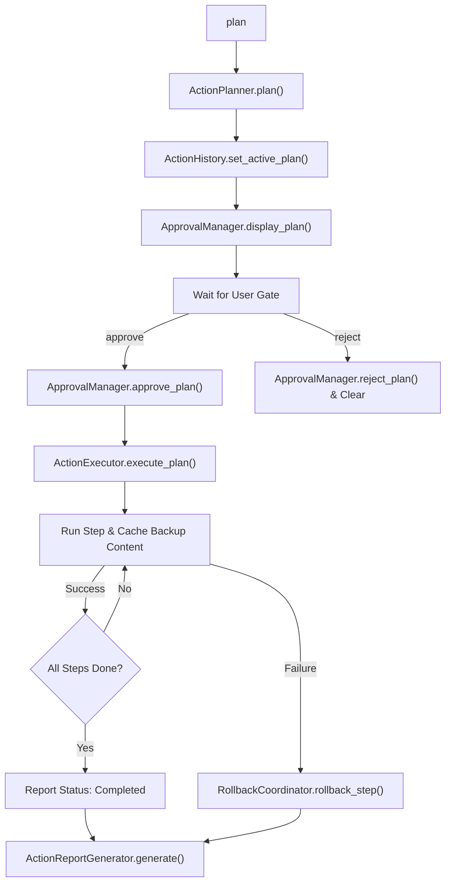

# AI OS Action Engine Specification

This document details the architecture, safety controls, risk classification systems, approval gates, rollback mechanisms, and reporting formats of the **Action Engine** inside the Personal AI OS.

---

## 1. Overview & Objectives

The Action Engine transforms the Personal AI OS from an analysis/read-only assistant into a human-in-the-loop engineering execution system. It executes file writes, modifications, deletions, or git actions safely by compiling planned execution items into a structured list, requiring explicit user approval before execution, and supporting automatic state rollback in the event of failures.

---

## 2. Risk Classification System

Every step in an action plan is assigned an operational category and a risk weight:

### Action Classifications
- **READ**: Accesses file content or repo information (Safe, no filesystem mutations).
- **WRITE**: Generates new files or config settings.
- **MODIFY**: Updates existing code or resource keys.
- **DELETE**: Removes obsolete or temporary files.
- **NETWORK**: Connects to remote git servers or third-party API services.

### Risk Levels
- **LOW**: Safe read operations or minor non-code file changes.
- **MEDIUM**: Code writing/modifications within existing directories.
- **HIGH**: Deletions (`DELETE` classification) or external deployments (`NETWORK` classification).
- **Safety Gate**: **HIGH-risk steps always block execution until explicit approval is confirmed.**

---

## 3. Rollback & State Recovery Heuristics

To protect workspace integrity, the Action Engine coordinates automatic rollbacks when step execution fails:
1. **Pre-Execution Backups**: Before running any mutating step (`WRITE`, `MODIFY`, or `DELETE`), the executor attempts to read the target file's current content.
2. **Reverse State Reversion**: If a step fails, the executor triggers the `RollbackCoordinator` to walk back completed steps in **reverse order**.
3. **Reversion Strategies**:
   - `WRITE` steps are rolled back by running a file delete command.
   - `MODIFY` and `DELETE` steps are rolled back by writing back the cached `backup_content` payload.

---

## 4. Execution Lifecycle

---

## 5. Command Interface

The CLI exposes the following interactions:
- `plan <objective>`: Decomposes the objective into steps and displays their classification, risk, and reversible statuses.
- `approve`: Approves the currently active execution plan.
- `reject`: Rejects the active plan and clears it.
- `execute`: Starts sequential execution of the approved plan.
- `rollback <plan_id>`: Triggers manual rollback of completed mutating actions of a plan.
- `execution history`: Lists all previously generated action plans and their execution logs.
