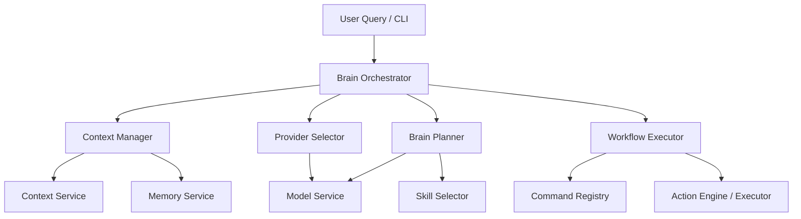

# AI OS Brain

The **AI OS Brain** is the central orchestration layer of the Personal AI OS. It coordinates Skills, Providers, Tools, Memory, Conversation, and the Action Engine into a unified execution pipeline.

---

## Architecture Overview

The Brain is structured as a collection of decoupled components, each with a single responsibility:

---

## 1. Decision Flow

When a user submits a query to the Brain (e.g., via the `brain` command in the CLI), the following lifecycle is executed:

1. **Context Assembly**: The `ContextManager` queries the workspace context (project root, git branch) and retrieves relevant memories.
2. **Provider Selection**: The `ProviderSelector` analyzes the query and selects the most appropriate LLM model and provider (e.g. Gemini, Claude, OpenAI).
3. **Workflow Planning**: The `BrainPlanner` identifies whether the request is deterministic (mapping exactly to a skill's command) or complex (requires multi-step orchestration).
4. **Execution**: The `WorkflowExecutor` executes the plan step-by-step.
   - For skill commands, it invokes the respective handler registered in the `CommandRegistry`.
   - For low-level modifications (e.g., file writes/deletes), it hands execution over to the **Action Engine** for safe execution and potential rollback.
5. **Response Consolidation**: The results of all steps are aggregated and formatted. If multiple steps were executed, they are summarized by the LLM into a final merged response.

---

## 2. Skill Orchestration

Skills are decoupled packages that implement specific tasks (e.g., `github`, `developer`, `career`).
- **Discovery**: During OS bootstrap, all enabled skills are discovered, and their commands are registered on the `CommandRegistry`.
- **Selection**: The `SkillSelector` performs keyword and exact matching on user objectives to calculate confidence scores for each skill.
- **Routing**: If a step in a planned workflow belongs to a skill, the `WorkflowExecutor` executes the corresponding command from the registry.

---

## 3. Provider Routing

The `ProviderSelector` implements dynamic routing to ensure the best balance between speed, cost, and capability:
- **Development Tasks**: Queries involving code reviews, repository scans, and Git workflows are routed to high-capability models like `claude-3-5-sonnet`.
- **Text & General Queries**: Generic requests default to `gemini-1.5-pro`.
- **Local / Mock Commands**: Direct or mocked tasks route to local configurations like `llama3` or `mock-model`.

---

## 4. Workflow Lifecycle

Workflows represent the execution plan formulated by the Brain. A workflow transitions through the following states:

- **Pending**: Steps are created and queued.
- **Running**: The current step is executed (with captured stdout redirection).
- **Completed**: The step finishes successfully.
- **Failed**: A step fails. If the step was handed off to the Action Engine, a rollback plan is automatically coordinate and run to undo any side-effects.

---

## CLI Usage

The CLI registers several commands to monitor and trace the Brain:

- `brain <query>`: Runs the natural language objective or multi-skill request through the Brain.
- `brain explain <query>`: Explains how the Brain would route, select, and plan the query without actually executing it.
- `brain trace [workflow_id]`: Traces the execution, output, and errors of the last or specified workflow.
- `brain status`: Displays the status of the Brain, active workflows, and history size.
