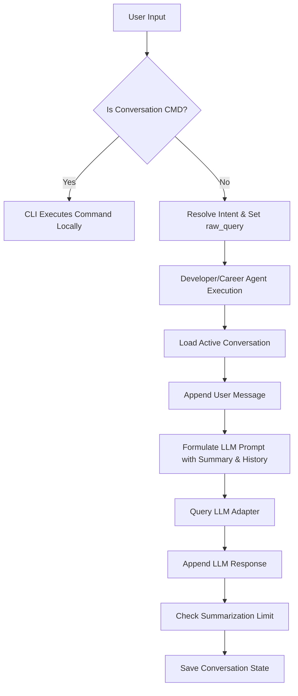

# AI OS Conversation Engine Specification

This document describes the design, storage formats, and execution/summarization lifecycle of the Conversation Engine.

---

## 1. Architecture

The Conversation Engine provides persistent, multi-turn dialogue capability for every agent in the Personal AI OS. It is designed to be decoupled from the core Kernel lifecycle, instead relying on the workspace and active session context.

### Class Layout
- **ConversationMessage**: Represents a single turn in a conversation. Contains `role` ("user", "assistant"), `content`, and a `timestamp`.
- **ConversationSummary**: Holds the summarized context of older messages, including synthesized lists of `decisions`, `action_items`, and `unresolved_questions`.
- **Conversation**: The primary entity storing conversation state. Contains `id`, `title`, `created_time`, `updated_time`, `active_agent`, `messages` (active list of messages), and `summary` (latest summary).
- **ConversationStore**: A filesystem storage wrapper that saves and loads JSON records within `.aios_conversations/` under the active workspace.
- **ConversationManager**: Coordinates conversation life, handles creation, listing, switching, renaming, message appending, and automatic compression.

---

## 2. Conversation Lifecycle



---

## 3. Storage Format

Conversations are persisted in JSON format. Example record (`.json`):

```json
{
  "id": "c7fbe8d5-104e-4f51-b998-e62a14e91244",
  "title": "Default Conversation",
  "created_time": 1718873491.12,
  "updated_time": 1718873895.34,
  "active_agent": "developer_agent",
  "messages": [
    {
      "role": "user",
      "content": "suggest a fix"
    },
    {
      "role": "assistant",
      "content": "Here is the recommended code change..."
    }
  ],
  "summary": {
    "summary": "Analyzed workspace structure and found python dependencies.",
    "decisions": [
      "Targeted Python version 3.10",
      "Configured pytest for unit testing"
    ],
    "action_items": [
      "Run pyproject tests"
    ],
    "unresolved_questions": [
      "Should we enforce strict type checking?"
    ],
    "timestamp": 1718873600.0
  },
  "archived": false
}
```

---

## 4. Summarization Strategy (Context Compression)

To prevent tokens from accumulating indefinitely, the Conversation Engine implements automatic history compression:

1. **Threshold**: When a conversation's active messages count exceeds the configured limit (default: **10** messages), a summarization is triggered.
2. **Context Retention**: The latest **4** messages are preserved verbatim to maintain current immediate conversational flow.
3. **Synthesis**: The older messages are serialized and processed via the model adapter using the `prompts/conversation/summarize_history.md` template.
4. **Structured Summary**: The model extracts:
   - A high-level paragraph summary.
   - Core technical decisions made.
   - Pending action items.
   - Unresolved questions.
5. **Aggregation**: The new summary is merged into the conversation's `summary` property, and older messages are discarded from the active list.
