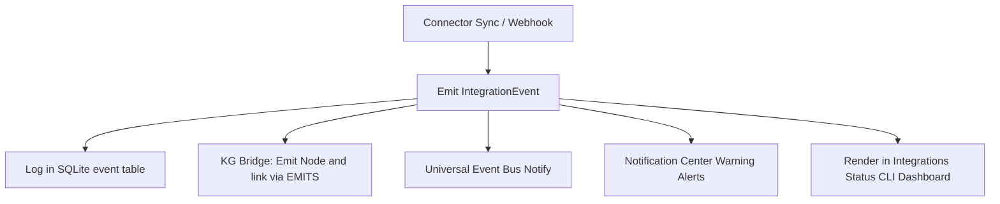

# Event Sync Guide

All connectors emit event streams upon synchronization or webhooks reception, dispatching data across the AI OS.

---

## 1. Event Propagation Pipeline

---

## 2. Event Types

- **GitHubPush**: Repository code push.
- **GitHubPR**: New Pull Request issue opened.
- **NotionPageCreated**: New Notion page.
- **WorkflowDeployed**: Successfully deployed n8n workflow.
- **CalendarEventCreated**: Meeting booked.
- **EmailReceived**: Inbox message.
- **SlackMessage**: Channel update.
- **TelegramMessage**: Bot notification.

---

## 3. History Auditing

Verify recent sync events in the integrations dashboard:
`aios integrations status`
