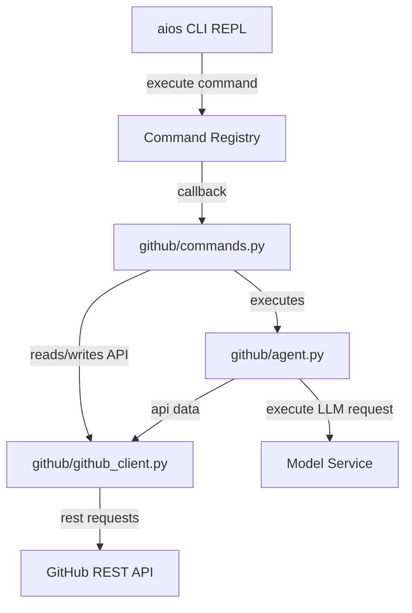

# GitHub Skill Pro Documentation

GitHub Skill Pro provides deep, robust integration with GitHub repositories, pull requests, issues, releases, workflows, commits, and tags for the Personal AI OS.

## 🚀 Getting Started

To initialize the GitHub Skill Pro, start the system with `aios` and run the login command:

```bash
github login
```

You will be prompted to enter your GitHub Personal Access Token (PAT). 

> [!NOTE]
> The token is encrypted locally under `~/.aios_github_config.json` using a lightweight symmetric key XOR cipher.

---

## 🛠️ Commands Reference

GitHub Skill Pro registers the following commands with the AI OS Command Registry:

| Command | Description | Example Usage | Write Action? |
|---|---|---|---|
| `github login` | Prompts for and saves PAT | `github login` | No |
| `github status` | Checks current auth state and user | `github status` | No |
| `list repositories` | Lists repos accessible by authenticated user | `list repositories` | No |
| `clone repository` | Clones a repo locally | `clone repository Anzar0904/aios` | Yes (Requires Approval) |
| `review pull request` | Reviews a PR's diff using Developer Mode | `review pull request 15` | No |
| `review issue` | Summarizes and critiques an issue | `review issue 10` | No |
| `summarize repository` | Outlines repository purpose and structure | `summarize repository` | No |
| `compare branches` | Summarizes functional changes between branches | `compare branches main dev` | No |
| `generate release notes` | Drafts changelog from commits | `generate release notes v1.1.0` | No |
| `create issue` | Creates a new issue | `create issue` | Yes (Requires Approval) |
| `create pull request` | Creates a new pull request | `create pull request` | Yes (Requires Approval) |
| `list workflows` | Lists GitHub Actions workflows | `list workflows` | No |
| `workflow status` | Returns workflow run state and explains failures | `workflow status` | No |
| `latest release` | Retrieves latest release notes | `latest release` | No |

---

## 🔒 Security & Constraints

1. **Explicit Approval**: Every write action (e.g. `clone repository`, `create issue`, `create pull request`) triggers an **Action Engine Approval Prompt**. The user must explicitly type `y` to allow the modification.
2. **Read-Only Codebase Principle**: No automatic modifications of the codebase or repositories are carried out without manual user approval.
3. **Local Encryption**: Config PAT credentials are encrypted locally rather than stored in plain text.

---

## 🧩 Architectural Design

The integration follows a decoupled, clean-architecture pattern matching the AI OS spec:



- **[models.py](file:///Users/anzarakhtar/aios/skills/github/models.py)**: Defines strongly typed entities (e.g., `GitHubPR`, `GitHubIssue`, `GitHubWorkflow`, `GitHubCommit`).
- **[github_client.py](file:///Users/anzarakhtar/aios/skills/github/github_client.py)**: Handles authentication retrieval and coordinates requests using the `httpx` HTTP client.
- **[agent.py](file:///Users/anzarakhtar/aios/skills/github/agent.py)**: Performs semantic review tasks (Developer Mode PR reviews, Issue summaries, and CI explanations) by building prompts from `skills/github/prompts/` and requesting predictions from the configured `ModelService`.
