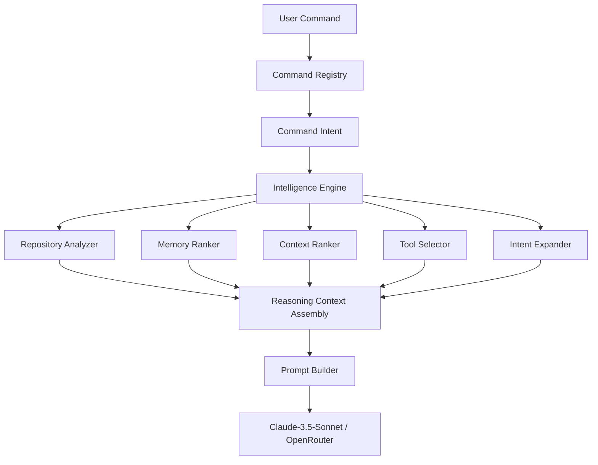

# AI OS Intelligence Engine Specification

This document details the architecture, context filtering logic, ranking algorithms, and data workflows of the **Intelligence Engine** inside the Personal AI OS.

---

## 1. Architecture

The Intelligence Engine acts as a cognitive intermediary between incoming intents (from the Command Registry/User) and raw LLM queries. It analyzes workspace files, prioritizes memory cues, parses relevant subtrees, and dynamically limits prompt context sizes to avoid token bloat.

### Component Structure
- **RepositoryAnalyzer**: Combines file trees, configurations, git diffs, and dependencies into a structured `RepositoryAnalysis` object.
- **MemoryRanker**: Ranks local memories based on workspace compatibility, importance, recency, and token-based semantic similarity keyword overlap.
- **ContextRanker**: Filters out irrelevant telemetry (like directory subtrees or git diffs) if the command does not request them.
- **ToolSelector**: Determines which system tool integrations (filesystem, git, terminal, memory) are required for the intent.
- **IntentExpander**: Reframes natural language instructions or short command terms into comprehensive, highly detailed software engineering objectives.
- **ReasoningContext**: Integrates the intent, analysis data, active conversation summary, relevant memories, and tools into a single reasoning context payload.

---

## 2. Data Flow

---

## 3. Context Filtering & Ranking Strategy

### Memory Ranking
Memories are evaluated dynamically using a deterministic scoring model (without requiring an external database or vector embedding library):
$$\text{Score} = \text{Overlap} \times 2.0 + \text{Recency Boost} + \text{Importance} \times 0.5 + \text{Workspace Match} \times 1.5 + \text{Tag Boost}$$

1. **Semantic Overlap**: Computes intersection of query tokens and memory content keywords.
2. **Recency**: Boosts newer memories (up to `1.0`) relative to their creation age.
3. **Importance**: Integrates user-supplied priority tags.
4. **Workspace Match**: Prioritizes notes stored under the active workspace path.

### Context Filtering (Anti-Bloat)
To preserve the model's focus, the `ContextRanker` applies context-sensitive pruning:
- **Git Diffs & Logs**: Included only for git/review-focused actions.
- **Directory Tree**: Truncated to a depth of `20` lines unless a full repository scan/review is requested.
- **Todos**: Included only for repository audits and technical debt analyses.

---

## 4. Reasoning Pipeline Integration

1. The interactive REPL loop matches the command and dispatches it to the agent runtime.
2. The agent executes and initiates the **Intelligence Engine**.
3. Context, memories, and commands are dynamically parsed, ranked, and merged into a `ReasoningContext` object.
4. The `PromptBuilder` accepts the `ReasoningContext` and maps parameters directly to prompt templates under `prompts/developer/`.
5. The formulated prompt is dispatched to the OpenRouter/LLM Adapter.

---

## 5. Future Extension Points

- **Syntax & AST Analysis**: Integrate Python AST parsing in the `RepositoryAnalyzer` to collect and build class relationship graphs.
- **Dynamic Feedback Loop**: Allow the `ToolSelector` to react to intermediate execution errors by selecting recovery tools dynamically.
- **Fine-Grained Context Budgets**: Introduce a strict token-count budget constraint to automatically adjust context size when dealing with large code repositories.
