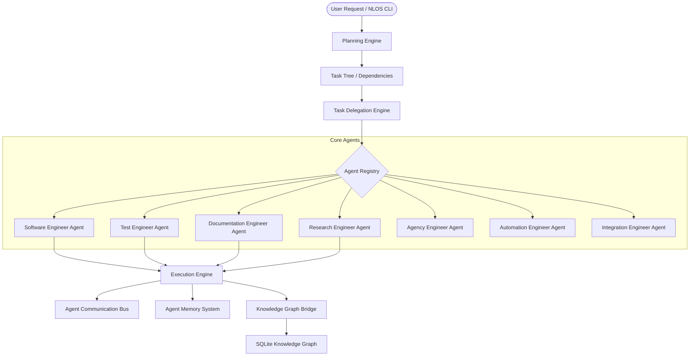

# Phase 12: Autonomous Multi-Agent Platform Specification

Welcome to the **Autonomous Multi-Agent Platform** (Phase 12) of AI OS. This platform shifts the paradigm of AI OS from a single-agent system to a coordinated, high-performance team of core specialized agents that plan, delegate, collaborate, execute, review, learn, and report on complex software and operations tasks.

## System Architecture Overview

## Platform Components

1. **Agent Registry**: Stores Agent ID, Name, Role, Capabilities, Status, Assigned Tasks, Metrics, and Memory references. See [AGENT_REGISTRY_GUIDE.md](file:///Users/anzarakhtar/aios/AGENT_REGISTRY_GUIDE.md).
2. **Specialized Agents**: Declares the 7 core engineering and business agents.
3. **Agent Communication Bus**: Enables point-to-point and broadcast message passing, task requesting, and escalation. See [AGENT_COMMUNICATION_GUIDE.md](file:///Users/anzarakhtar/aios/AGENT_COMMUNICATION_GUIDE.md).
4. **Task Delegation Engine**: Manages assigning, reassigning, splitting, merging, and ownership tracking of tasks. See [DELEGATION_ENGINE_GUIDE.md](file:///Users/anzarakhtar/aios/DELEGATION_ENGINE_GUIDE.md).
5. **Planning Engine**: Automatically breaks natural language objectives into task dependency trees. See [PLANNING_ENGINE_GUIDE.md](file:///Users/anzarakhtar/aios/PLANNING_ENGINE_GUIDE.md).
6. **Execution Engine**: Directs single-agent, multi-agent, sequential, and parallel task execution. See [EXECUTION_ENGINE_GUIDE.md](file:///Users/anzarakhtar/aios/EXECUTION_ENGINE_GUIDE.md).
7. **Agent Memory**: Persists lessons learned, execution histories, metrics, and failures. See [AGENT_MEMORY_GUIDE.md](file:///Users/anzarakhtar/aios/AGENT_MEMORY_GUIDE.md).

## Knowledge Graph Schema Integration

The platform automatically registers its entities and links directly inside the Universal Knowledge Graph SQLite schema.

### New Entity Types (`EntityType`)
- `AGENT`: Represents a registered core or custom agent.
- `RESULT`: Represents the generated output or artifact of a task.
- `CAPABILITY`: Represents a specialized skill or API capability of an agent.

### New Relationship Types (`RelationshipType`)
- `ASSIGNED_TO`: Connects a `TASK` to the `AGENT` responsible for it.
- `COMPLETED_BY`: Connects a `TASK` to the `AGENT` that successfully finished it.
- `REQUESTED_BY`: Connects a task or message to its initiating entity.
- `DEPENDS_ON`: Links a `TASK` to its prerequisite tasks.
- `COLLABORATES_WITH`: Represents active communication between two `AGENT` nodes.
- `REPORTS_TO`: Defines organizational or reporting hierarchy between agents.

## Quick CLI Reference
* `aios agents` (Open the Agent Dashboard)
* `aios agent list` (Show all registered agents)
* `aios agent status [agent_id]` (Retrieve real-time status of agent(s))
* `aios agent assign <task_id> <agent_id>` (Manually assign or delegate tasks)
* `aios agent execute <NL_objective>` (Run autonomous multi-agent planner/execution pipeline)
* `aios agent memory <agent_id>` (Query lessons learned ledger)
