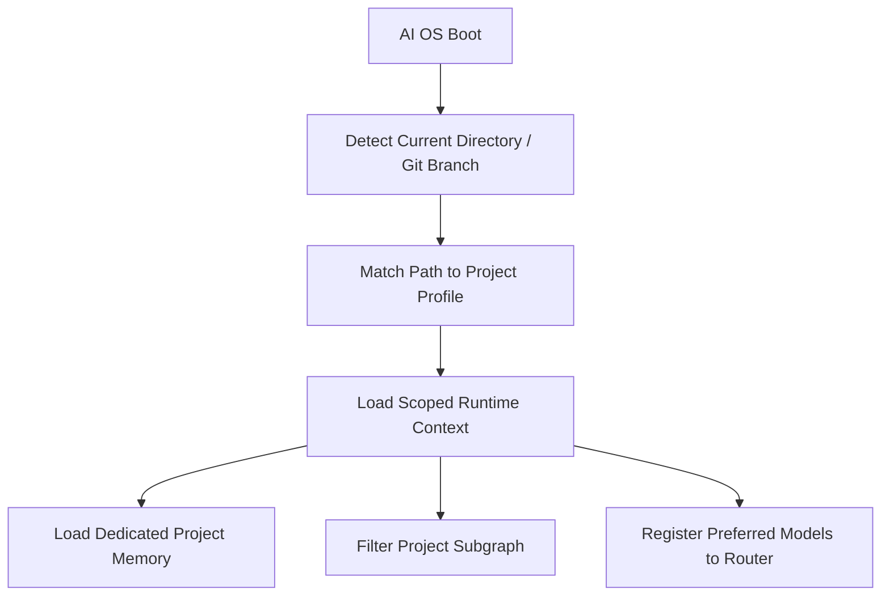

# Project Context Guide

This guide details the isolation, state management, and lifecycle of project-specific contexts in the AI OS.

## Runtime Isolation

Every workspace receives an isolated context:
- Environment variables (e.g. tracking branches, active directory scopes).
- Local task states.
- Scoped model configurations.

### Context Lifecycle Diagram



---

## State Persistence

Context state is persisted inside the SQLite registry in the `project_contexts` table:

```sql
CREATE TABLE project_contexts (
    project_id  TEXT PRIMARY KEY,
    data        TEXT NOT NULL DEFAULT '{}' -- JSON payload containing runtime state
);
```

### Serialized Properties

- `active_branch`: tracks current git branch (defaults to `main`).
- `active_models`: project-level model preferences list.
- `open_tasks`: tasks registered to this project.
- `goals`: active sprint and milestone targets.
- `documents`: associated doc paths.
- `decisions`: registry of architectural decision records.

---

## Automations & Hooks

### Workspace Boot Auto-Detection
Whenever the AI OS CLI or service layer starts, it inspects the current working directory. The path is matched against known project hints (e.g., if path contains `/agency`, it loads the `Agency` project context).

### Auto-Linking Decisions & Actions
All actions performed (e.g. creating a task) automatically look up the active context and associate the event to that project in the Universal Knowledge Graph.
