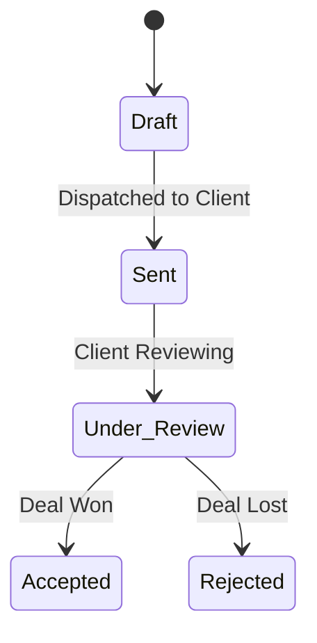

# Proposal Engine Guide

The Proposal Engine procedurally generates, tracks, and manages commercial documents.

---

## 1. Proposal Types

The engine supports five core proposal types:

1. **Cold Email Proposal (`cold_email`)**: Designed for lightweight initial pitches, providing expected budget parameters.
2. **Automation Proposal (`automation`)**: Focused on workflows, task sync setups, Notion integration databases, and GitHub notifications.
3. **AI Development Proposal (`ai_development`)**: Detailed project scope for deploying custom local models, reasoning models, routers, and fine-tuning pipelines.
4. **Consulting Proposal (`consulting`)**: Strategy-first evaluation and technical readiness audits.
5. **Custom Proposal (`custom`)**: Tailored outputs generated via custom instruction prompts.

---

## 2. Document Status Pipeline



---

## 3. Proposal Storage & Graph Integration

Every generated proposal is:
- Saved to the relational SQLite registry.
- Saved as a text draft within the project scope directory.
- Registered to the Knowledge Graph as a `proposal` node.
- Linked to the parent `lead` node via a `RELATED_TO` edge.

---

## 4. Invocation Commands

```bash
# List all generated proposals
aios agency proposals

# Generate an automation proposal for a lead
aios agency proposals generate <lead_id> automation

# Generate a custom AI OS development proposal
aios agency proposals generate <lead_id> ai_development
```
