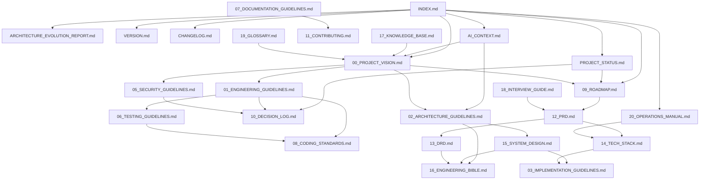
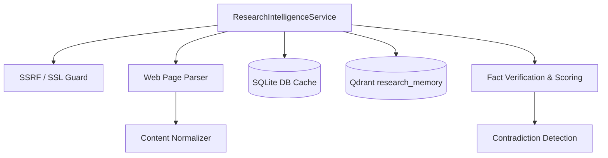

# Personal AI OS

Monorepo root for the Personal AI OS. 

---

## 📖 Documentation System
This repository maintains a professional, structured documentation system under the [docs/](file:///Users/anzarakhtar/aios/docs/) directory. Every file follows strict guidelines to serve as the permanent source of truth for the project.

### Core Entrypoints
* 🗺️ **[INDEX.md](file:///Users/anzarakhtar/aios/docs/INDEX.md)**: The primary Documentation Homepage. Categorizes all files by purpose, audience, prerequisites, and when to read them. **(Start here for human-friendly navigation).**
* 📐 **[ARCHITECTURE_EVOLUTION_REPORT.md](file:///Users/anzarakhtar/aios/docs/ARCHITECTURE_EVOLUTION_REPORT.md)**: Dynamic core scaling planning evaluation.
* 📈 **[PROJECT_STATUS.md](file:///Users/anzarakhtar/aios/docs/PROJECT_STATUS.md)**: The Live Project Dashboard. Tracks current phases, priorities, risks, known issues, and technical debt.
* 🏷️ **[VERSION.md](file:///Users/anzarakhtar/aios/docs/VERSION.md)**: The Version Registry. Tracks project, architecture, documentation, and API release versions.
* 📋 **[CHANGELOG.md](file:///Users/anzarakhtar/aios/docs/CHANGELOG.md)**: Release log tracking chronological version changes, features added, and updates.
* 🤖 **[AI_CONTEXT.md](file:///Users/anzarakhtar/aios/docs/AI_CONTEXT.md)**: AI-optimized system entrypoint and token-efficient index. **(AIs must read this first before working on the project).**
* 📜 **[00_PROJECT_VISION.md](file:///Users/anzarakhtar/aios/docs/00_PROJECT_VISION.md)**: The foundational constitution of the Personal AI OS. Explains what the AI OS is, why it exists, vision, core philosophy, and success metrics.

### Index of System Documents
1. **[01_ENGINEERING_GUIDELINES.md](file:///Users/anzarakhtar/aios/docs/01_ENGINEERING_GUIDELINES.md)**: Core engineering principles (boring by default, optimize for deletion) and dependency policies.
2. **[02_ARCHITECTURE_GUIDELINES.md](file:///Users/anzarakhtar/aios/docs/02_ARCHITECTURE_GUIDELINES.md)**: Kernel-service boundary decoupling and Dependency Inversion rules.
3. **[03_IMPLEMENTATION_GUIDELINES.md](file:///Users/anzarakhtar/aios/docs/03_IMPLEMENTATION_GUIDELINES.md)**: How to implement new skills, write tools, and register commands.
4. **[04_AI_MODEL_STRATEGY.md](file:///Users/anzarakhtar/aios/docs/04_AI_MODEL_STRATEGY.md)**: Model selection matrices, offline local runtimes, and fallback chains.
5. **[05_SECURITY_GUIDELINES.md](file:///Users/anzarakhtar/aios/docs/05_SECURITY_GUIDELINES.md)**: Secrets handling, data encryption (at rest and in transit), and risk level gates.
6. **[06_TESTING_GUIDELINES.md](file:///Users/anzarakhtar/aios/docs/06_TESTING_GUIDELINES.md)**: Unit, integration, contract, and regression testing standards.
7. **[07_DOCUMENTATION_GUIDELINES.md](file:///Users/anzarakhtar/aios/docs/07_DOCUMENTATION_GUIDELINES.md)**: Standards for formatting markdown, metadata blocks, and inline docstrings.
8. **[08_CODING_STANDARDS.md](file:///Users/anzarakhtar/aios/docs/08_CODING_STANDARDS.md)**: Style rules, file line limits (max 400 lines), complexity budgets, and formatting.
9. **[09_ROADMAP.md](file:///Users/anzarakhtar/aios/docs/09_ROADMAP.md)**: Release timelines and product maturity horizons.
10. **[10_DECISION_LOG.md](file:///Users/anzarakhtar/aios/docs/10_DECISION_LOG.md)**: Chronological Architecture Decision Records (ADRs) log and templates.
11. **[11_CONTRIBUTING.md](file:///Users/anzarakhtar/aios/docs/11_CONTRIBUTING.md)**: Setup, branch management, and AI-authored commit tagging guidelines.
12. **[12_PRD.md](file:///Users/anzarakhtar/aios/docs/12_PRD.md)**: Product Requirements Document, target use cases, and MVP scope.
13. **[13_DRD.md](file:///Users/anzarakhtar/aios/docs/13_DRD.md)**: Design Requirements Document, database structures, and JSON schemas.
14. **[14_TECH_STACK.md](file:///Users/anzarakhtar/aios/docs/14_TECH_STACK.md)**: Approved languages, external packages, and platform requirements.
15. **[15_SYSTEM_DESIGN.md](file:///Users/anzarakhtar/aios/docs/15_SYSTEM_DESIGN.md)**: Component diagrams, sequence maps, and event pipelines.
16. **[16_ENGINEERING_BIBLE.md](file:///Users/anzarakhtar/aios/docs/16_ENGINEERING_BIBLE.md)**: Low-level file execution map and CLI REPL mechanics.
17. **[17_KNOWLEDGE_BASE.md](file:///Users/anzarakhtar/aios/docs/17_KNOWLEDGE_BASE.md)**: Structuring personal notes, research folders, and tags.
18. **[18_INTERVIEW_GUIDE.md](file:///Users/anzarakhtar/aios/docs/18_INTERVIEW_GUIDE.md)**: User alignment sessions and `/grill-me` templates.
19. **[19_GLOSSARY.md](file:///Users/anzarakhtar/aios/docs/19_GLOSSARY.md)**: Official terminology definitions and project vocabulary.
20. **[20_OPERATIONS_MANUAL.md](file:///Users/anzarakhtar/aios/docs/20_OPERATIONS_MANUAL.md)**: Installation, configurations, backups, diagnostics, and recoveries.

---

## 🗺️ Cross-Reference Map
To navigate the system, follow these relational links between documents:



---

## 📁 Repository Folder Structure

```text
/ (root)
├── config/                 # Environment configuration files
│   └── config.toml         # Active system configuration
├── core/                   # The Core OS Package
│   ├── src/
│   │   └── aios/           # Main core logic package
│   │       ├── cli.py      # CLI REPL loop (entry point)
│   │       ├── kernel.py   # Kernel orchestration engine
│   │       ├── registry.py # Service registration index
│   │       ├── n8n/        # n8n Integration, Intelligence & Runtime
│   │       │   ├── service.py
│   │       │   ├── intelligence.py
│   │       │   ├── connection.py
│   │       │   └── runtime.py
│   │       └── services/   # Service contract interfaces and stubs
│   └── tests/              # Core unit and integration tests
├── docs/                   # Structured guidelines, specs, and runtime reports
│   ├── n8n/                # n8n connection and intelligence docs
│   ├── runtime/            # Workflow runtime architecture and deployment guides
│   ├── supabase/           # Supabase DB schema and security reports
│   ├── vercel/             # Vercel deployment and build diagnostics guides
│   └── project/            # Project Intelligence health, risk, and graph reports
├── architecture/           # Folder for system diagrams and schemas
├── design/                 # Folder for UX designs and screenshots
├── diagrams/               # Raw files for Mermaid/Draw.io files
├── assets/                 # Custom static images and logo components
├── examples/               # Usage scripts and sample skill code
├── templates/              # Standard file and prompt templates
├── pyproject.toml          # **Authoritative version source** + shared workspace tools config (Ruff, Pytest)
└── README.md
```

---

## ⚙️ Running the OS

Bootstrap dependency installation using `uv` or `pip`:

```bash
# Setup virtual environment and install package in editable mode
python3 -m venv .venv
source .venv/bin/activate
pip install -e ./core pytest ruff
```

To boot the system:

```bash
aios
```

## 🧪 Testing and Linting

To run unit and integration tests:
```bash
pytest
```

To verify code style and formatting:
```bash
ruff check ./core
ruff format --check ./core
```

---

## 🔍 Research Intelligence (Sprint 21)

The **Research Intelligence** module enables the Personal AI OS to securely acquire, parse, validate, and reason over external technical literature.

### Key Capabilities
* **Outbound SSRF Guards & SSL Audit**: Enforces strict URL validations (blocking loopback, private range, or link-local IPs) and verifies target SSL/TLS certificates.
* **HTML Element Stripping & Unicode Normalization**: Cleans boilerplate tags (e.g. `nav`, `footer`, `script`, `aside`), converts text to Unicode NFKC, and compacts whitespace.
* **Concept Extraction & Fact Validation**: Automatically extracts concepts and evidence statements via the LLM (or regex fallback) and stores them in SQLite.
* **Confidence Scoring**: Computes credibility scores using:
  `CS = (SCS * 0.3) + (Consensus * 0.3) + (AgeDecay * 0.1) + (DirectValidation * 0.3)`
* **Contradiction Detection**: Flags conflicting claims across sources, links them in a relation graph (`CONFLICTS_WITH`), and logs warning messages to the console.
* **Vector Indexing**: Automatically syncs report markdown pages to `KnowledgeHubService` and `research_memory` in Qdrant.

### Architecture Map


### Usage Examples
```python
from aios.services.research_impl import LocalResearchService

# Initialize the research service
service = LocalResearchService(model_service, workspace_root=".")
service.initialize()

# 1. Search cached SQLite/external providers
docs = service.search("Compare LocalEventBus and NATS", limit=5)

# 2. Fetch and parse url to markdown
doc = service.fetch_document("https://nats.io/documentation")

# 3. Verify claim and get confidence score
verification = service.verify_claim("LocalEventBus runs in-process")
print(f"Status: {verification.verification_status}, Score: {verification.confidence_score}")


## 🤖 n8n Intelligence (Sprint 23)

The **n8n Intelligence** subsystem enables AI OS to design, generate, analyze, validate, optimize, and document n8n workflows.

### Key Capabilities
- **Workflow Generation**: Generates production-ready n8n workflow JSON based on natural language requirements or prebuilt categories using `WorkflowGenerator`.
- **Workflow Graph Validation**: Evaluates connections, missing node properties, circular loops (DFS check), and orphaned nodes using `WorkflowValidator`.
- **Workflow Optimization**: Consolidates redundant duplicate nodes and simplifies connections via `WorkflowOptimizer`.
- **Workflow Path & Credential Analysis**: Identifies external API integrations, required credentials, and performance bottlenecks via `WorkflowAnalyzer` and `CredentialIntelligence`.
- **Workflow Memory & Templates**: Indexes previous configurations and caches reusable templates for lead generation, cold email, AI agent assistant, customer support, and more in `WorkflowMemory`.

### Local Setup
To install and run n8n locally for use with the n8n intelligence subsystem:
```bash
# 1. Install n8n globally via npm
npm install -g n8n

# 2. Start the local n8n instance
n8n start
```
The editor is accessible at `http://localhost:5678`, and health status can be verified at `http://localhost:5678/healthz`.

### CLI Subcommand Reference
```bash
# 1. List available workflow templates
aios workflow templates

# 2. Generate a workflow from a prompt
aios workflow generate "Create Slack notification on Shopify purchase"

# 3. Validate a workflow JSON file
aios workflow validate path/to/workflow.json

# 4. Analyze execution paths and credential requirements
aios workflow analyze path/to/workflow.json

# 5. Optimize workflow nodes and connections
aios workflow optimize path/to/workflow.json

# 6. Export latest workflow JSON to file
aios workflow export my_workflow.json

# 7. Print summary statistics
aios workflow summary path/to/workflow.json
```


## 🔌 Live n8n Integration (Sprint 24A)

AI OS integrates with live, running local or remote n8n instances using `N8NLiveConnectionManager`.

### Key Capabilities
- **Automatic Discovery**: Automatically checks for instances running on `http://localhost:5678` or `http://127.0.0.1:5678`.
- **Connection Management**: Connects, tests health/latency, credentials, and caches the connection details in Persistent Memory.
- **Reporting**: Automatically compiles connection status, configuration, health latency, and API support details under `docs/n8n/`.
- **Version Detection**: Probes version payload from public healthz headers or falls back to local CLI commands if local.

### CLI Commands Reference
```bash
# 1. Connect to local or remote n8n server
aios n8n connect http://localhost:5678

# 2. Check current integration status
aios n8n status

# 3. Disconnect and clear cache
aios n8n disconnect

# 4. Measure server latency and health
aios n8n health

# 5. Detect server version
aios n8n version

# 6. Show configuration details
aios n8n config

# 7. Execute live diagnostic tests
aios n8n test
```


## 🚀 Workflow Runtime & Deployment (Sprint 24B)

AI OS can now deploy, execute, monitor, version, recover, and synchronize workflows
on a live n8n instance via `N8NWorkflowRuntimeManager`.

### Key Capabilities
- **Deployment Engine**: Upload, update, replace, or clone workflows. Never overwrites without confirmation (`force` flag).
- **Version History**: Every deployment is recorded in `.aios_n8n_cache/deployment_history.json` for audit and rollback.
- **Rollback**: Restore any previous version from history; appends a new version entry so the audit trail is preserved.
- **Execution Manager**: Trigger workflows by ID with optional input data. Captures execution IDs.
- **Lifecycle Control**: Enable, disable, activate, deactivate, or delete workflows.
- **Drift Detection**: `sync` compares local JSON node-sets against the live server and reports any drift.
- **Runtime Analytics**: Computes success rate, failure count, and average latency from execution history.
- **Runtime Reports**: Generates 6 markdown docs under `docs/runtime/` on every deploy or execution.

### CLI Commands Reference
```bash
# Deploy workflow to live n8n instance
aios workflow deploy path/to/workflow.json

# Update an already-deployed workflow
aios workflow update <workflow_id> path/to/workflow.json

# Trigger a workflow execution
aios workflow execute <workflow_id> ['{"key":"value"}']

# View execution analytics dashboard
aios workflow monitor

# Retrieve execution logs summary
aios workflow logs

# View full deployment version history
aios workflow history <workflow_id>

# Roll back to a prior version
aios workflow rollback <workflow_id> <version_number>

# Enable (activate) a workflow
aios workflow enable <workflow_id>

# Disable (deactivate) a workflow
aios workflow disable <workflow_id>

# Delete workflow from live n8n server
aios workflow delete <workflow_id>

# Detect local-vs-live state drift
aios workflow sync path/to/workflow.json
```

### Architecture Reference
See [docs/runtime/ARCHITECTURE.md](docs/runtime/ARCHITECTURE.md) for full design details,
data flows, version history schema, drift detection, failure recovery, and the complete
CLI reference.


## ⚡ Supabase Intelligence (Sprint 26)

The **Supabase Intelligence** subsystem enables AI OS to discover, manage, analyze, secure, monitor, and automate Supabase projects.

### Key Capabilities
- **Connection Manager**: Secure connection and authentication using Personal Access Tokens (PAT), Project URLs, and Service Role Keys (stored securely with `0600` permissions).
- **Schema & Database Intelligence**: Automatically discovers database schemas, tables, columns, views, triggers, and foreign key relationships to generate comprehensive ER summaries.
- **Security Audit**: Scans database tables for missing RLS policies, alerts on public table exposures, checks storage bucket policies, and flags security drift.
- **Migration & Drift Engine**: Tracks migration logs and applied versions in the remote database, detecting schema drift dynamically without applying destructive migrations automatically.
- **Edge Functions & Storage**: Indexes storage buckets (public vs private limits) and lists active Deno Edge Functions with JWT authorization configurations.
- **Runtime Reports**: Automatically outputs 6 markdown files (summary, schema, security, migrations, storage, auth reports) under `docs/supabase/`.

### CLI Commands Reference
```bash
# 1. Log in to a Supabase project or account
aios supabase login [--token <token>] [--url <url>] [--key <key>]

# 2. Check current active project connection status
aios supabase status

# 3. List all discovered projects under account (requires PAT login)
aios supabase projects

# 4. Explore active database schema tables, views, and functions
aios supabase schema

# 5. Execute a security audit scan on RLS policies and exposures
aios supabase security

# 6. List storage buckets and check access permissions
aios supabase storage

# 7. View auth configuration, MFA states, and SMTP mailer configurations
aios supabase auth

# 8. Retrieve applied migration history and schema drift status
aios supabase migrations

# 9. List deployed Edge Functions and check JWT verification status
aios supabase functions

# 10. Compile a high-level summary and generate markdown reports
aios supabase summary
```

### Architecture Reference
See [docs/supabase/architecture.md](docs/supabase/architecture.md) for design details, APIs, credentials schemas, and the complete CLI guides.


## 🔺 Vercel Intelligence (Sprint 27)

The **Vercel Intelligence** subsystem enables AI OS to discover, manage, deploy, monitor, analyze, and troubleshoot Vercel projects.

### Key Capabilities
- **Connection Manager**: Supports secure credentials management (under `.agent/vercel/credentials.json` with `0600` permissions) with token validation and discovery for Personal and Team scopes.
- **Project Exploration**: Discovers active project properties, framework, DNS custom domains, environment variables metadata (keys/scopes only), and build/install commands.
- **Deployments Tracking**: Monitors build history, retrieves current deployment state, and evaluates safe rollback candidates (successful historical production builds) without automatically deploying without user approval.
- **Build Diagnostics & Explanations**: Inspects build events/logs and diagnoses build failures (missing dependencies, syntax errors, build script failure) to present AI-powered explanations.
- **Custom Domains & SSL Audit**: Queries custom domains DNS configuration, SSL/TLS certificate health, and redirects.
- **Environment Metadata Audit**: Indexes environment variable targets (Production, Preview, Development) and flags configuration drift without exposing secret values.
- **Monitoring & Health Scorecard**: Gathers activity metrics, average build times, success rates, and outputs project health indicators.
- **Runtime Reports**: Automatically generates 5 markdown reports (deployment, build, domain, environment, health reports) under `docs/vercel/`.

### CLI Commands Reference
```bash
# 1. Authenticate with Vercel using personal access token
aios vercel login [--token <token>] [--team <team_id>]

# 2. Check Vercel connectivity and scope (personal vs team)
aios vercel status

# 3. List all discovered Vercel projects
aios vercel projects

# 4. View recent deployments list and rollback candidates
aios vercel deployments

# 5. Retrieve deployment build logs and AI failure diagnosis
aios vercel logs <deployment_id>

# 6. Verify custom domains SSL status and redirects
aios vercel domains

# 7. Audit environment variables configuration targets
aios vercel env

# 8. Compile project health summary and write reports
aios vercel summary
```

### Architecture Reference
See [docs/vercel/architecture.md](docs/vercel/architecture.md) for detailed APIs, credentials schemas, and the CLI guide.


## 📂 Project Intelligence (Sprint 28)

The **Project Intelligence** subsystem acts as the single source of truth for all software projects managed by AI OS. It aggregates insights from Workspace, Research, GitHub, Supabase, Vercel, n8n, and semantic memory.

### Key Capabilities
- **Project Registry**: Automatically registers and tracks active projects under `.agent/project/projects.json` (secured with `0600` permissions).
- **Project Discovery**: Automatically detects frameworks, git repositories, package managers, databases, deployments, workflows, environment scopes, and documentation structures.
- **Unified Project Model**: Merges source code, database status, deployment targets, workflows, and issue tracking into one cohesive model.
- **Architecture Intelligence**: Generates service maps, module mappings, dependency graphs, and relationships.
- **Health Scorecard**: Calculates documentation coverage, test scores, tech debt, and readiness indicators.
- **Timeline Engine**: Merges commits, database migrations, and deployments into a consolidated event timeline.
- **Risk Assessor**: Flags environmental drift, security vulnerabilities, missing tests, and configuration issues.
- **Project Memory**: Stores and semantically retrieves architecture decisions and previous bug resolutions.
- **Markdown Reports**: Compiles 7 reports (summary, architecture, health, risks, timeline, dependencies, graph) under `docs/project/`.

### CLI Commands Reference
```bash
# 1. List all registered projects
aios project list

# 2. Display registry status and active project
aios project status

# 3. Compile project summary and generate reports
aios project summary [project_id]

# 4. Query knowledge graph node connections
aios project graph [project_id]

# 5. View health scorecard, debt, and recommendations
aios project health [project_id]

# 6. Retrieve aggregated historical timeline events
aios project timeline [project_id]

# 7. Check coverage gaps, security, and drift risks
aios project risks [project_id]

# 8. Display components service map and modules
aios project architecture [project_id]

# 9. Perform semantic memory query over design history
aios project memory [project_id] [query]

# 10. Auto-discover framework and config at path
aios project analyze [path]
```

### Architecture Reference
See [docs/project/architecture.md](docs/project/architecture.md) for detailed APIs, schemas, and CLI guides.


