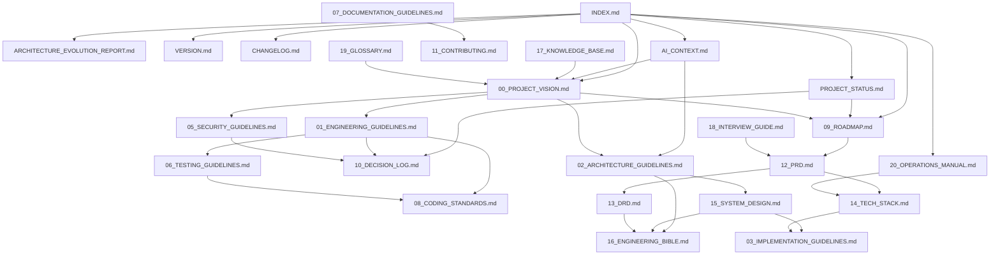
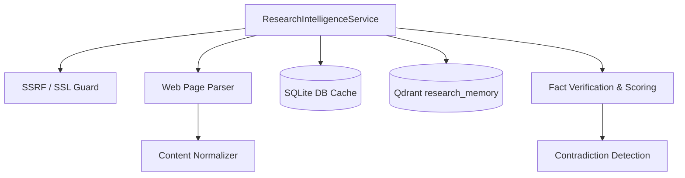

# Personal AI OS

Monorepo root for the Personal AI OS. 

---

## 📖 Documentation System
This repository maintains a professional, structured documentation system under the [docs/](file:///Users/anzarakhtar/aios/docs/) directory. Every file follows strict guidelines to serve as the permanent source of truth for the project.

### Core Entrypoints
* 🗺️ **[INDEX.md](file:///Users/anzarakhtar/aios/docs/INDEX.md)**: The primary Documentation Homepage. Categorizes all files by purpose, audience, prerequisites, and when to read them. **(Start here for human-friendly navigation).**
* 📐 **[ARCHITECTURE_EVOLUTION_REPORT.md](file:///Users/anzarakhtar/aios/docs/ARCHITECTURE_EVOLUTION_REPORT.md)**: Dynamic core scaling planning evaluation.
* 📈 **[PROJECT_STATUS.md](file:///Users/anzarakhtar/aios/docs/PROJECT_STATUS.md)**: The Live Project Dashboard. Tracks current phases, priorities, risks, known issues, and technical debt.
* 🏷️ **[VERSION.md](file:///Users/anzarakhtar/aios/docs/VERSION.md)**: The Version Registry. Tracks project, architecture, documentation, and API release versions.
* 📋 **[CHANGELOG.md](file:///Users/anzarakhtar/aios/docs/CHANGELOG.md)**: Release log tracking chronological version changes, features added, and updates.
* 🤖 **[AI_CONTEXT.md](file:///Users/anzarakhtar/aios/docs/AI_CONTEXT.md)**: AI-optimized system entrypoint and token-efficient index. **(AIs must read this first before working on the project).**
* 📜 **[00_PROJECT_VISION.md](file:///Users/anzarakhtar/aios/docs/00_PROJECT_VISION.md)**: The foundational constitution of the Personal AI OS. Explains what the AI OS is, why it exists, vision, core philosophy, and success metrics.

### Index of System Documents
1. **[01_ENGINEERING_GUIDELINES.md](file:///Users/anzarakhtar/aios/docs/01_ENGINEERING_GUIDELINES.md)**: Core engineering principles (boring by default, optimize for deletion) and dependency policies.
2. **[02_ARCHITECTURE_GUIDELINES.md](file:///Users/anzarakhtar/aios/docs/02_ARCHITECTURE_GUIDELINES.md)**: Kernel-service boundary decoupling and Dependency Inversion rules.
3. **[03_IMPLEMENTATION_GUIDELINES.md](file:///Users/anzarakhtar/aios/docs/03_IMPLEMENTATION_GUIDELINES.md)**: How to implement new skills, write tools, and register commands.
4. **[04_AI_MODEL_STRATEGY.md](file:///Users/anzarakhtar/aios/docs/04_AI_MODEL_STRATEGY.md)**: Model selection matrices, offline local runtimes, and fallback chains.
5. **[05_SECURITY_GUIDELINES.md](file:///Users/anzarakhtar/aios/docs/05_SECURITY_GUIDELINES.md)**: Secrets handling, data encryption (at rest and in transit), and risk level gates.
6. **[06_TESTING_GUIDELINES.md](file:///Users/anzarakhtar/aios/docs/06_TESTING_GUIDELINES.md)**: Unit, integration, contract, and regression testing standards.
7. **[07_DOCUMENTATION_GUIDELINES.md](file:///Users/anzarakhtar/aios/docs/07_DOCUMENTATION_GUIDELINES.md)**: Standards for formatting markdown, metadata blocks, and inline docstrings.
8. **[08_CODING_STANDARDS.md](file:///Users/anzarakhtar/aios/docs/08_CODING_STANDARDS.md)**: Style rules, file line limits (max 400 lines), complexity budgets, and formatting.
9. **[09_ROADMAP.md](file:///Users/anzarakhtar/aios/docs/09_ROADMAP.md)**: Release timelines and product maturity horizons.
10. **[10_DECISION_LOG.md](file:///Users/anzarakhtar/aios/docs/10_DECISION_LOG.md)**: Chronological Architecture Decision Records (ADRs) log and templates.
11. **[11_CONTRIBUTING.md](file:///Users/anzarakhtar/aios/docs/11_CONTRIBUTING.md)**: Setup, branch management, and AI-authored commit tagging guidelines.
12. **[12_PRD.md](file:///Users/anzarakhtar/aios/docs/12_PRD.md)**: Product Requirements Document, target use cases, and MVP scope.
13. **[13_DRD.md](file:///Users/anzarakhtar/aios/docs/13_DRD.md)**: Design Requirements Document, database structures, and JSON schemas.
14. **[14_TECH_STACK.md](file:///Users/anzarakhtar/aios/docs/14_TECH_STACK.md)**: Approved languages, external packages, and platform requirements.
15. **[15_SYSTEM_DESIGN.md](file:///Users/anzarakhtar/aios/docs/15_SYSTEM_DESIGN.md)**: Component diagrams, sequence maps, and event pipelines.
16. **[16_ENGINEERING_BIBLE.md](file:///Users/anzarakhtar/aios/docs/16_ENGINEERING_BIBLE.md)**: Low-level file execution map and CLI REPL mechanics.
17. **[17_KNOWLEDGE_BASE.md](file:///Users/anzarakhtar/aios/docs/17_KNOWLEDGE_BASE.md)**: Structuring personal notes, research folders, and tags.
18. **[18_INTERVIEW_GUIDE.md](file:///Users/anzarakhtar/aios/docs/18_INTERVIEW_GUIDE.md)**: User alignment sessions and `/grill-me` templates.
19. **[19_GLOSSARY.md](file:///Users/anzarakhtar/aios/docs/19_GLOSSARY.md)**: Official terminology definitions and project vocabulary.
20. **[20_OPERATIONS_MANUAL.md](file:///Users/anzarakhtar/aios/docs/20_OPERATIONS_MANUAL.md)**: Installation, configurations, backups, diagnostics, and recoveries.

---

## 🗺️ Cross-Reference Map
To navigate the system, follow these relational links between documents:



---

## 📁 Repository Folder Structure

```text
/ (root)
├── config/                 # Environment configuration files
│   └── config.toml         # Active system configuration
├── core/                   # The Core OS Package
│   ├── src/
│   │   └── aios/           # Main core logic package
│   │       ├── cli.py      # CLI REPL loop (entry point)
│   │       ├── kernel.py   # Kernel orchestration engine
│   │       ├── registry.py # Service registration index
│   │       └── services/   # Service contract interfaces and stubs
│   └── tests/              # Core unit and integration tests
├── docs/                   # Structured guidelines and specifications
├── architecture/           # Folder for system diagrams and schemas
├── design/                 # Folder for UX designs and screenshots
├── diagrams/               # Raw files for Mermaid/Draw.io files
├── assets/                 # Custom static images and logo components
├── examples/               # Usage scripts and sample skill code
├── templates/              # Standard file and prompt templates
├── pyproject.toml          # **Authoritative version source** + shared workspace tools config (Ruff, Pytest)
└── README.md
```

---

## ⚙️ Running the OS

Bootstrap dependency installation using `uv` or `pip`:

```bash
# Setup virtual environment and install package in editable mode
python3 -m venv .venv
source .venv/bin/activate
pip install -e ./core pytest ruff
```

To boot the system:

```bash
aios
```

## 🧪 Testing and Linting

To run unit and integration tests:
```bash
pytest
```

To verify code style and formatting:
```bash
ruff check ./core
ruff format --check ./core
```

---

## 🔍 Research Intelligence (Sprint 21)

The **Research Intelligence** module enables the Personal AI OS to securely acquire, parse, validate, and reason over external technical literature.

### Key Capabilities
* **Outbound SSRF Guards & SSL Audit**: Enforces strict URL validations (blocking loopback, private range, or link-local IPs) and verifies target SSL/TLS certificates.
* **HTML Element Stripping & Unicode Normalization**: Cleans boilerplate tags (e.g. `nav`, `footer`, `script`, `aside`), converts text to Unicode NFKC, and compacts whitespace.
* **Concept Extraction & Fact Validation**: Automatically extracts concepts and evidence statements via the LLM (or regex fallback) and stores them in SQLite.
* **Confidence Scoring**: Computes credibility scores using:
  `CS = (SCS * 0.3) + (Consensus * 0.3) + (AgeDecay * 0.1) + (DirectValidation * 0.3)`
* **Contradiction Detection**: Flags conflicting claims across sources, links them in a relation graph (`CONFLICTS_WITH`), and logs warning messages to the console.
* **Vector Indexing**: Automatically syncs report markdown pages to `KnowledgeHubService` and `research_memory` in Qdrant.

### Architecture Map


### Usage Examples
```python
from aios.services.research_impl import LocalResearchService

# Initialize the research service
service = LocalResearchService(model_service, workspace_root=".")
service.initialize()

# 1. Search cached SQLite/external providers
docs = service.search("Compare LocalEventBus and NATS", limit=5)

# 2. Fetch and parse url to markdown
doc = service.fetch_document("https://nats.io/documentation")

# 3. Verify claim and get confidence score
verification = service.verify_claim("LocalEventBus runs in-process")
print(f"Status: {verification.verification_status}, Score: {verification.confidence_score}")
```

