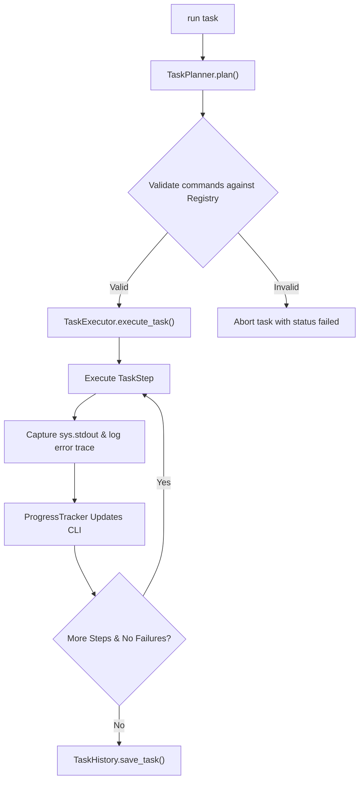

# AI OS Task Executor Specification

This document details the architecture, planning strategies, execution lifecycle, and error-handling pipelines of the **Task Executor** inside the Personal AI OS.

---

## 1. Architecture

The Task Executor acts as an orchestrator layer on top of the Command Framework, translating high-level objectives into sequential command invocations.

### Component Structure
- **Task & TaskStep**: Strongly typed models representing the overarching objective, status, step telemetry, and captured output logs.
- **TaskPlanner**: Formulates structured steps matching registered commands using rule-based parsing and fallback LLM generation.
- **TaskExecutor**: Resolves commands in sequence, redirects standard outputs to step logs, and handles flow control.
- **ProgressTracker**: Intercepts state changes to display real-time terminal metrics.
- **TaskHistory**: Locally serializes and deserializes task execution JSON records to `.aios_tasks/`.

---

## 2. Planning Strategy

To guarantee safety and prevent the execution of arbitrary actions, the planner strictly adheres to a **Closed-World Command Map**:

1. **Exact Registry Matching**: Plans are composed entirely of existing commands registered in the `CommandRegistry`.
2. **Rule-Based Mapping**: Common multi-command pipelines (like code auditing + changelog generation) resolve deterministically to predefined pipelines.
3. **Structured Fallback Planning**: Objectives that fall outside rule boundaries invoke the LLM with a list of available command schemas to select candidate command strings.

---

## 3. Execution Lifecycle

---

## 4. Failure Handling

- **Task Termination**: By default, if any step fails, execution halts immediately to prevent compounding downstream failures.
- **Optional Steps**: Individual steps can be flagged as `optional=True`. If an optional step fails, its error is logged, but the executor continues with subsequent steps.
- **Fault Resume**: Interrupted or failed tasks can be re-run using `task resume <task_id>`. The executor will skip all completed steps and resume from the first non-completed step.
