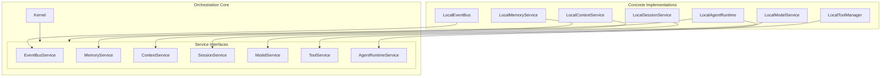

# AI OS Architecture: Dependency Inversion Principle (DIP) Refactor

This document describes the architectural design and structural changes introduced in Personal AI OS v0.2 to achieve full compliance with the Dependency Inversion Principle (DIP).

---

## 1. Dependency Direction

In Personal AI OS v0.2, high-level modules (such as `Kernel` and `AgentRuntime`) depend strictly on abstract service interfaces rather than concrete implementations.

* **Abstract Service Interfaces**: Defined in `aios.services.<service_name>` (e.g. `EventBusService`, `MemoryService`, `ContextService`, `SessionService`, `ModelService`, `ToolService`).
* **Concrete Implementations**: Defined in `aios.services.<service_name>_impl` (e.g., `LocalEventBus`, `LocalMemoryService`, etc.).
* **Kernel & Runtime Boundaries**:
  - The [Kernel](file:///Users/anzarakhtar/aios/core/src/aios/kernel.py) static imports are completely decoupled from concrete classes. It interacts with services only using their abstract signatures registered inside the `ServiceRegistry`.
  - The [LocalAgentRuntime](file:///Users/anzarakhtar/aios/core/src/aios/services/agent_impl.py#L555) interacts only with abstract interfaces, avoiding any hardcoded dependencies on specific agent implementations or concrete helper services.

---

## 2. Constructor Injection

All core modules and services receive their required dependencies via constructor injection. For example:
- `LocalAgentRuntime` requires type-hinted service interfaces (`EventBusService`, `MemoryService`, `ContextService`, `ToolService`, `ModelService`) which are injected during system construction.
- `MockAgent`, `DeveloperAgent`, and `CareerAgent` have their dependencies injected as interfaces, completely decoupling them from the execution runtime.

---

## 3. Composition Root

We introduced a centralized composition root in [bootstrap.py](file:///Users/anzarakhtar/aios/core/src/aios/bootstrap.py). 

* **Responsibility**: The Composition Root is the *only* place in the production code where concrete service classes are imported and constructed.
* **Service Wiring**: It instantiates the concrete services, wires them together, registers the agents to the runtime, registers the services on a `ServiceRegistry`, and passes the registry to the `Kernel`.
* **Zero Scattering**: Concrete object graph instantiation is no longer scattered across the codebase.

---

## 4. Service Lifecycle

Every service registered in the `ServiceRegistry` conforms to the `ServiceLifecycle` contract:

1. **initialize()**: Instantiates local resources (e.g., registers event types on the Event Bus or subscribes to events).
2. **on_ready()**: Executed once all services have been registered.
3. **on_active()**: Executed when transitioning to an active session context.
4. **teardown()**: Invoked during graceful system shutdown to flush buffers, release file locks, and clear event subscribers in reverse order of initialization.
