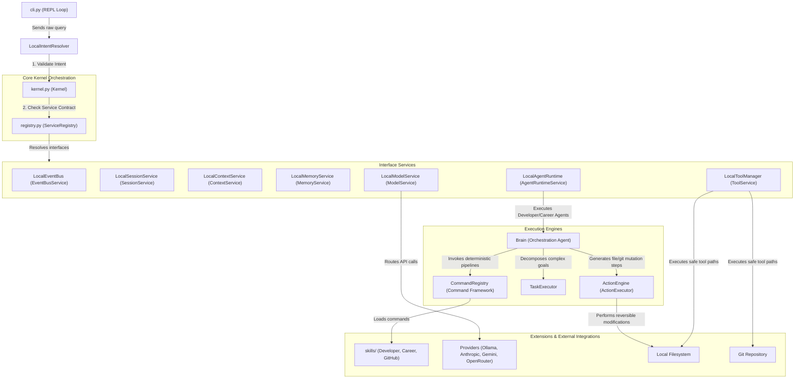
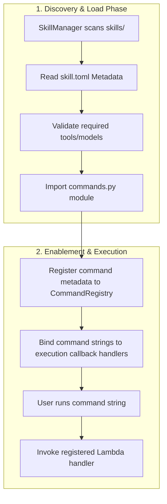
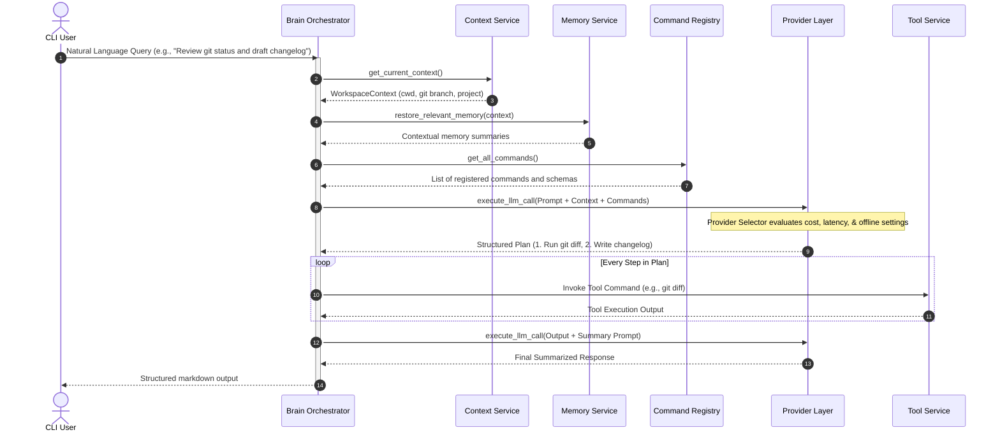
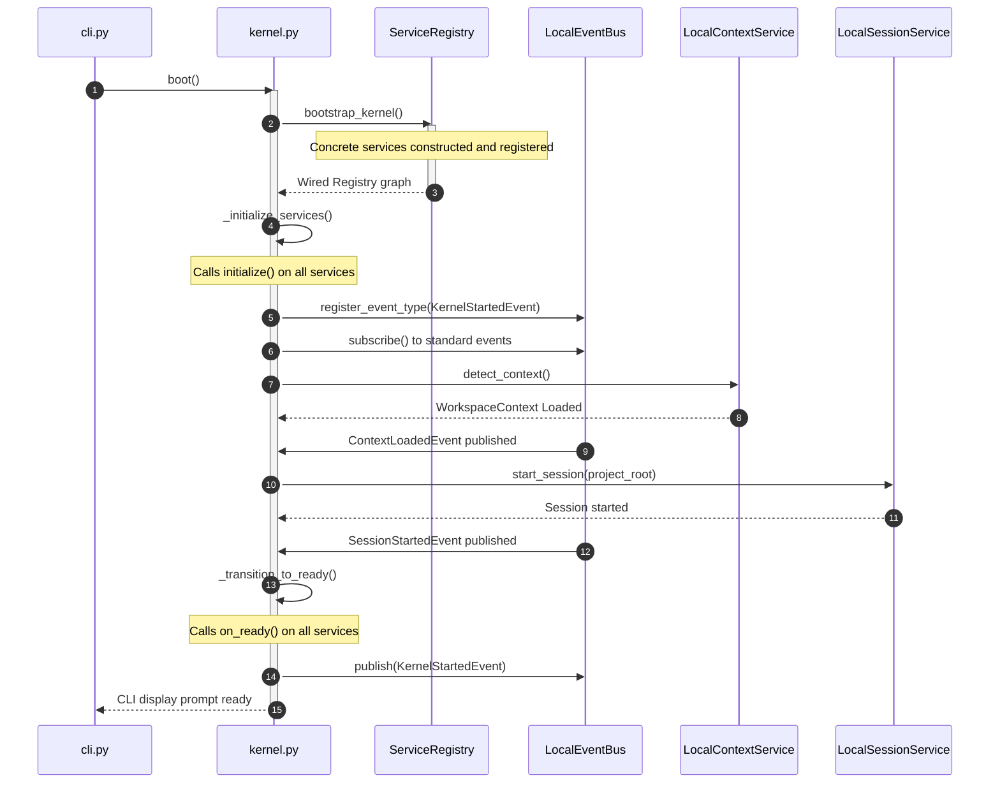
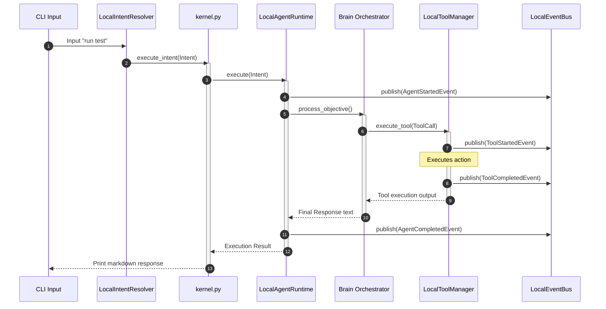

# 02 — Architecture Guidelines
**Version 1.0** · *Classified: For One Person Only* · *July 2026*

---

## Document Metadata
* **Purpose**: Provide the authoritative architectural blueprint, component design standards, communication protocols, and execution lifecycles for the Personal AI OS. It serves as the primary technical specification for engineers extending the OS.
* **Scope**: Applies to the entire repository runtime graph, covering CLI entrypoints, core kernel modules, service layers, skill packages, memory stores, and provider clients.
* **Audience**: Systems Architects, Backend Developers, and AI coding agents.
* **Related Documents**:
  * [00_PROJECT_VISION.md](file:///Users/anzarakhtar/aios/docs/00_PROJECT_VISION.md) - Philosophical and constitutional objectives.
  * [01_ENGINEERING_GUIDELINES.md](file:///Users/anzarakhtar/aios/docs/01_ENGINEERING_GUIDELINES.md) - Coding principles and Definition of Done.
  * [15_SYSTEM_DESIGN.md](file:///Users/anzarakhtar/aios/docs/15_SYSTEM_DESIGN.md) - Architectural class diagrams and models.
  * [16_ENGINEERING_BIBLE.md](file:///Users/anzarakhtar/aios/docs/16_ENGINEERING_BIBLE.md) - Low-level module mapping and REPL parsing sequences.
* **Future Extensions**: This document will be updated as the system transitions from a single-process local runtime to a distributed daemon model or introduces a web client interface.

---

## 1. Purpose of this Document
This document defines the technical design patterns, modular boundaries, lifecycle hooks, and communication protocols of the Personal AI OS. It ensures that the software remains maintainable, extensible, and clean over a decade of continuous development. It acts as the definitive guide to **how the system is constructed**, enabling human developers and AI agents to implement features without breaking kernel isolation boundaries.

---

## 2. Scope
This document specifies the system architecture of the monorepo located at `/Users/anzarakhtar/aios`. It details the structural relationships between:
* **The Core Orchestration Layer** (`kernel.py`, `bootstrap.py`, `registry.py`).
* **The Core Services** (Event Bus, Memory, Session, Context, Tool, Model, Intent, Agent Runtime).
* **The Execution Engines** (Brain, Task Executor, Action Engine, Command Framework).
* **The Extension Packages** (Skills, Tool implementations, Provider adapters).

It does not cover syntax rules, naming conventions, or testing tools, which are specified in [04_CODING_STANDARDS.md](file:///Users/anzarakhtar/aios/docs/04_CODING_STANDARDS.md) and [06_TESTING_GUIDELINES.md](file:///Users/anzarakhtar/aios/docs/06_TESTING_GUIDELINES.md).

---

## 3. Architectural Principles

The Personal AI OS architecture is designed around several core principles to maintain a clean codebase:

```
+-----------------------------------------------------------------------------------+
|                            ARCHITECTURAL PRINCIPLES                               |
+--------------------------+--------------------------------------------------------+
| Principle                | Technical Definition                                   |
+--------------------------+--------------------------------------------------------+
| Modular Architecture     | Components are decoupled behind abstract interfaces.   |
| Separation of Concerns   | Infrastructure orchestration contains no domain logic. |
| Event-Driven Design      | Modules communicate asynchronously via Event Bus.      |
| Dependency Injection     | Services receive dependencies via constructors.        |
| Composition Root         | Graph wiring is isolated in bootstrap.py.              |
| Interface-First Design   | Callers depend on registry contracts, not concrete impl|
| Extensibility            | New skills and tools plug in without core changes.     |
| Maintainability          | Hard file line limits (400 lines) keep files readable. |
+--------------------------+--------------------------------------------------------+
```

* **Modular Architecture**: Systems are isolated into discrete modules (e.g., memory, tool executing, model routing). Modifying one component does not require changes in others.
* **Separation of Concerns**: The orchestration kernel manages service execution but knows nothing about specific skills (like career advice or coding). Domain logic is isolated in skill adapters.
* **Event-Driven Design**: Components communicate asynchronously by publishing typed events to a central, synchronous event bus (`LocalEventBus`). This decouples publishers from consumers.
* **Dependency Injection (DI)**: Classes receive their dependencies (such as event buses or database services) via constructor parameters. Mocking interfaces for testing is clean and requires no global state manipulation.
* **Composition Root**: Object graphs are wired in a single location: [bootstrap.py](file:///Users/anzarakhtar/aios/core/src/aios/bootstrap.py). Scattered class instantiations are banned.
* **Interface-First Design**: Callers interact with abstract contracts defined under `aios.services`. Concrete implementations (prefixed with `Local` or `Mock`) are hidden behind service contracts.
* **Extensibility**: The system is designed to support the addition of new skills, model providers, and terminal tools without modifying core services.
* **Maintainability**: Clear limits on cyclomatic complexity and class parameters, combined with a **400-line limit per file**, prevent codebases from decaying.

---

## 4. High-Level Architecture

The system operates as a local-first service graph managed by the Kernel. User inputs are processed by the Command Framework or routed through the Brain to coordinate LLM providers, memory systems, and secure filesystem tools.



---

## 5. Core Components

Every core component follows a strict lifecycle and contract boundary:

### 5.1 Kernel
* **Purpose**: Act as the boot engine and coordinator for the operating system process.
* **Responsibilities**:
  * Loads `config.toml` at startup.
  * Coordinates initialization and teardown of registered services.
  * Captures environment context and boots sessions.
  * Transitions the runtime state (`HALTED` ➔ `BOOTING` ➔ `READY` ➔ `BUSY` ➔ `SHUTTING_DOWN`).
* **Dependencies**: `ServiceRegistry`, `OSConfig`, `EventBusService`, `SessionService`, `ContextService`, `IntentResolverService`.
* **Extension Points**: None (Protected core).
* **Lifecycle**: Instantiated by the composition root ➔ `boot()` initializes services and starts sessions ➔ `execute_intent()` runs work ➔ `shutdown()` tears down services in reverse order.
* **Communication**: Direct synchronous interface calls; publishes `KernelStartedEvent`.
* **Protected Status**: **Protected Core**. Modifications are prohibited without direct user consent.

### 5.2 Bootstrap
* **Purpose**: Configure and wire the system graph (Composition Root).
* **Responsibilities**:
  * Instantiates concrete services (`LocalEventBus`, `LocalMemoryService`, etc.).
  * Wires dependencies through constructors.
  * Registers agents (e.g., `DeveloperAgent`, `CareerAgent`) into the Agent Runtime.
  * populates the `ServiceRegistry` and returns a configured Kernel.
* **Dependencies**: Concrete services, registry, kernel, and agent implementations.
* **Extension Points**: Registration of new agents and services.
* **Lifecycle**: Executed once during Kernel boot.
* **Communication**: Instantiates modules directly.
* **Protected Status**: **Protected Core**.

### 5.3 Event Bus
* **Purpose**: Provide synchronous, typed, local messaging between components.
* **Responsibilities**:
  * Manages event type registration to maintain structured messaging.
  * Dispatches published events to registered subscriber callback handlers.
  * Prevents runtime message leaks.
* **Dependencies**: None.
* **Extension Points**: Registering custom event classes inheriting from `Event`.
* **Lifecycle**: Active throughout the Kernel lifecycle.
* **Communication**: Handles synchronous pub-sub dispatches.
* **Protected Status**: **Protected Core**.

### 5.4 Brain
* **Purpose**: Resolve natural language queries by coordinating skills, planning workflows, and orchestrating models.
* **Responsibilities**:
  * Compiles active context (workspace metadata, memory tiers) into LLM prompt contexts.
  * Routes queries to appropriate skills and providers.
  * Outlines execution steps and monitors execution outcomes.
* **Dependencies**: `ModelService`, `MemoryService`, `ContextService`, `ToolService`, `CommandRegistry`.
* **Extension Points**: Adding new agent scripts and prompt structures.
* **Lifecycle**: Invoked dynamically per query by the `AgentRuntimeService`.
* **Communication**: Publishes agent telemetry events (`AgentStartedEvent`, `AgentCompletedEvent`, `AgentFailedEvent`).
* **Protected Status**: **Protected Core**.

### 5.5 Memory Service
* **Purpose**: Manage the collection, storage, and lifecycle of the user's permanent, long-lived, and short-term records.
* **Responsibilities**:
  * Persists user context, insights, and milestones.
  * Prunes short-lived logs and compresses long-term tables.
  * Retrieves relevant blocks matching the active workspace context.
* **Dependencies**: `EventBusService`, `LocalMemoryStorage`.
* **Extension Points**: Implementing custom storage adapters (e.g., SQL, Vector).
* **Lifecycle**: Loaded at boot; flushes caches to disk during teardown.
* **Communication**: Listens for system context, tool execution, and session events.
* **Protected Status**: **Protected Core**.

### 5.6 Session Service
* **Purpose**: Manage the persistence of interactive dialogue threads and user commands.
* **Responsibilities**:
  * Generates session IDs and maps workspace roots.
  * Flushes active message sequences to `.aios_conversations/` at shutdown.
  * Restores aborted session states on startup.
* **Dependencies**: `EventBusService`.
* **Extension Points**: Implementing custom database storage engines.
* **Lifecycle**: active during active sessions.
* **Communication**: Publishes `SessionStartedEvent` and `SessionEndedEvent`.
* **Protected Status**: Core Infrastructure.

### 5.7 Context Service
* **Purpose**: Inspect the workspace environment and provide metadata to the system.
* **Responsibilities**:
  * Resolves CWD, git roots, active branches, and project names.
  * Fallbacks to current directories when git is unavailable.
  * Monitors workspace folders and triggers updates when directories change.
* **Dependencies**: `EventBusService`, `git` command tools.
* **Extension Points**: Custom file trackers or directory analyzers.
* **Lifecycle**: active throughout the Kernel runtime.
* **Communication**: Publishes `ContextLoadedEvent` and `ContextChangedEvent`.
* **Protected Status**: Core Infrastructure.

### 5.8 Intent Resolver
* **Purpose**: Parse raw user queries into system executions.
* **Responsibilities**:
  * Validates command inputs against registered command signatures.
  * Routes matching entries to command handlers.
  * Fallbacks unmatched natural language queries to the Brain.
* **Dependencies**: `CommandRegistry`.
* **Extension Points**: Custom intent regex mapping.
* **Lifecycle**: Executed per user query from the REPL loop.
* **Communication**: Direct interface routing.
* **Protected Status**: Core Infrastructure.

### 5.9 Conversation Engine
* **Purpose**: Persist multi-turn dialogue trees for active agent frameworks.
* **Responsibilities**:
  * Appends message models to dialogue files.
  * Triggers history compression when messages exceed threshold counts.
  * Generates dialogue summaries containing technical decisions and action items.
* **Dependencies**: `ModelService`, `ConversationStore`.
* **Extension Points**: Dialog compression strategies.
* **Lifecycle**: Created per session; persists files under `.aios_conversations/`.
* **Communication**: Direct API calls.
* **Protected Status**: Core Infrastructure.

### 5.10 Action Engine
* **Purpose**: Execute mutating operations safely using human-in-the-loop gates.
* **Responsibilities**:
  * Decomposes file edits, creations, and git tasks into structured steps.
  * Calculates risk levels and blocks high-risk steps until approved.
  * Caches file backups to coordinate reverse rollbacks if a step fails.
* **Dependencies**: `ToolService`.
* **Extension Points**: Custom transaction executors.
* **Lifecycle**: Active during mutating tasks.
* **Communication**: Direct pipeline telemetry.
* **Protected Status**: **Protected Core**.

### 5.11 Task Executor
* **Purpose**: Orchestrate sequential execution pipelines for compound commands.
* **Responsibilities**:
  * Plans step chains matching registered command definitions.
  * Tracks progress and writes stdout logs to `.aios_tasks/`.
  * Supports resuming interrupted tasks.
* **Dependencies**: `CommandRegistry`, `TaskHistory`.
* **Extension Points**: Custom progress visualizations.
* **Lifecycle**: Active during task execution.
* **Communication**: Direct method calls.
* **Protected Status**: **Protected Core**.

### 5.12 Provider Layer
* **Purpose**: Decouple the Core OS from individual LLM provider configurations.
* **Responsibilities**:
  * Manages provider config settings, costs, and availability metrics.
  * Handles failover routing if a connection is lost.
  * Supports offline execution by routing queries to local models (Ollama, LM Studio).
* **Dependencies**: None.
* **Extension Points**: Registering new providers and model capabilities.
* **Lifecycle**: Active throughout the Kernel lifecycle.
* **Communication**: Direct API interfaces.
* **Protected Status**: **Protected Core**.

---

## 6. Skill Architecture

Skills are modular capability packages located under [skills/](file:///Users/anzarakhtar/aios/skills/).



### 6.1 Skill Lifecycle
1. **Discovery**: At boot, the `SkillManager` scans directories under `skills/` for `skill.toml`.
2. **Metadata Validation**: The manager reads the config schema and checks that required models and tools are available.
3. **Module Loading**: The system imports `commands.py` and executes `register_commands()`.
4. **Enablement**: Registered commands are added to the system-wide `CommandRegistry`.
5. **Execution**: The CLI and Brain map objectives to command handlers and run them.
6. **Teardown**: The registry unbinds command handlers at shutdown.

---

## 7. Brain Architecture

The Brain coordinates models and tools to resolve complex natural-language objectives.



---

## 8. Provider Architecture

The Provider Layer decouples the system from specific LLM provider APIs:

```
+--------------------------------------------------------+
|                    PROVIDER LAYER                      |
| (Handles configs, cost metrics, and error routing)      |
+---------------------------+----------------------------+
                            |
                            v
+--------------------------------------------------------+
|                MODEL INTELLIGENCE LAYER                |
| (Planned: maps task complexity to capabilities)       |
+---------------------------+----------------------------+
                            |
                            v
+--------------------------------------------------------+
|                       OMNIROUTE                        |
| (Applies offline rules, context limits, & failovers)   |
+---------------------------+----------------------------+
                            |
                            v
+--------------------------------------------------------+
|                    PROVIDERS REGISTRY                  |
| (Anthropic / OpenAI / Gemini / OpenRouter / Ollama)    |
+--------------------------------------------------------+
```

* **Decoupling Rationale**: Skills should focus entirely on task execution and domain logic. They must never contain provider-specific client code. This design ensures that swapping a model provider requires zero changes to skill packages.
* **Routing Philosophy**: OmniRoute applies filters to incoming requests:
  1. If `offline_mode = True`, it routes the request to local providers (Ollama, LM Studio).
  2. It checks prompt token size against provider context limits.
  3. If a provider times out, OmniRoute handles failover by routing to the next provider in the fallback chain.

---

## 9. Memory Architecture

The Memory Engine manages user context and history:
* **Workspace Memory**: Captures local environment metrics (e.g., active directories, active branches). This data is loaded dynamically based on workspace path changes.
* **Conversation Memory**: Manages dialog threads under `.aios_conversations/` to keep agent interactions persistent.
* **Knowledge Base**: Curated directories containing project templates and research summaries under `docs/` and `design/`.
* **Context Building**: When compiling prompts, the Memory Engine merges active workspace context, recent conversation history, and permanent goals. This keeps token usage efficient by omitting irrelevant details.

---

## 10. Conversation Architecture
* **Lifecycle**: Created when an agent starts a dialogue ➔ Appends message structures ➔ flushes to disk as JSON records ➔ Archive flags applied on close.
* **History Compression**: When a dialogue thread exceeds **10 messages**, the engine keeps the latest **4 messages** verbatim. The older messages are compiled and sent to the LLM to generate a summary block.
* **Summary Schema**: The generated summary updates the conversation entity with high-level summaries, technical decisions, action items, and unresolved questions.

---

## 11. Action Engine

The Action Engine executes mutating operations safely:

```
[Brain Plan] ➔ [Decompose to Mutating Steps] ➔ [Security Risk Check] 
                                                        |
                                                (If HIGH risk)
                                                        |
                                                [Approval Gate]
                                                        |
                                                    (Approved)
                                                        |
                                          [Cache Target File Backup]
                                                        |
                                             [Execute Step Mutations]
                                            /                       \
                                        (Success)                (Failure)
                                          /                           \
                               [Report Status]            [RollbackCoordinator Reverts]
```

* **Reversibility**: Before writing, modifying, or deleting any workspace file, the engine reads the file's current contents and caches a backup. If any step fails, the `RollbackCoordinator` restores the cached content to undo side effects.

---

## 12. Task Executor
* **Planning**: Decomposes high-level objectives into sequential steps mapped to registered commands.
* **Execution**: Executes commands in order, redirecting outputs to logs under `.aios_tasks/`.
* **Resume**: If execution halts, the executor uses the task ID to reload the execution state, skip completed steps, and resume from the first incomplete step.

---

## 13. Command Framework
* **CommandRegistry**: The central index storing command signatures and lambda handlers.
* **Discovery**: Scans monorepo directories and skill packages at startup to register commands.
* **Natural Language Fallback**: If an input command does not match any registry signature, the Intent Resolver forwards the query to the Brain for natural language processing.

---

## 14. Event Flow

This section details sequence mappings for system events:

### 14.1 System Startup Event Flow


### 14.2 Request Processing & Tool Flow


---

## 15. Repository Structure

The monorepo conforms to the flat layout defined in [01_ENGINEERING_GUIDELINES.md](file:///Users/anzarakhtar/aios/docs/01_ENGINEERING_GUIDELINES.md):

```text
/ (root)
├── config/                 # Active system environment configurations
│   └── config.toml         # Preferred models, providers, and settings
├── core/                   # The Core OS Package
│   ├── ARCHITECTURE.md     # Core package architectural rules
│   ├── pyproject.toml      # Build, Ruff, and Pytest configs
│   ├── src/
│   │   └── aios/           # Main package namespace
│   │       ├── cli.py      # Entry point console REPL loop
│   │       ├── kernel.py   # State machine and orchestrator
│   │       ├── registry.py # Service registration contract
│   │       ├── bootstrap.py# Centralized Composition Root
│   │       ├── providers/  # Model router submodules (OmniRoute)
│   │       └── services/   # Abstract contracts and concrete services
│   └── tests/              # Package testing suite
├── docs/                   # System design documentation
├── architecture/           # Folder for system diagrams and schemas
├── design/                 # Folder for UX designs and screenshots
├── diagrams/               # Raw files for Mermaid/Draw.io files
├── assets/                 # Custom static images and logo components
├── examples/               # Usage scripts and sample skill code
├── templates/              # Standard file and prompt templates
├── pyproject.toml          # Monorepo pyproject workspace configurations
└── README.md               # Onboarding and documentation directory map
```

---

## 16. Protected Core Policy

The following systems are classified as **Protected Core**:
* **Kernel (`kernel.py`)**
* **Brain (`brain/`)**
* **Event Bus (`event_bus_impl.py`)**
* **Memory Service (`memory_impl.py`)**
* **Provider Layer (`providers/`)**
* **Action Engine (`services/action/`)**
* **Task Executor (`services/task/`)**

### Extension Over Modification
Developers and AI agents are prohibited from modifying files in the protected core to add feature requirements. New capabilities must be implemented by extending the system:
* Registering new skills inside `skills/`.
* Exposing new commands through `CommandRegistry`.
* Creating custom tool submodules under the tool service.
* Adding provider adapters to OmniRoute.

---

## 17. Extension Guidelines

To extend the Personal AI OS safely:
1. **Adding a Capability**:
   * Create a new folder inside `skills/` with the appropriate prefix.
   * Write `skill.toml` declaring metadata and required dependencies.
   * Implement execution handlers inside `commands.py` and register them via `register_commands()`.
2. **Adding a Tool**:
   * Write a subclass of `Tool` inside `services/tool_impl.py` or a dedicated package.
   * Define the input schema, returned data format, and risk level.
3. **Registering Custom Prompt Templates**:
   * Store system prompts as markdown templates under the skill's `prompts/` directory.

---

## 18. Architectural Decision References
Instead of duplicating technical arguments, refer to the following records in [10_DECISION_LOG.md](file:///Users/anzarakhtar/aios/docs/10_DECISION_LOG.md):
* **ADR-0001**: Choice of Python.
* **ADR-0002**: Local Event Bus architecture.
* **ADR-0003**: filesystem storage specifications.

---

## 19. Future Architecture

Future extensions will construct the following interfaces and skills:

* **Renderer**: A local web server (Next.js/Vite) running a secure dashboard. It will communicate with the Kernel via HTTP/WebSockets to display task progress and memory structures.
* **Notion Skill**: Provides automated database sync and page creations.
* **n8n Skill**: Interfaces with local n8n workflow triggers.
* **Development Workspace Skill**: Integrates local compiler toolchains, docker containers, and automated code testing.
* **Research Skill**: Orchestrates web search engines and document parsers.
* **Supabase Skill**: Interfaces with local database clusters.
* **Vercel Skill**: Automates project deployments and environment checks.
* **Personal Skill**: Manages local habits trackers and task lists.
* **Project Intelligence Skill**: Analyzes project velocity and scopes deliverables.
* **Daily Dashboard**: Renders morning briefings, task priorities, and career progress metrics.

---

## 20. Summary
The Personal AI OS architecture balances loose coupling and modular design. By isolating the Kernel from specific domain logic, enforcing Dependency Inversion, routing actions through an event bus, and requiring human-in-the-loop gates for mutating operations, the system remains a secure, high-speed, and maintainable partner designed to grow with the user over a decade of use.
