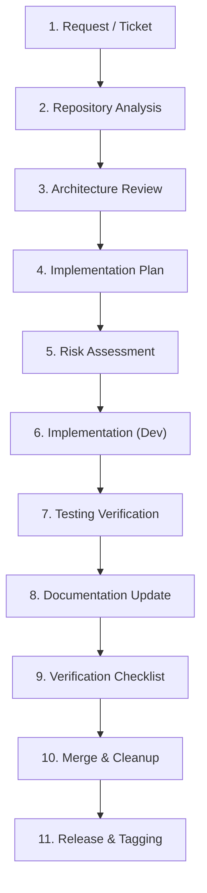

# 03 — Implementation Guidelines
**Version 1.0** · *Classified: For One Person Only* · *July 2026*

---

## Document Metadata
* **Purpose**: Define the standardized implementation workflow, software development lifecycle (SDLC) playbook, coding phases, and verification checklists for the Personal AI OS. It serves as the developer handbook for both humans and AI agents.
* **Scope**: Applies to all modifications, new feature branches, skill additions, and refactoring efforts across the monorepo.
* **Audience**: Core Developers, Systems Integrators, and AI Coding Agents.
* **Related Documents**:
  * [00_PROJECT_VISION.md](file:///Users/anzarakhtar/aios/docs/00_PROJECT_VISION.md) - Constitutional guiding principles.
  * [01_ENGINEERING_GUIDELINES.md](file:///Users/anzarakhtar/aios/docs/01_ENGINEERING_GUIDELINES.md) - Definition of Done (DoD) and dependency policies.
  * [02_ARCHITECTURE_GUIDELINES.md](file:///Users/anzarakhtar/aios/docs/02_ARCHITECTURE_GUIDELINES.md) - Kernel boundaries and composition roots.
  * [04_CODING_STANDARDS.md](file:///Users/anzarakhtar/aios/docs/04_CODING_STANDARDS.md) - Styling, sizing, and error handling syntax.
  * [05_SECURITY_GUIDELINES.md](file:///Users/anzarakhtar/aios/docs/05_SECURITY_GUIDELINES.md) - Risk levels and credentials management.
  * [06_TESTING_GUIDELINES.md](file:///Users/anzarakhtar/aios/docs/06_TESTING_GUIDELINES.md) - Pytest fixtures and coverage gates.
* **Future Extensions**: Future iterations will define automated check runs using git webhooks once the CI pipeline is established.

---

## 1. Purpose
This document serves as the operational playbook for introducing code changes to the Personal AI OS. It outlines the step-by-step development process, from repository analysis through to final release, ensuring that all contributors maintain the integrity, safety, and performance of the system.

---

## 2. Scope
This playbook governs all files and folders inside the `/Users/anzarakhtar/aios` monorepo. It applies to:
* **Infrastructure changes**: Modifications to the Core Kernel, Service Registry, bootstrap graph, or Event Bus.
* **Feature additions**: Development of new Skills, Model Providers, custom CLI Command handlers, or shell Tools.
* **Maintenance tasks**: Bug fixes, performance optimizations, documentation updates, and refactoring.

---

## 3. Target Audience
* **Human Developers**: Providing a structured pipeline to maintain project discipline, speed, and safety.
* **AI Coding Agents**: Serving as a strict contextual prompt constraint that outlines how the agent must gather context, formulate plans, write code, run tests, and format commits.

---

## 4. Feature Development Lifecycle

The lifecycle of any change is managed through a sequence of gates. No step may be bypassed.



### 4.1 Phase Descriptions
1. **Request**: The user issues a command or task objective (e.g., "Add support for Vercel deployment tool").
2. **Repository Analysis**: Search and inspect the codebase to discover affected modules, existing tools, and related helper commands.
3. **Architecture Review**: Evaluate service registry dependencies and verify if any changes modify the **Protected Core**.
4. **Implementation Plan**: Write a detailed, structured plan specifying files, tests, and rollback strategies.
5. **Risk Assessment**: Map execution steps to risk classifications (READ, WRITE, MODIFY, DELETE, NETWORK) and establish approval gates.
6. **Implementation**: Write the python logic and interface wiring.
7. **Testing**: Run the local pytest suite and write unit/integration tests to reach 85% coverage.
8. **Documentation Update**: Modify inline docstrings, update the relevant skill README, and document decisions.
9. **Verification Checklist**: Perform a final compliance audit against coding standards and safety boundaries.
10. **Merge**: Integrate code into the `main` branch and delete the feature branch.
11. **Release**: Bump the minor/patch version and update the changelog in plain language.

---

## 5. Repository Analysis Process

Before writing a single line of code, developers and AI agents must analyze the repository to locate boundaries and utilities.

```
+-----------------------------------------------------------------------------------+
|                            REPOSITORY ANALYSIS CHECKLIST                          |
+--------------------------+--------------------------------------------------------+
| Audit Item               | Verification Command / Tool                            |
+--------------------------+--------------------------------------------------------+
| Existing Abstractions    | Check core/src/aios/services/base.py and stubs.py      |
| Dependency Trees         | Review core/pyproject.toml and shared workspace configs|
| Protected Core check     | Verify if the target file is in the Protected Core list|
| Command Registry lookup  | Search CLI command definitions in skills/ & core/src/  |
| Skill & Provider check   | Check skills/ metadata and providers/ Registry list    |
+--------------------------+--------------------------------------------------------+
```

### 5.1 Step-by-Step Context Discovery
1. **Locate Abstractions**: Inspect [stubs.py](file:///Users/anzarakhtar/aios/core/src/aios/services/stubs.py) and [base.py](file:///Users/anzarakhtar/aios/core/src/aios/services/base.py) to check if an abstract service class already exists for the capability.
2. **Identify Protected Core Boundaries**: Ensure the change does not alter files in the protected list (e.g., `kernel.py`, `LocalEventBus`). If a change is required inside these folders, pause and route the task through the **Protected Core Workflow** (Section 8).
3. **Scan Related Commands**: Review command keywords by searching [discovery.py](file:///Users/anzarakhtar/aios/core/src/aios/services/command/discovery.py) or running command audits in the terminal to avoid namespace collisions.
4. **Inspect Existing Skills**: Check the folder structure under `skills/` to evaluate if the new capability fits inside an existing skill category (e.g., `developer` skill) or requires a new package.

---

## 6. Implementation Planning

All tasks require a written plan before editing code. The implementation plan must conform to the following template:

### 6.1 Implementation Plan Template
```markdown
# Implementation Plan: [Feature/Bug Name]

## 1. Objective
*Provide a concise summary of what this change achieves.*

## 2. Scope
*List the explicit functional requirements and boundaries (what it does NOT cover).*

## 3. Files Affected
*Specify exact relative paths to all files to be created or modified.*
* E.g., [core/src/aios/services/tool_impl.py](file:///Users/anzarakhtar/aios/core/src/aios/services/tool_impl.py)

## 4. Dependencies
*List added packages (with exact pinned versions) or imports required.*

## 5. Risk Assessment
*Define risk classification (LOW, MEDIUM, HIGH) per step and map security gates.*

## 6. Testing Strategy
*Detail unit test mocks, integration targets, and manual execution commands.*

## 7. Rollback Strategy
*Provide step-by-step commands to revert changes if tests fail or compilation breaks.*

## 8. Documentation Impact
*List READMEs, docstrings, and ADR files to be updated.*
```

---

## 7. Feature Classification

To optimize effort and enforce appropriate quality controls, changes are classified into specific categories:

### 7.1 Classification Routing Matrix
* **Bug Fix**:
  * *Description*: Resolves an error, test failure, or unintended runtime behavior.
  * *Approach*: Reproduce the issue with a failing unit test ➔ Write the fix ➔ Verify that the test passes and Ruff check is green.
* **Enhancement**:
  * *Description*: Extends an existing capability (e.g., adding an optional command flag).
  * *Approach*: Write the code updates ➔ Add regression tests ➔ Confirm 85% test coverage.
* **Refactor**:
  * *Description*: Restructures files or simplifies functions without changing behavior.
  * *Approach*: Ensure zero changes to CLI API signature ➔ Run test suite to verify tests remain green.
* **New Skill**:
  * *Description*: Introduces a new category of capabilities (e.g., `finance` skill).
  * *Approach*: Create `skills/id/` ➔ Implement `skill.toml` and `commands.py` ➔ Register commands.
* **Integration**:
  * *Description*: Connects a third-party tool or client API (e.g., Notion integration).
  * *Approach*: Route calls through the Tool Service boundary ➔ Add user approval gates.
* **Provider**:
  * *Description*: Integrates a new LLM provider model.
  * *Approach*: Subclass the Model Provider interface ➔ Update OmniRoute config registry.
* **Infrastructure**:
  * *Description*: Modifies the Core Kernel, Service Registry, or Event Bus.
  * *Approach*: Requires a formal ADR, approval log, and full regression test execution.
* **Documentation**:
  * *Description*: Updates guidelines, project plans, templates, or inline notes.
  * *Approach*: Adhere to markup guidelines ➔ Validate file links.

---

## 8. Protected Core Workflow

If a task requires changes inside the **Protected Core** (Kernel, Brain, Provider routing, Event Bus, Memory Service, Action Engine, Task Executor):

```
                       +---------------------------------------+
                       |    PROTECTED CORE MODIFICATION FLOW   |
                       +-------------------+-------------------+
                                           |
                                           v
                             Does it modify a protected file?
                               /                           \
                            (No)                           (Yes)
                             /                               \
                     Proceed with normal              Is there an extension point?
                      feature development              (subclass, event subscriber)
                                                         /                     \
                                                      (Yes)                    (No)
                                                       /                         \
                                            Implement via extension        1. Draft ADR in ADR log
                                            with zero core code changes    2. Require User approval
                                                                           3. Verify full regression
```

1. **Extension Check**: Audit the service registry to check if the objective can be solved by subclassing an abstract helper, registering a tool, or subscribing to an Event Bus event instead of editing core files.
2. **Draft ADR**: If core changes are unavoidable, write a detailed Architecture Decision Record (ADR) in [10_DECISION_LOG.md](file:///Users/anzarakhtar/aios/docs/10_DECISION_LOG.md).
3. **Approval Gate**: Stop execution and obtain explicit approval from the user before writing code.
4. **Regression Run**: Following implementation, run all integration and validation tests across all core workspaces.

---

## 9. Skill Implementation Workflow

This section outlines the steps to build a new Skill:

### 9.1 Step-by-Step Skill Design
1. **Directory Setup**: Create a folder `skills/<skill_id>/`.
2. **Metadata Setup (`skill.toml`)**: Define dependencies, category, and command mappings.
   * *Example*:
     ```toml
     [skill]
     id = "github"
     name = "GitHub Integration Skill"
     version = "1.0.0"
     commands = ["git push", "create pull request"]
     required_tools = ["git"]
     required_models = ["gemini-1.5-pro"]
     ```
3. **Command Implementation (`commands.py`)**: Write the Python logic and register handlers using `register_commands()`.
   * *Example*:
     ```python
     def register_commands(registry, kernel, conv_manager):
         registry.register_command(
             CommandMetadata(
                 name="git push",
                 description="Push commits to git remote",
                 category=CommandCategory.DEVELOPER
             ),
             lambda args: execute_git_push(kernel, args)
         )
     ```
4. **Prompts Directory (`prompts/`)**: Place agent system prompts inside `<skill_id>/prompts/` as markdown files.
5. **Dynamic Loading**: Verify that the `SkillManager` discovers, installs, and registers commands automatically during system boot.

---

## 10. Provider Implementation Workflow
1. **Provider Subclassing**: Implement client adapters by overriding base signatures under `core/src/aios/providers/`.
2. **Registry Configuration**: Add metadata entries (context sizes, costs, latencies) inside `registry.py` and `config.py`.
3. **Failover Integration**: Wire the adapter into `ProviderSelector` to support fallback execution loops.
4. **Offline Modes**: Ensure that local adapters (Ollama, LM Studio) execute when offline configurations are activated.

---

## 11. Testing Workflow

Testing is the primary mechanism to protect codebase quality. Refer to [06_TESTING_GUIDELINES.md](file:///Users/anzarakhtar/aios/docs/06_TESTING_GUIDELINES.md) for detail configurations.

* **Unit Tests**: Mandatory for all new functions, logic blocks, and parser routines. Write unit tests to check public methods.
* **Integration Tests**: Mandatory for database writes, event bus notifications, and provider connections.
* **Regression Tests**: Required when modifications are made to the Protected Core. Ensure existing tests continue to pass.

---

## 12. Documentation Workflow

Documentation must be updated alongside codebase changes. For formatting syntax, consult [07_DOCUMENTATION_GUIDELINES.md](file:///Users/anzarakhtar/aios/docs/07_DOCUMENTATION_GUIDELINES.md).

* **Source Code updates**: Add Google-style docstrings to all modified or created classes and functions.
* **Registry updates**: Update metadata properties inside `pyproject.toml` or Toml registries.
* **Decision Logging**: Log new dependencies or architectural shifts in [10_DECISION_LOG.md](file:///Users/anzarakhtar/aios/docs/10_DECISION_LOG.md).
* **Onboarding updates**: Document new CLI commands or environment variables in the root [README.md](file:///Users/anzarakhtar/aios/README.md).

---

## 13. Code Review Workflow

Contributors (human or AI) must audit changes against this checklist before merging:

* **Architecture compliance**: Does the code respect Kernel-Service boundaries and avoid direct import couplings?
* **Dependency compliance**: Are all package additions pinned to an exact version and documented in the decision log?
* **Coding Standards**: Does the file contain under 400 lines? Are cyclomatic complexities under 10? Are docstrings present?
* **Testing validation**: Does test coverage reach 85%? Do all pytest runs pass?
* **Commit formats**: Does the commit message use conventional formatting (`feat:`, `fix:`) and include appropriate AI trailers?

---

## 14. Security Review Workflow

Before code submission, verify compliance with [05_SECURITY_GUIDELINES.md](file:///Users/anzarakhtar/aios/docs/05_SECURITY_GUIDELINES.md):
* Ensure no secrets, tokens, or private workspace paths are hardcoded in files.
* Confirm tool permissions and ensure high-risk commands (e.g. deletions, remote posts) route through approval gates.
* Filter sensitive parameters from standard output logs.

---

## 15. Performance Review Workflow
* **Command Latency**: Verify core command routing takes under **200ms** (measured via uptime execution telemetry).
* **Context footprint**: Inspect prompt generation payloads to verify that token usage remains optimized.

---

## 16. Verification Checklist

Complete this checklist before declaring a task complete:

- [ ] Linter checks (`ruff check` and `ruff format`) run successfully with zero errors.
- [ ] The entire pytest suite passes successfully with zero warnings.
- [ ] Code coverage matches or exceeds targets (minimum **85%** on modified files).
- [ ] No secrets or keys are stored in source configurations or git history.
- [ ] Google-style docstrings are written for all public APIs.
- [ ] The roadmap or feature list is updated in documentation logs.

---

## 17. Definition of Completion
A task milestone is considered complete only when the code compiles with zero warnings, all pytest runs pass, test coverage targets are met, documentation updates are committed, git logs use conventional formatting, and the human user verifies execution on the interactive CLI.

---

## 18. Common Mistakes
* **Monolithic Files**: Letting class scripts grow beyond 400 lines without splitting.
* **Mixed commits**: Combining refactoring steps with functional enhancements or bug fixes.
* **Dependency inflation**: Importing massive frameworks (like LangChain) when simple standard Python modules are sufficient.
* **Hardcoded settings**: Storing provider keys, models, or directory paths directly in python source code.
* **Bypassing event loops**: Wiring sibling modules directly instead of leveraging Event Bus subscriptions.

---

## 19. Future Extensions
This implementation playbook will be updated to support containerized sandbox execution environments (e.g., Docker testing pools) and CI automation workflows (e.g., GitHub Actions) as development scaling increases.

---

## 20. Summary
The Software Development Playbook ensures consistency, safety, and speed for the Personal AI OS. By adhering to structured context analysis, implementation planning, classification routing, testing protocols, and verification checklists, developers maintain a clean, performant, and stable digital assistant.
