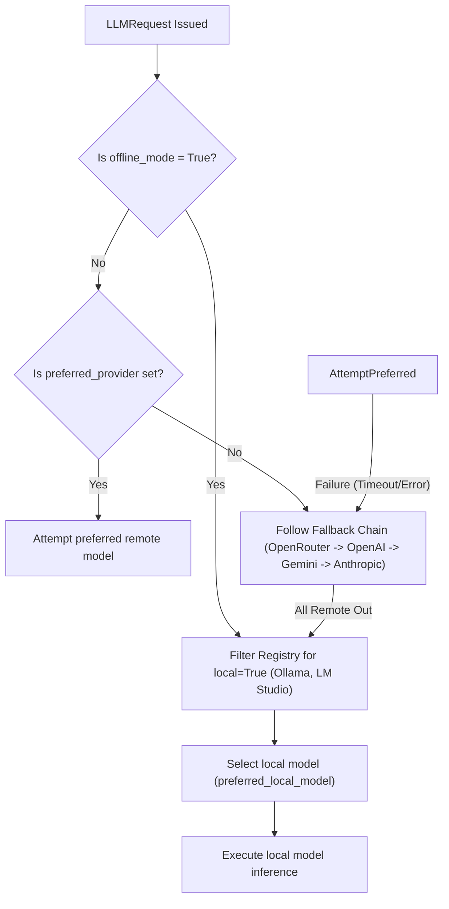

# 04 — AI Model Strategy
**Version 1.0** · *Classified: For One Person Only* · *July 2026*

---

## Document Metadata
* **Purpose**: Define LLM model configurations, routing rules, cost/latency criteria, fallback hierarchies, and local-first execution strategies.
* **Scope**: Applies to the `ModelService` interface, concrete provider integrations (e.g., Anthropic, OpenRouter, Gemini, Ollama, LM Studio), and the selector logic.
* **Audience**: AI Architects, Backend Engineers, and AI coding agents.
* **Related Documents**:
  * [00_PROJECT_VISION.md](file:///Users/anzarakhtar/aios/docs/00_PROJECT_VISION.md) - Constitutional privacy and performance parameters.
  * [01_ENGINEERING_GUIDELINES.md](file:///Users/anzarakhtar/aios/docs/01_ENGINEERING_GUIDELINES.md) - Boring-by-default selection criteria.
  * [02_ARCHITECTURE_GUIDELINES.md](file:///Users/anzarakhtar/aios/docs/02_ARCHITECTURE_GUIDELINES.md) - Decoupled Model Adapter interfaces and specifications.
  * [14_TECH_STACK.md](file:///Users/anzarakhtar/aios/docs/14_TECH_STACK.md) - List of supported libraries.
  * [PROVIDERS.md](file:///Users/anzarakhtar/aios/PROVIDERS.md) - Implementation reference.
* **Future Extensions**: Integration details for edge-based models and hardware-accelerated local frameworks (e.g., Apple MLX) as hardware capacity improves.

---

## 1. Introduction & Strategy Goals
The **AI Model Strategy** establishes a flexible, cost-effective, and secure routing system for LLM queries. By isolating model access behind the abstract `ModelService` and utilizing `ProviderSelector` rules, the Personal AI OS achieves:
* **Vendor Independence**: Swapping AI model providers requires zero changes to core orchestration logic.
* **Privacy Protection**: Local routing rules ensure sensitive data stays local when offline modes are activated.
* **Cost Control**: Prompts are dynamically routed between high-capability models and lightweight models based on task complexity.
* **Resiliency**: Fallback hierarchies guarantee session operations continue even during remote endpoint outages.

---

## 2. Supported Model Registry

The system maintains a centralized registry of approved models across 7 default provider environments, defining context windows, capabilities, and token costs:

```
+--------------------------------------------------------------------------------------------------+
|                                    SUPPORTED MODEL REGISTRY                                      |
+--------------+-------------------------------+-------------+------------+-----------+------------+
| Provider     | Supported Models              | Context Win | Input Cost | Out Cost  | Type       |
+--------------+-------------------------------+-------------+------------+-----------+------------+
| openrouter   | qwen/qwen3-coder              | 128k        | $0.15 / M  | $0.60 / M | Remote     |
|              | anthropic/claude-3-5-sonnet   |             |            |           |            |
|              | meta-llama/llama-3-8b-instruct|             |            |           |            |
+--------------+-------------------------------+-------------+------------+-----------+------------+
| openai       | gpt-4o, gpt-4o-mini,          | 128k        | $5.00 / M  | $15.00 /M | Remote     |
|              | gpt-3.5-turbo                 |             |            |           |            |
+--------------+-------------------------------+-------------+------------+-----------+------------+
| anthropic    | claude-3-5-sonnet,            | 200k        | $3.00 / M  | $15.00 /M | Remote     |
|              | claude-3-opus, claude-3-haiku |             |            |           |            |
+--------------+-------------------------------+-------------+------------+-----------+------------+
| gemini       | gemini-1.5-pro,               | 1M          | $1.25 / M  | $3.75 / M | Remote     |
|              | gemini-1.5-flash              |             |            |           |            |
+--------------+-------------------------------+-------------+------------+-----------+------------+
| ollama       | llama3, mistral, phi3,        | 8k          | $0.00      | $0.00     | Local      |
|              | codellama                     |             |            |           |            |
+--------------+-------------------------------+-------------+------------+-----------+------------+
| lmstudio     | luna-7b, hermes-2-pro         | 4k          | $0.00      | $0.00     | Local      |
+--------------+-------------------------------+-------------+------------+-----------+------------+
| mock         | mock-model                    | 1M          | $0.00      | $0.00     | Local Test |
+--------------+-------------------------------+-------------+------------+-----------+------------+
```

---

## 3. Model Routing & Capability Mapping

To balance performance and budget, the system categorizes tasks and routes queries to models matching the required intelligence level:

```
+-------------------------------------------------------------------------------------------------+
|                                 TASK-TO-MODEL MAPPING MATRIX                                    |
+--------------------------+-----------------------+-----------------------+----------------------+
| Task Category            | Primary Model         | Fallback Model        | Local (Offline) Model|
+--------------------------+-----------------------+-----------------------+----------------------+
| Complex Coding / Audits  | claude-3-5-sonnet     | qwen/qwen3-coder      | codellama            |
| General Dialogue / Chat  | gpt-4o-mini           | gemini-1.5-flash      | llama3               |
| Memory / Summarization  | gemini-1.5-flash      | gpt-4o-mini           | mistral              |
| Structured JSON Parsing  | gpt-4o                | gemini-1.5-pro        | hermes-2-pro         |
+--------------------------+-----------------------+-----------------------+----------------------+
```

### 3.1 Routing Rules
* **Coding Tasks**: Code reviews, refactoring, and test generation require deep logical capabilities. These requests route to high-capability models (`claude-3-5-sonnet`).
* **Text / General Queries**: Lightweight conversational prompts map to faster, low-cost models (`gpt-4o-mini`, `gemini-1.5-flash`).
* **Offline Fallbacks**: When system variables isolate the environment, requests route to Ollama (`llama3` or `codellama`).

---

## 4. Local-First & Offline Operations

In alignment with the constitutional *Private* and *Secure* principles, the Personal AI OS is built local-first:



* **Offline Configurations**: Setting `offline_mode = True` inside `config/config.toml` blocks outgoing external API connections.
* **Data Privacy Boundaries**: High-privacy tasks (e.g., parsing personal banking logs, credential management) are restricted to local processing models (`ollama/llama3`) to ensure no data leaves the system.

---

## 5. Fallback & Failover Architecture

The `ProviderSelector` coordinates failures using the following steps:

1. **Filtering Pipeline**:
   * Inspects the prompt token length. If it exceeds the provider’s context window (e.g., 8k for Ollama), the provider is skipped.
   * Checks the health monitor. If the provider's success rate is below **50%**, the selector bypasses the provider.
2. **Sequential Failover**:
   * If a connection times out or returns an HTTP rate limit error (HTTP 429), the error is caught by `ProviderRouter`.
   * The `ProviderHealthMonitor` marks the provider as unhealthy.
   * The router queries the selector for the next available candidate in the `fallback_chain` list.
3. **Degraded Execution Mode**:
   * If all remote and local providers are offline, the system degrades gracefully. It prints a warning: `[ModelService] All providers offline. Continuing in local-mock mode.` and routes calls to the `mock` provider to prevent crashes.

---

## 6. Prompt Management & Token Optimization

To control costs and latency, the system utilizes strict prompt management:
* **Template Isolation**: All prompts reside in external markdown files under `prompts/` and `skills/<skill_id>/prompts/`. Prompts must never be hardcoded in Python files.
* **Token Pruning Rules**:
  * Prior to querying the model adapter, the session manager evaluates history sizes.
  * Conversations are compressed (summarized) when messages exceed **10 turns** (as detailed in [02_ARCHITECTURE_GUIDELINES.md](file:///Users/anzarakhtar/aios/docs/02_ARCHITECTURE_GUIDELINES.md)).
  * System prompts are structured to require brief, direct responses (e.g., outputting only code diffs instead of conversational explanations) to minimize output token generation costs.

---

## 7. Future Extensions
* **Apple Silicon MLX Integration**: Planning native MLX integrations to support fast local inference directly on Mac GPU hardware, bypassing Ollama server latency.
* **Local Embeddings & Vector Stores**: Deploying lightweight local sentence transformers (e.g., `all-MiniLM-L6-v2`) for semantic indexing of the knowledge base without external API dependencies.
