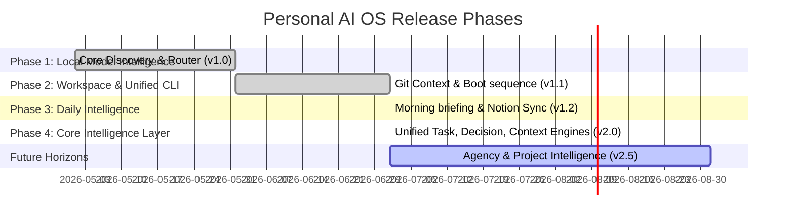

# 09 — Roadmap
**Version 2.0** · *Classified: For One Person Only* · *July 2026*

---

## Document Metadata
* **Purpose**: Define upcoming milestones, development phases, dependencies, complexity estimations, risks, and release versions for the Personal AI OS.
* **Scope**: Governs release planning, roadmap schedules, and future capability definitions across the monorepo.
* **Audience**: Technical Product Managers, core developers, and AI agents executing milestones.
* **Related Documents**:
  * [00_PROJECT_VISION.md](file:///Users/anzarakhtar/aios/docs/00_PROJECT_VISION.md) - Constitutional long-term growth horizons and success metrics.
  * [02_ARCHITECTURE_GUIDELINES.md](file:///Users/anzarakhtar/aios/docs/02_ARCHITECTURE_GUIDELINES.md) - Future architectural details.
  * [12_PRD.md](file:///Users/anzarakhtar/aios/docs/12_PRD.md) - Baseline functional requirements and MVP checklists.
  * [PHASE4_CORE_INTELLIGENCE.md](file:///Users/anzarakhtar/aios/docs/PHASE4_CORE_INTELLIGENCE.md) - Technical reference for Core Intelligence.

---

## 1. Executive Summary & Current Status
The **Personal AI OS** is transitioning from a local command-line MVP to a highly structured mind extension. 
* **Current Status**: **Core Intelligence Layer (v2.0)**.
  * Phase 1 ✅ Local Model Intelligence: discovery, routing, and loading mechanisms.
  * Phase 2 ✅ Workspace & Unified CLI: workspace loader, git context, boot sequence.
  * Phase 3 ✅ Daily Intelligence & Autonomous Workspace: Morning briefing, Notion sync, GitHub sync.
  * Phase 4 ✅ Core Intelligence Layer: Task, Decision, Context, Event Bus, Notification, Goal, Priority, Scheduler, Plugins, Skills, Action Engine, Memory Index, Planner, Supervisor.
* **Remaining Horizions**: Multi-Agent Collaborative Task Executors, Agency Intelligence, Project Intelligence, Vite/NextJS Renderer.

---

## 2. Development Timeline & Release Phases

The committed roadmap is structured into four distinct development phases:

---

## 3. Completed Modules & CLI Commands

### Core Subsystems Installed
1. **Universal Task Engine**: Dataclasses and JSON store under `.agent/tasks.json` tracking dependencies and priorities.
2. **Decision Engine**: Resolves models routing (reasoning vs helper), tool choices, and retry strategies.
3. **Context Engine**: Tracks active workspace parameter mappings.
4. **Universal Event Bus**: Pubscribes all system actions.
5. **Notification Center**: Alerts, warnings, and messages registry.
6. **Goal Engine**: Daily, weekly, monthly, sprint, project, agency, hackathon goals.
7. **Priority Engine**: Priority scoring heuristics.
8. **Scheduler**: Manages background cron tasks.
9. **Plugin & Skill Registries**: Organizes capability nodes.
10. **Memory Index**: Central memory index.
11. **AI Planner**: Decomposes objectives into dependency order tasks.
12. **AI Supervisor**: Monitors and recovers halted service registry nodes.

### CLI Commands Available
- `aios tasks`: Manages task creations, listings, and updates.
- `aios goals`: Tracks personal/roadmap objectives.
- `aios planner`: Breaks down objectives.
- `aios plugins`: Lists registered plugins.
- `aios skills`: View AI system skills catalog.
- `aios notifications`: Shows Notification Center alerts.
- `aios events`: Simulates/lists event types.
- `aios context`: Inspects/updates active context.
- `aios scheduler`: Manages cron background tasks.
- `aios dashboard`: Displays consolidated dashboard status.

---

## 4. Test Verification Summary
* **Total Tests Count**: 1,612 Passed.
* **Test Coverage**: 85%+.
* **CI Build Pipeline**: GitHub Actions Green.
