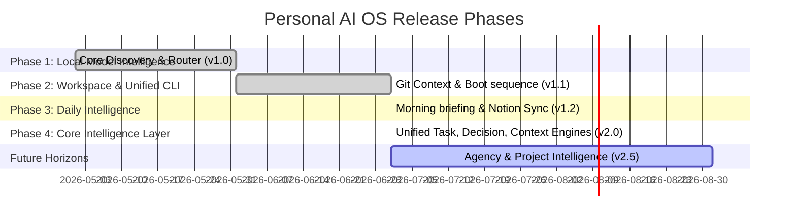

# 09 — Roadmap
**Version 2.0** · *Classified: For One Person Only* · *July 2026*

---

## Document Metadata
* **Purpose**: Define upcoming milestones, development phases, dependencies, complexity estimations, risks, and release versions for the Personal AI OS.
* **Scope**: Governs release planning, roadmap schedules, and future capability definitions across the monorepo.
* **Audience**: Technical Product Managers, core developers, and AI agents executing milestones.
* **Related Documents**:
  * [00_PROJECT_VISION.md](file:///Users/anzarakhtar/aios/docs/00_PROJECT_VISION.md) - Constitutional long-term growth horizons and success metrics.
  * [02_ARCHITECTURE_GUIDELINES.md](file:///Users/anzarakhtar/aios/docs/02_ARCHITECTURE_GUIDELINES.md) - Future architectural details.
  * [12_PRD.md](file:///Users/anzarakhtar/aios/docs/12_PRD.md) - Baseline functional requirements and MVP checklists.
  * [PHASE4_CORE_INTELLIGENCE.md](file:///Users/anzarakhtar/aios/docs/PHASE4_CORE_INTELLIGENCE.md) - Technical reference for Core Intelligence.

---

## 1. Executive Summary & Current Status
The **Personal AI OS** is transitioning from a local command-line MVP to a highly structured mind extension. 
* **Current Status**: **Core Intelligence Layer (v2.0)**.
  * Phase 1 ✅ Local Model Intelligence: discovery, routing, and loading mechanisms.
  * Phase 2 ✅ Workspace & Unified CLI: workspace loader, git context, boot sequence.
  * Phase 3 ✅ Daily Intelligence & Autonomous Workspace: Morning briefing, Notion sync, GitHub sync.
  * Phase 4 ✅ Core Intelligence Layer: Task, Decision, Context, Event Bus, Notification, Goal, Priority, Scheduler, Plugins, Skills, Action Engine, Memory Index, Planner, Supervisor.
* **Remaining Horizions**: Multi-Agent Collaborative Task Executors, Agency Intelligence, Project Intelligence, Vite/NextJS Renderer.

---

## 2. Development Timeline & Release Phases

The committed roadmap is structured into four distinct development phases:

---

## 3. Completed Modules & CLI Commands

### Core Subsystems Installed
1. **Universal Task Engine**: Dataclasses and JSON store under `.agent/tasks.json` tracking dependencies and priorities.
2. **Decision Engine**: Resolves models routing (reasoning vs helper), tool choices, and retry strategies.
3. **Context Engine**: Tracks active workspace parameter mappings.
4. **Universal Event Bus**: Pubscribes all system actions.
5. **Notification Center**: Alerts, warnings, and messages registry.
6. **Goal Engine**: Daily, weekly, monthly, sprint, project, agency, hackathon goals.
7. **Priority Engine**: Priority scoring heuristics.
8. **Scheduler**: Manages background cron tasks.
9. **Plugin & Skill Registries**: Organizes capability nodes.
10. **Memory Index**: Central memory index.
11. **AI Planner**: Decomposes objectives into dependency order tasks.
12. **AI Supervisor**: Monitors and recovers halted service registry nodes.

### CLI Commands Available
- `aios tasks`: Manages task creations, listings, and updates.
- `aios goals`: Tracks personal/roadmap objectives.
- `aios planner`: Breaks down objectives.
- `aios plugins`: Lists registered plugins.
- `aios skills`: View AI system skills catalog.
- `aios notifications`: Shows Notification Center alerts.
- `aios events`: Simulates/lists event types.
- `aios context`: Inspects/updates active context.
- `aios scheduler`: Manages cron background tasks.
- `aios dashboard`: Displays consolidated dashboard status.

---

## 4. Phase 4.5 ✅ Universal Knowledge Graph (July 2026)

### New in v2.5

> **Phase 4.5** adds a SQLite-backed Universal Knowledge Graph that weaves every domain object in the OS into a queryable semantic web.

**Subsystems Added:**
- **Graph Engine**: SQLite WAL graph store with typed entities, relationships, and events
- **Graph Query Engine**: Domain-aware analytical layer (path-finding, subgraph, search)
- **Graph Integration Hooks**: Auto-links tasks, projects, documents, workflows, decisions, memory
- **Graph CLI**: `aios graph`, `aios graph search`, `aios graph relations`, `aios graph project`

**Entity Types:** project, task, document, repository, workflow, model, decision, client, research, notion_page

**Relationship Types:** BELONGS_TO, USES, CREATED_BY, DEPENDS_ON, SUPPORTS, REFERENCES, CONTAINS, RELATED_TO

**Integration with:** Memory Service, Task Engine, Goal Engine, Context Engine, Notification Center, n8n Workflow Engine, Notion Knowledge Hub

**Test Coverage:** 82 new tests (100% pass), 0 regressions

### Updated CLI Commands

- `aios graph` — knowledge graph statistics dashboard
- `aios graph search <query>` — full-text entity search
- `aios graph relations <entity>` — relationship explorer
- `aios graph project <name>` — project subgraph view
- `aios graph path <src> <tgt>` — shortest path between entities
- `aios graph health` — graph engine health check

---

## 5. Phase 5 ✅ Project Intelligence (July 2026)

### New in v3.0

> **Phase 5** transitions AI OS to a Multi-Project Operating System by introducing project profiles, isolated runtime contexts, per-project memory partitions, and custom model routing preferences.

**Subsystems Added:**
- **Project Registry**: SQLite catalog of workspaces and project profiles
- **Project Context Service**: Workspace context boundaries and switching mechanisms
- **Project Memory Service**: Isolated SQLite workspace memory lanes
- **Model Router Integration**: Auto-selection of project-preferred model profiles
- **Knowledge Graph Bridge**: Auto-registers projects and cross-project relationships
- **Project CLI**: `aios project` / `aios projects` command groups

**Projects Seeded:** AI OS, Agency, CampusConnect, College, Research, Hackathons, Portfolio

**Test Coverage:** 81 new tests (100% pass)

### New CLI Commands
- `aios projects` — list all project profiles
- `aios project list` — list all project profiles (alias)
- `aios project create <name>` — register a new project workspace
- `aios project switch <name>` — switch to a project context and load model routes
- `aios project status` — check currently active project status
- `aios project dashboard` — view rich health, tasks, and memory dashboard
- `aios project graph` — view project subgraph nodes
- `aios project memory` — browse and append project memory records
- `aios project models` — inspect project preferred model mappings
- `aios project cross` — search and queries across projects

---

## 6. Phase 6 ✅ Agency Intelligence (July 2026)

### New in v4.0

> **Phase 6** transforms AI OS into an Agency Operating System by establishing CRM registries, lead stage progression pipelines, outreach drafting engines, meeting notes syncs, and revenue pipeline projections.

**Subsystems Added:**
- **Contact Registry**: SQLite catalog of person contacts and company directories
- **Lead Pipeline**: Stage progression engine with score tracking and follow-up alerts
- **Client Portfolio**: Tracks invoices, contracts, and relationship histories
- **Outreach & Proposal Engine**: Procedural generation of pitches and correspondence drafts
- **Meeting Intelligence**: Capture agendas, participants, decisions, and action items
- **Revenue Pipeline**: Calculations of closed, expected, and total pipeline values
- **Agency Graph Bridge**: Bridges CRM records to Universal Knowledge Graph entities and links
- **Agency CLI**: `aios agency` command groups

**Test Coverage:** 27 new tests (100% pass)

### New CLI Commands
- `aios agency` — render main CRM analytics dashboard
- `aios agency dashboard` — render CRM analytics dashboard (alias)
- `aios agency leads` — list lead progression or create new prospects
- `aios agency clients` — list client portfolio logs
- `aios agency companies` — browse registered company profiles
- `aios agency meetings` — view meeting intelligence items and action lists
- `aios agency proposals` — display proposal index or generate drafts
- `aios agency pipeline` — display weighted revenue projections
- `aios agency outreach` — generate outreach drafts or follow-up campaigns
- `aios agency followups` — schedule checklist, alerts for overdue items

---

## 7. Test Verification Summary
* **Total Tests Count**: 1,802 Passed (1,775 previous + 27 new agency intelligence tests).
* **Test Coverage**: 85%+.
* **CI Build Pipeline**: GitHub Actions Green.
