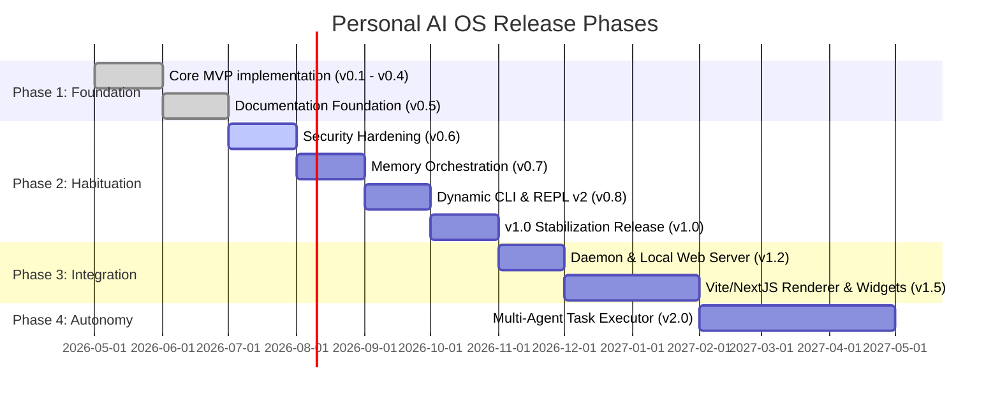

# 09 — Roadmap
**Version 1.0** · *Classified: For One Person Only* · *July 2026*

---

## Document Metadata
* **Purpose**: Define upcoming milestones, development phases, dependencies, complexity estimations, risks, and release versions for the Personal AI OS.
* **Scope**: Governs release planning, roadmap schedules, and future capability definitions across the monorepo.
* **Audience**: Technical Product Managers, core developers, and AI agents executing milestones.
* **Related Documents**:
  * [00_PROJECT_VISION.md](file:///Users/anzarakhtar/aios/docs/00_PROJECT_VISION.md) - Constitutional long-term growth horizons and success metrics.
  * [02_ARCHITECTURE_GUIDELINES.md](file:///Users/anzarakhtar/aios/docs/02_ARCHITECTURE_GUIDELINES.md) - Future architectural details (Renderer, skills).
  * [12_PRD.md](file:///Users/anzarakhtar/aios/docs/12_PRD.md) - Baseline functional requirements and MVP checklists.
* **Future Extensions**: This roadmap will be updated at the end of each project phase to log completed milestones and adjust task estimates based on user velocity.

---

## 1. Executive Summary & Current Status
The **Personal AI OS** is transitioning from a local command-line MVP to a highly structured mind extension. 
* **Current Status**: **Documentation Foundation Phase (v0.5)**.
  * Core architecture boundaries (Dependency Inversion, Event Bus, Service Registry) are implemented.
  * Core development tools (git, filesystem, model clients) are fully operational.
  * System-wide guidelines (Vision, Engineering, Security, Testing, AI Model Strategy) are written, serving as the permanent source of truth.
* **Next Objective**: Begin **Phase 2: Habituation (v0.6 to v1.0)**, focusing on security hardening, memory tiers orchestration, and developer tool enhancements.

---

## 2. Development Timeline & Release Phases

The committed roadmap is structured into four distinct development phases:

---

## 3. Detailed Milestones & Feature Specifications

### Milestone 1: Security Hardening (v0.6)
* **Status**: **In Progress** | **Priority**: P0 | **Estimated Complexity**: Medium (2 weeks)
* **Features**:
  * Implement local file database encryption (SQLCipher) for `memory.json` and `.aios_conversations/`.
  * Restrict terminal tool commands execution using macOS sandbox-exec.
  * Integrate Ruff linter checks and security scans (Bandit) as pre-commit hooks.
* **Dependencies**: Completion of [05_SECURITY_GUIDELINES.md](file:///Users/anzarakhtar/aios/docs/05_SECURITY_GUIDELINES.md).
* **Success Criteria & DoD**: All file writes are encrypted at rest, and unauthorized system commands are successfully blocked by sandbox constraints.

### Milestone 2: Memory Tier Orchestration (v0.7)
* **Status**: **Planned** | **Priority**: P0 | **Estimated Complexity**: High (3 weeks)
* **Features**:
  * Build background pruning cron jobs inside the memory service to expire short-term logs.
  * Deploy local sentence embeddings (HuggingFace transformers) for indexing workspace files.
  * Implement automatic memory update loops by tracking git commit changes and terminal commands.
* **Dependencies**: Milestone 1 (requires encrypted db storage).
* **Success Criteria & DoD**: Memory service automatically prunes expired entries at session shutdown, and vector searches return relevant context blocks under 100ms.

### Milestone 3: Dynamic CLI & REPL v2 (v0.8)
* **Status**: **Planned** | **Priority**: P1 | **Estimated Complexity**: Low (1 week)
* **Features**:
  * Integrate real-time loading spinners and stream formatting for provider queries.
  * Implement dynamic workspace context displays in the shell prompt (active branch name, project status).
  * Build a diagnostic command (`aios diagnose`) to audit provider health and system uptime.
* **Dependencies**: None.
* **Success Criteria & DoD**: Terminal rendering displays formatted Markdown, and streaming responses print characters with under 50ms latency.

### Milestone 4: v1.0 Stabilization Release (v1.0)
* **Status**: **Planned** | **Priority**: P0 | **Estimated Complexity**: Medium (2 weeks)
* **Features**:
  * Execute comprehensive integration tests across all workspaces to guarantee 85% coverage.
  * Stabilize provider selectors and model routers failovers.
  * Complete user manual documentation under the root directory.
* **Dependencies**: Milestones 1, 2, and 3.
* **Success Criteria & DoD**: Zero compilation warnings, test coverage target is reached, and the version is tagged v1.0.0 in pyproject.toml.

---

## 4. Phase 3 & Phase 4 Integration Roadmap

### Phase 3: Integration (v1.1 - v1.5)
* **Milestone 5: Daemon Execution (v1.2)** [Planned | Priority: P1 | Complexity: High]: Transition from process invocation to a background daemon running locally. Provides persistent workspace trackers and cron triggers.
* **Milestone 6: Web Renderer & Dashboard (v1.5)** [Planned | Priority: P2 | Complexity: High]: Build a Next.js local web server dashboard that displays active task execution metrics, memory graphs, and dialogue histories.

### Phase 4: Autonomy (v2.0)
* **Milestone 7: Multi-Agent Task Orchestrator (v2.0)** [Planned | Priority: P2 | Complexity: Very High]: Deploy collaborative agent frameworks. Enables spawning specialized background agents (e.g., developer, research agents) to perform tasks concurrently.

---

## 5. Risk Assessment & Mitigations

* **Risk 1: Token Context Inflation**
  * *Impact*: High cost and performance lag.
  * *Mitigation*: Enforce history compression limits, summarizing dialogue histories when conversations cross 10 turns (as defined in [04_AI_MODEL_STRATEGY.md](file:///Users/anzarakhtar/aios/docs/04_AI_MODEL_STRATEGY.md)).
* **Risk 2: Rogue Commands Execution**
  * *Impact*: Filesystem corruption or data loss.
  * *Mitigation*: Terminal commands execution requires direct shell-arguments validation, and mutating file actions are cached for reverse rollbacks.
* **Risk 3: Model Quality Variations**
  * *Impact*: Unstable workflow planning.
  * *Mitigation*: Decouple adapters from skills, allowing immediate provider swaps via OmniRoute configurations.

---

## 6. Future Ideas & Research

These ideas represent research directions and are not yet committed to the active roadmap:
* **LLM Prompt Recording**: YAML-based record and playback frameworks to support fast, offline test validation runs.
* **Apple MLX Local Inference**: Native integration to run lightweight models (e.g., Mistral-7B) directly on Apple Silicon GPUs, bypassing Ollama server latency.
* **Multi-Workspace Synchronization**: Secure, encrypted peer-to-peer workspace syncing using Git.
* **Spaced Repetition Integration**: Memory Engine automated reminders based on knowledge base updates.
