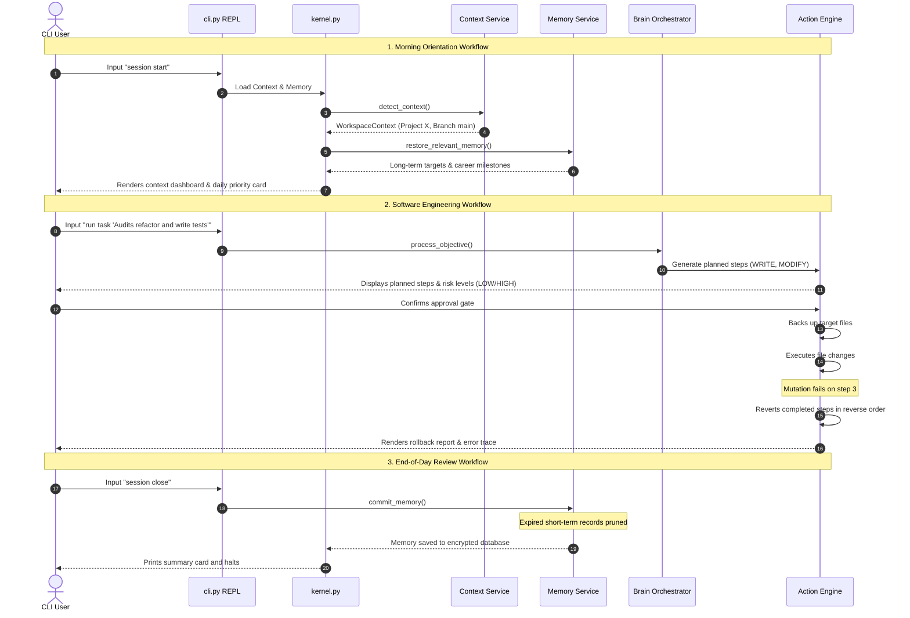

# 12 — Product Requirements Document (PRD)
**Version 1.0** · *Classified: For One Person Only* · *July 2026*

---

## Document Metadata
* **Purpose**: Define the product requirements, target user personas, functional/non-functional criteria, user workflows, and success metrics for the Personal AI OS.
* **Scope**: Governs core product feature scopes, interactive CLI behaviors, memory tier interfaces, and integration specs across the monorepo.
* **Audience**: Product Managers, Systems Engineers, Designers, and AI coding agents.
* **Related Documents**:
  * [00_PROJECT_VISION.md](file:///Users/anzarakhtar/aios/docs/00_PROJECT_VISION.md) - Constitutional vision, mission, and core philosophy.
  * [02_ARCHITECTURE_GUIDELINES.md](file:///Users/anzarakhtar/aios/docs/02_ARCHITECTURE_GUIDELINES.md) - Component systems design boundaries.
  * [05_SECURITY_GUIDELINES.md](file:///Users/anzarakhtar/aios/docs/05_SECURITY_GUIDELINES.md) - Security classifications and validations rules.
  * [09_ROADMAP.md](file:///Users/anzarakhtar/aios/docs/09_ROADMAP.md) - Release milestones and development phases.
* **Future Extensions**: This PRD will be updated as the system transitions from a local CLI shell to a web-based dashboard and multi-agent workflow orchestrator.

---

## 1. Executive Summary
The **Personal AI OS** is a local-first, privacy-focused operating system designed to act as an extension of the user’s mind. It aggregates software engineering workflows, knowledge management, project scoping, and tiered memory into a single interface. It is **not a chatbot**; it is an opinionated, developer-focused workspace coordinator that automates repetitive workflows while keeping the user in control of all final decisions.

---

## 2. Problem Statement & Target Users

### 2.1 The Problem
Modern knowledge workers, particularly software engineers, face structural frictions:
1. **Context Fragmentation**: Developers jump between IDEs, terminal windows, note-taking apps, and web chats, losing cognitive focus at each transition.
2. **Ephemeral Memory**: Standard AI search tools forget user interactions immediately, requiring the user to repeatedly re-explain code guidelines, project setups, and preferences.
3. **Privacy Exposure**: Proprietary code and personal reflections are routinely sent to external servers, exposing users to security vulnerabilities.
4. **Productivity Clutter**: General-purpose AI models validate bad plans and write generic, verbose code without understanding the user's specific context.

### 2.2 Target Users & Persona
* **Primary User**: *Anzar*, a Senior Full-Stack Engineer and Software Architect.
* **Persona Characteristics**:
  * Demands extreme speed (latency under 200ms) and keyboard-driven, command-line efficiency.
  * Works across multiple local git repositories.
  * Accumulates knowledge across diverse technical projects.
  * Prioritizes strict privacy and local data ownership.
  * Prefers direct, technical push-back over conversational flattery from AI tools.

---

## 3. Product Goals & Non-Goals

To maintain focus, the system adheres to strict boundaries (grounded in [00_PROJECT_VISION.md](file:///Users/anzarakhtar/aios/docs/00_PROJECT_VISION.md)):

* **Product Goals**:
  * Build a single, secure command line interface for software development, research, and daily workflow logging.
  * Establish a tiered, persistent memory database that loads relevant context blocks based on the active folder.
  * Ensure that high-risk mutating actions (writes, deletes) require explicit user approval and support reverse rollbacks.
  * Route requests to local model services automatically when offline config modes are active.

* **Product Non-Goals**:
  * **Not a Multi-Tenant SaaS**: The system will never support user logins, registration forms, billing systems, or SaaS subscriptions. It is built for exactly one person.
  * **Not an Autonomous Auto-Coder**: The system does not make final git commits or deploy servers without manual user confirmation.
  * **Not a Social Tool**: No integrations with social networks, email campaign tools, or notification engines that compete for user attention.

---

## 4. Functional Requirements

The system must satisfy five core functional domains:

### 4.1 Interactive CLI Shell (`cli.py`)
* The shell must boot under 200ms and display a prompt containing active workspace context metrics (cwd, git branch).
* Provide dynamic autocompletion for registered CLI commands.
* Stream output characters from model queries with low latency.

### 4.2 Workspace Context Resolver (`LocalContextService`)
* Automatically detect git repo roots, branch names, project roots, and CWD.
* Publish events to the local event bus when workspace paths are switched mid-session.
* Fallback gracefully to the current directory when git metadata is missing.

### 4.3 Tiered Memory Service (`LocalMemoryService`)
* Load permanent goals and career milestones on system boot.
* Query and cache long-term summaries matching active directory roots.
* automatically prune short-term log files at session teardown.

### 4.4 Model Adapter Router (`ModelService` / OmniRoute)
* Evaluate LLM prompt lengths and route requests to providers based on context window limits.
* Automatically fallback to alternative models if the primary provider times out.
* Route all requests to local instances (Ollama, LM Studio) when offline modes are activated.

### 4.5 Safe Action Engine (`ActionExecutor`)
* Parse planned modifications into sequential execution steps.
* Map steps to risk classifications and block high-risk actions until approved.
* Cache file contents prior to writing changes, enabling reverse rollbacks on failure.

---

## 5. Non-Functional Requirements

* **Performance & Speed**: Core command routing and system event dispatches must complete under **200ms** (excluding LLM generation latency).
* **Security & Sandboxing**: Filesystem actions must validate that target paths lie strictly within the active workspace root. Symbolic link dereferencing must block directory traversal.
* **Local Offline Stability**: If remote API endpoints fail or internet connectivity is lost, the system must continue executing using local LLM engines (Ollama/LM Studio).
* **Observable Audit Logs**: Save structured JSON files of all transaction plans, step executions, and approvals to `.aios_tasks/` and `.aios_actions/`.

---

## 6. User Workflows

---

## 7. Success Metrics & KPIs

To monitor product utility, success is evaluated against the following key performance indicators:

* **Command Latency**: 95th percentile system response time under **200ms** (verified via logging telemetry).
* **Friction reduction**: Over **90%** of automated code edits, git commits, and test validations execute successfully without requiring manual terminal corrections.
* **Offline self-sufficiency**: System operates successfully during network outages, resolving local developer tasks with zero external calls.
* **Test Suite Quality**: Code coverage on core packages and skill sets remains above **85%**.

---

## 8. Release Strategy & Version Planning

The release milestones align with the committed timeline defined in [09_ROADMAP.md](file:///Users/anzarakhtar/aios/docs/09_ROADMAP.md):
* **v0.5 (Documentation Phase)**: Baseline CLI REPL, service registry, dynamic providers registry, and system-wide documentation guidelines.
* **v0.6 (Security Hardening)**: Integration of database encryption (SQLCipher) and macOS sandbox command validation.
* **v0.7 (Memory Orchestration)**: Automatic memory updates, Cron pruning, and local vector embeddings search.
* **v1.0 (Stabilization Release)**: Verified integration tests, stable providers routing, and public release tagging.
* **v1.5 (Web UI Dashboard)**: Deploy local Next.js web server interface displaying task progress and context graphs.
* **v2.0 (Multi-Agent Autonomy)**: Coordinate background agent pipelines to perform tasks concurrently.
