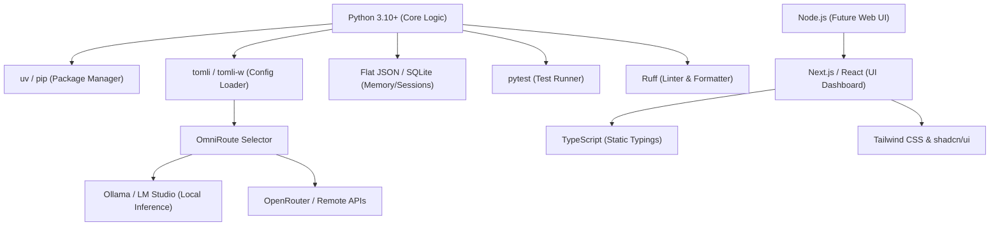

# 14 — Technology Stack
**Version 1.0** · *Classified: For One Person Only* · *July 2026*

---

## Document Metadata
* **Purpose**: Enforce the approved programming languages, dependency libraries, runtime environments, storage backends, and future frontend/backend integration suites.
* **Scope**: Governs all dependencies, configurations, and developer utilities in the monorepo.
* **Audience**: Systems Integrators, Software Architects, and AI coding agents.
* **Related Documents**:
  * [00_PROJECT_VISION.md](file:///Users/anzarakhtar/aios/docs/00_PROJECT_VISION.md) - Constitutional focus on Simple, Minimal, and Fast principles.
  * [01_ENGINEERING_GUIDELINES.md](file:///Users/anzarakhtar/aios/docs/01_ENGINEERING_GUIDELINES.md) - Boring-by-default selection criteria and version pinning rules.
  * [02_ARCHITECTURE_GUIDELINES.md](file:///Users/anzarakhtar/aios/docs/02_ARCHITECTURE_GUIDELINES.md) - Component systems design boundaries.
  * [09_ROADMAP.md](file:///Users/anzarakhtar/aios/docs/09_ROADMAP.md) - Next.js renderer timeline.
  * [13_DRD.md](file:///Users/anzarakhtar/aios/docs/13_DRD.md) - Design elements, typography, and color tokens.
* **Future Extensions**: This tech stack will be updated as new libraries are approved and logged via Architecture Decision Records (ADRs) in the decision log.

---

## 1. Technology Selection Philosophy
The Personal AI OS adheres to a **Boring-by-Default & Local-First** technology selection philosophy. Every component of our stack is evaluated against the principles defined in [01_ENGINEERING_GUIDELINES.md](file:///Users/anzarakhtar/aios/docs/01_ENGINEERING_GUIDELINES.md):
1. **Boring is Stable**: Prioritize mature, widely-adopted, and heavily-documented technologies to ensure predictability.
2. **Minimal Dependency Footprint**: Avoid importing large, complex frameworks (like LangChain) when simple standard Python packages or custom light abstractions are sufficient.
3. **Local-First & Private**: Restrict tools to local executions to secure personal data.
4. **Strict Version Lock**: Pin dependencies to exact versions to prevent breaking upstream updates.

---

## 2. Technology Dependency Graph



---

## 3. Core Technology Selection Table

For every current and planned technology, the table below outlines the core architectural justification:

```
+-----------------------------------------------------------------------------------------------------------------------------------------+
|                                                      CORE STACK JUSTIFICATION                                                           |
+------------+----------------+-------------------------------+------------------------------+---------------------------+----------------+
| Tech       | Purpose        | Selected Rationale            | Alternatives Considered      | Key Trade-off             | Scalability    |
+------------+----------------+-------------------------------+------------------------------+---------------------------+----------------+
| Python     | Core Runtime   | Broad AI libraries support,   | Rust, Go, TypeScript         | Slower execution than     | High via async |
| 3.10+      |                | rapid prototyping, simple syntax                             | compiled binaries.        | service loops. |
+------------+----------------+-------------------------------+------------------------------+---------------------------+----------------+
| uv         | Package Manager| Native C speed, instant virtual| pipenv, poetry               | Newer tool, but highly    | Pinned lock    |
|            |                | environment bootstrapping.                                   | stable local operations.  | files.         |
+------------+----------------+-------------------------------+------------------------------+---------------------------+----------------+
| tomli      | Config Loader  | Pinned standard parse library;| PyYAML, json                 | Static structure;         | Centralized    |
|            |                | matches pyproject layout.                                    | no dynamic calculations.  | config service.|
+------------+----------------+-------------------------------+------------------------------+---------------------------+----------------+
| JSON Files | Storage DB     | Simple format, readable, git-  | PostgreSQL, MongoDB          | Poor concurrency;         | Upgrade path to|
|            |                | trackable, zero db overhead.                                 | slow on huge structures.  | local SQLite.  |
+------------+----------------+-------------------------------+------------------------------+---------------------------+----------------+
| pytest     | Test Runner    | Standard framework, rich      | unittest                     | None (industry standard). | High modular   |
|            |                | fixture ecosystem.                                           |                           | fixtures.      |
+------------+----------------+-------------------------------+------------------------------+---------------------------+----------------+
| Ruff       | Code Quality   | Fast rust-based checks;       | flake8, black, pylint        | None (replaces multiple   | Instant lint   |
|            |                | formats and checks in one tool.                              | legacy tools).            | runs on CI.    |
+------------+----------------+-------------------------------+------------------------------+---------------------------+----------------+
```

---

## 4. Current Core Stack Breakdown

### 4.1 Programming Languages & Runtime
* **Python 3.10+**: Core logic, services execution, and provider routing. Python provides the optimal ecosystem for LLM providers routing, JSON parsing, and directory auditing.
* **uv / pip**: Package management and editable workspace installations (`pip install -e ./core`). `uv` is selected to speed up environment bootstrapping in under 1 second.

### 4.2 Config & Storage
* **Configuration**: `config/config.toml` parsed via `tomli` (and modified via `tomli-w` in writes). TOML is chosen over YAML for its strict, readable formatting.
* **Memory & Conversation Database**: Flat JSON structures stored under `.aios_conversations/` and `config/memory.json`. Matches our boring-by-default philosophy, allowing direct Git history audits.

### 4.3 Quality Gates
* **Pytest**: Pytest-9.1.1 executing tests under `core/tests/`. Integrated with `pytest-asyncio` for non-blocking event bus checks.
* **Ruff**: Fast, combined formatting and linting check rules, replacing black, flake8, and isort.

---

## 5. Future Technology Stack Specifications

### 5.1 Frontend Stack (Next.js Dashboard - Phase 3)
When constructing the local web server renderer (per [09_ROADMAP.md](file:///Users/anzarakhtar/aios/docs/09_ROADMAP.md)):
* **Next.js (React)**: Purpose-built React framework supporting server-side rendering (SSR) for instant dashboard page loads.
* **TypeScript**: Enforces strict static typings across UI components.
* **Tailwind CSS & shadcn/ui**: Tailwind provides fast, flexible css utility classes; shadcn/ui provides minimal, highly-accessible component patterns styled with HSL color tokens (complying with [13_DRD.md](file:///Users/anzarakhtar/aios/docs/13_DRD.md)).

### 5.2 External Backend Integrations (Phase 2 & Phase 3)
* **GitHub Integration**: Utilizes the official GitHub REST API (via `httpx` client connections) to pull pull-requests, check repository statuses, and push commit updates.
* **Notion Integration**: Custom Notion API connector to sync personal task cards and project scoping tables.
* **n8n Integration**: Webhook triggers to local n8n workflow systems.
* **Supabase Integration**: PostgreSQL storage adapter to sync knowledge summaries.
* **Vercel Integration**: Vercel deployment tool wrapper to automate static site checks.

---

## 6. Deployment Philosophy
* **Local-First Executions**: The system is packaged to run directly in the user's local terminal environment. There are no cloud hosting targets (e.g. AWS, GCP) for the core orchestrator.
* **Encapsulated Virtual Environments**: Deployments utilize isolated virtual environments (`.venv/`) pinned to exact package versions to guarantee environment stability.
