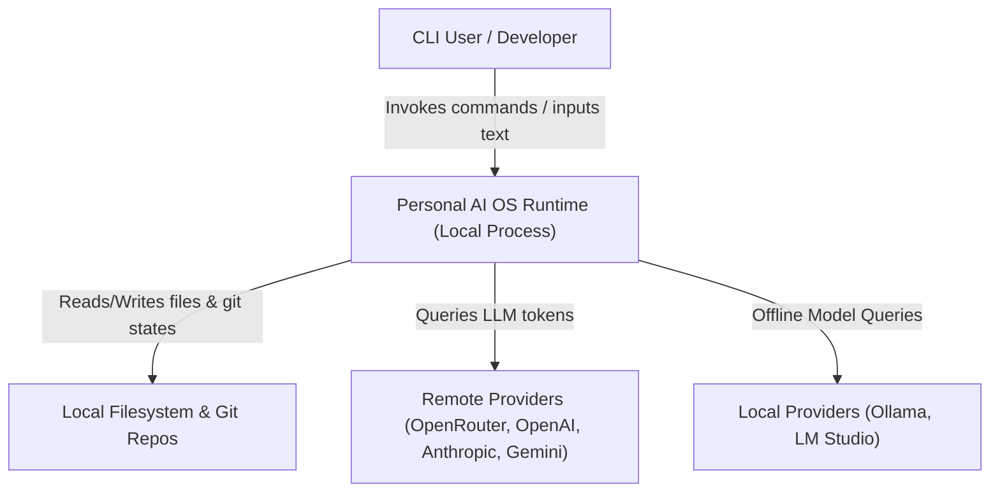
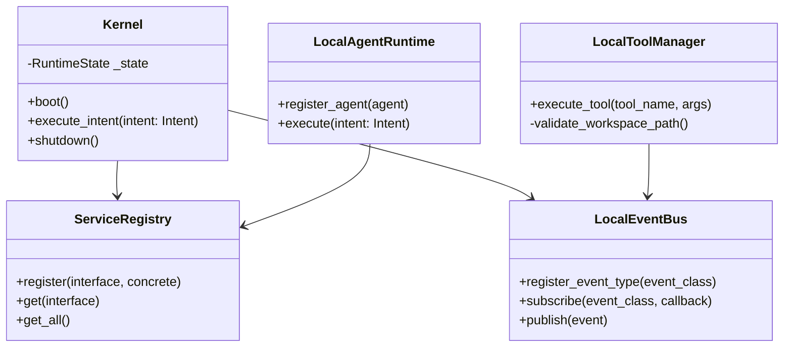
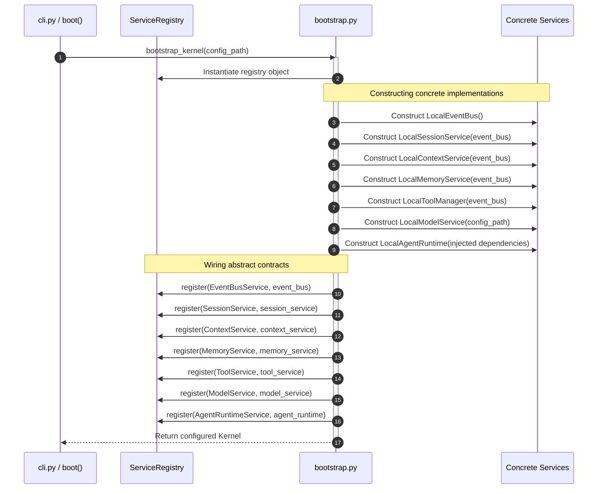

# 15 — System Design
**Version 1.0** · *Classified: For One Person Only* · *July 2026*

---

## Document Metadata
* **Purpose**: Define the subsystem specifications, interface definitions, sequence diagrams, container layouts, and failure handling profiles for the Personal AI OS.
* **Scope**: Governs all module interfaces, class interactions, and runtime topologies across the monorepo.
* **Audience**: Software Architects, Core Developers, and AI coding agents.
* **Related Documents**:
  * [00_PROJECT_VISION.md](file:///Users/anzarakhtar/aios/docs/00_PROJECT_VISION.md) - Constitutional focus on Simple, Minimal, and Fast principles.
  * [02_ARCHITECTURE_GUIDELINES.md](file:///Users/anzarakhtar/aios/docs/02_ARCHITECTURE_GUIDELINES.md) - Kernel-service Decoupling and dependency inversion specifications.
  * [12_PRD.md](file:///Users/anzarakhtar/aios/docs/12_PRD.md) - Functional and non-functional requirements.
  * [14_TECH_STACK.md](file:///Users/anzarakhtar/aios/docs/14_TECH_STACK.md) - Approved languages, libraries, and runtime ecosystems.
* **Future Extensions**: UML class specifications and message routing schemas will be expanded once the local daemon RPC interface is designed.

---

## 1. System Context & Containers

The Personal AI OS operates locally as a single-user system. The Context Diagram below details the boundary limits:

### 1.1 Container Specification
Within the local runtime environment, the system organizes execution contexts into three core containers:
1. **Interactive Shell Container**: Manages standard user input parsing, stdout rendering, and intent mapping.
2. **Kernel & Service Registry Container**: Coordinates the lifecycles, configuration loads, and routing contracts of registered services.
3. **Execution Engines Container**: Houses the planning planners, task managers, and transaction executors (Brain, Task Executor, Action Engine).

---

## 2. Component Design & Subsystems

### 2.1 Subsystem Specifications

#### A. Kernel Subsystem
* **Responsibilities**: Orchestrate initialization, state transitions, session boots, and graceful service teardowns.
* **Inputs**: Path to `config.toml`, user `Intent` objects.
* **Outputs**: `IntentResult` objects, system lifecycle telemetry events.
* **Dependencies**: `ServiceRegistry`, `OSConfig`, `EventBusService`, `SessionService`, `ContextService`.
* **Failure Handling**: Catches startup exceptions, sets state to `HALTED`, and logs details before raising a clean `RuntimeError`.
* **Extension Points**: None (Protected Core).
* **Scalability Considerations**: Keeps footprint minimal to guarantee startup under 200ms.

#### B. Event Bus Subsystem
* **Responsibilities**: Provide synchronous, typed, in-process event delivery.
* **Inputs**: Registered Event instances.
* **Outputs**: Synchronous subscriber callbacks dispatches.
* **Dependencies**: None.
* **Failure Handling**: Captures individual handler exceptions and logs them to `caplog` without interrupting remaining subscribers.
* **Extension Points**: Declaring new subclass types of `Event`.
* **Scalability Considerations**: Synchronous execution prevents thread overhead but requires handlers to perform fast, non-blocking tasks.

#### C. Local Agent Runtime Subsystem
* **Responsibilities**: Manage agent metadata, maps incoming intents, and coordinates LLM reasoning loops.
* **Inputs**: `Intent` data parameters.
* **Outputs**: `AgentResult` text responses and telemetry logs.
* **Dependencies**: `MemoryService`, `ContextService`, `ToolService`, `ModelService`.
* **Failure Handling**: Intercepts LLM timeouts or tool execution crashes and publishes `AgentFailedEvent` logs.
* **Extension Points**: Registering new agent classes (e.g. `DeveloperAgent`, `CareerAgent`).

#### D. Tool Manager Subsystem
* **Responsibilities**: Validate execution arguments, verify path security, and run subprocess commands.
* **Inputs**: Command name strings and parameter lists.
* **Outputs**: Plaintext execution logs or structured JSON results.
* **Dependencies**: `EventBusService`, shell utility libraries.
* **Failure Handling**: Rejects paths escaping boundaries with a `PermissionError` and catches execution exceptions to return clean fail statuses.
* **Extension Points**: Registering new subclasses of `Tool`.

---

## 3. Core Execution Sequences

### 3.1 Bootstrap & Dependency Injection Flow

### 3.2 Brain & Command Execution Flow
* **Sequence**:
  1. Brain receives user prompt ➔ Resolves active context via `ContextService`.
  2. Restores long-term memories via `MemoryService` ➔ Queries registered command list schemas.
  3. Sends payload to `ModelService` ➔ OmniRoute selects best provider client.
  4. Parses returned step objectives ➔ Passes file modifications to the Action Engine or executes commands via the Tool Service.
  5. Summarizes outputs and prints response to console.

---

## 4. Subsystem Interfaces

All cross-module interactions are restricted to interface contracts:
* `EventBusService`: `publish(event: Event) -> None`, `subscribe(event_type: Type[T], callback: Callable[[T], None]) -> None`.
* `MemoryService`: `restore_memory(context: WorkspaceContext) -> MemoryContext`, `commit_memory() -> None`.
* `ModelService`: `generate(request: LLMRequest) -> LLMResponse`.
* `ToolService`: `execute_tool(tool_name: str, args: List[str]) -> ToolResult`.

---

## 5. Future System Topology

* **Future Renderer Architecture (Planned)**: Next.js/Vite dashboard client communicating with the local core runtime daemon via HTTP/WebSockets JSON-RPC interfaces.
* **Future Daemon Architecture (Planned)**: The Kernel runs as a background process (`aiosd`), listening to local TCP socket files and monitoring filesystem event notifications (e.g. `watchdog` loops).
* **Future Notion / n8n Integrations (Vision)**: External event connectors triggered by changes in local database states, syncing workspace files.
