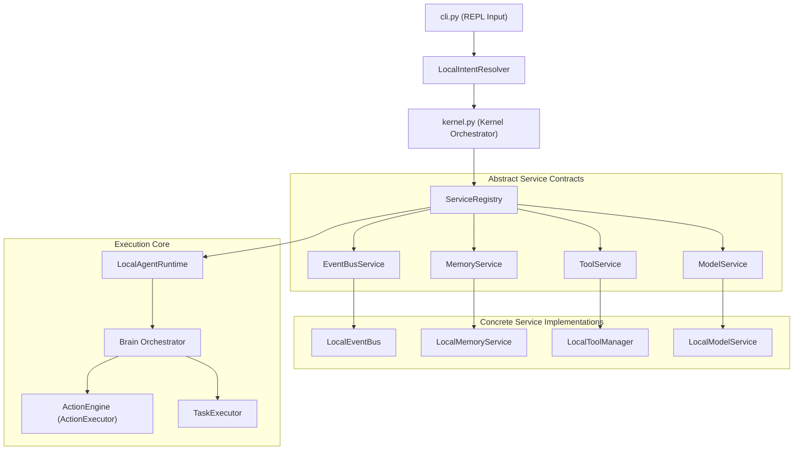

# 16 — The Engineering Bible (Official Reference Manual)
**Version 1.0** · *Classified: For One Person Only* · *July 2026*

---

## Document Metadata
* **Purpose**: Serve as the comprehensive, definitive textbook and core reference manual for the architecture, subsystems, principles, and engineering methodologies of the Personal AI OS.
* **Scope**: Governs all structural components, specifications, and execution lifecycles in the project.
* **Audience**: Technical Directors, Software Architects, Maintainers, and AI coding agents.
* **Related Documents**:
  * [00_PROJECT_VISION.md](file:///Users/anzarakhtar/aios/docs/00_PROJECT_VISION.md) - Constitutional core principles.
  * [02_ARCHITECTURE_GUIDELINES.md](file:///Users/anzarakhtar/aios/docs/02_ARCHITECTURE_GUIDELINES.md) - Dependency inversion rules.
  * [15_SYSTEM_DESIGN.md](file:///Users/anzarakhtar/aios/docs/15_SYSTEM_DESIGN.md) - Subsystem models and sequences.
  * [17_KNOWLEDGE_BASE.md](file:///Users/anzarakhtar/aios/docs/17_KNOWLEDGE_BASE.md) - System dictionary.
* **Future Extensions**: This reference manual will be updated to document changes in runtime execution models (e.g. process daemons, socket APIs) as they are deployed.

---

## 1. Introduction & Constitutional Vision
The **Personal AI OS** is a local-first, privacy-focused operating system designed to act as an extension of the user’s mind. 

Rather than a chatbot, the system functions as a keyboard-driven command CLI shell that aggregates software engineering workflows, tiered memory indexing, and project planning. 

Every design decision traces its origin back to **[00_PROJECT_VISION.md](file:///Users/anzarakhtar/aios/docs/00_PROJECT_VISION.md)** (the Project Constitution). The constitution establishes the non-negotiable principles—**Simple**, **Minimal**, **Fast**, **Modular**, **Private**, and **Honest**—which govern how the system behaves and interacts.

---

## 2. Core Philosophy & Engineering Principles

The development of the system is guided by a disciplined software engineering methodology:
* **Boring by Default**: Prioritize Python's standard library and stable, well-documented technologies to reduce maintenance overhead.
* **Optimize for Deletion**: Design modules behind strict public boundaries so they can be removed or replaced without causing breaking changes elsewhere.
* **One Reason to Change (SRP)**: Isolate files and classes around a single domain (e.g. separating command parsers from filesystem executors).
* **No Speculative Generality**: Prohibit writing placeholder code or interfaces for non-existent future requirements.
* *For details on SDLC gates and Definition of Done, consult **[01_ENGINEERING_GUIDELINES.md](file:///Users/anzarakhtar/aios/docs/01_ENGINEERING_GUIDELINES.md)**.*

---

## 3. High-Level Architecture Overview

The system architecture is built on the **Dependency Inversion Principle (DIP)**. Orchestrators and service clients never import concrete classes; they interact strictly via interfaces registered in a central registry.

* *For specifications on Composition Roots (`bootstrap.py`), constructor injection, and lifecycles, review **[02_ARCHITECTURE_GUIDELINES.md](file:///Users/anzarakhtar/aios/docs/02_ARCHITECTURE_GUIDELINES.md)** and **[15_SYSTEM_DESIGN.md](file:///Users/anzarakhtar/aios/docs/15_SYSTEM_DESIGN.md)**.*

---

## 4. Key Subsystem Deep Dives

### 4.1 The Brain Orchestration Engine
* **Purpose**: Evaluate natural language queries, build context, select appropriate skill commands, and coordinate LLM providers.
* **Flow**: Context Assembly ➔ Provider Selection (OmniRoute) ➔ Plan Formulation ➔ Pipeline Execution.
* **Interfaces**: Interacts with the `ModelService` adapter, memory storage indexes, and command registries.

### 4.2 Modular Skill System
* **Structure**: Capabilities live in standalone packages under `skills/`. Every skill must include a `skill.toml` metadata manifest, `commands.py` register hooks, and `prompts/` templates.
* **Loading**: The `SkillManager` scans directories, validates required tools, and registers commands dynamically at boot.
* *For implementation guidelines, consult **[03_IMPLEMENTATION_GUIDELINES.md](file:///Users/anzarakhtar/aios/docs/03_IMPLEMENTATION_GUIDELINES.md)**.*

### 4.3 Model Provider & OmniRoute Strategy
* **OmniRoute Selector**: Evaluates prompt lengths against context windows and queries provider metrics (success rate, latency) to select the best endpoint.
* **Offline Execution**: Blocks remote API calls and routes queries to local Ollama/LM Studio endpoints when `offline_mode = True`.
* *For routing tables and fallbacks, consult **[04_AI_MODEL_STRATEGY.md](file:///Users/anzarakhtar/aios/docs/04_AI_MODEL_STRATEGY.md)**.*

### 4.4 Tiered Memory System
* **Hierarchy**: Permanent memory (never expires), Long-Lived memory (1-3 years), and Short-Lived memory (days/weeks).
* **Context Assembly**: Restores memory blocks matching active directory paths. Expired short-term logs are pruned at shutdown.

### 4.5 Action Engine & Task Executor
* **Task Executor**: Decomposes objectives into whitelisted command steps. Tracks progress and supports resuming interrupted tasks.
* **Action Engine**: Generates safe, mutating filesystem/Git steps. Risk classifications (LOW, MEDIUM, HIGH) determine approval gates. File contents are cached before writing, enabling rollbacks on step failures.

---

## 5. Security & Verification Playbook

### 5.1 Security Safeguards
* **Path Traversal Prevention**: Canonical path resolution via `.resolve()` and workspace containment checking using `.is_relative_to(workspace_root)`. Symbolic link dereferencing outside the workspace root is blocked.
* **Command Injection Mitigation**: Subprocess commands execute with `shell=False`. Inputs are parsed using `shlex.split()` and validated against whitelisted commands (`echo`, `pwd`, `whoami`, `git` subcommands).
* *For detail guidelines, review **[05_SECURITY_GUIDELINES.md](file:///Users/anzarakhtar/aios/docs/05_SECURITY_GUIDELINES.md)**.*

### 5.2 Quality Testing
* **Test Isolation**: Assert against public contracts. The test suite runs locally with zero network calls.
* **Coverage Target**: touched files must maintain at least **85%** code coverage.
* *For fixture setups and checklists, review **[06_TESTING_GUIDELINES.md](file:///Users/anzarakhtar/aios/docs/06_TESTING_GUIDELINES.md)**.*

---

## 6. Project Terminology & Operations

### 6.1 Glossary References
* **Composition Root**: The single place (`bootstrap.py`) where class dependencies are wired.
* **Protected Core**: High-risk system directories isolated from dynamic plugin alterations.
* **History Compression**: Automated dialog summarization triggered when conversation turns exceed 10.
* *For a complete vocabulary index, review **[19_GLOSSARY.md](file:///Users/anzarakhtar/aios/docs/19_GLOSSARY.md)**.*

### 6.2 Operations Manual
* **Configuration**: Preferences are loaded from `config/config.toml`. Environmental variables handle API keys.
* **Backup & Recovery**: Daily cron scripts compress `.aios_conversations/`, `.aios_tasks/`, and `config/`. Wiping the local states and extracting backups restores the system.
* *For troubleshooting guides, review **[20_OPERATIONS_MANUAL.md](file:///Users/anzarakhtar/aios/docs/20_OPERATIONS_MANUAL.md)**.*
