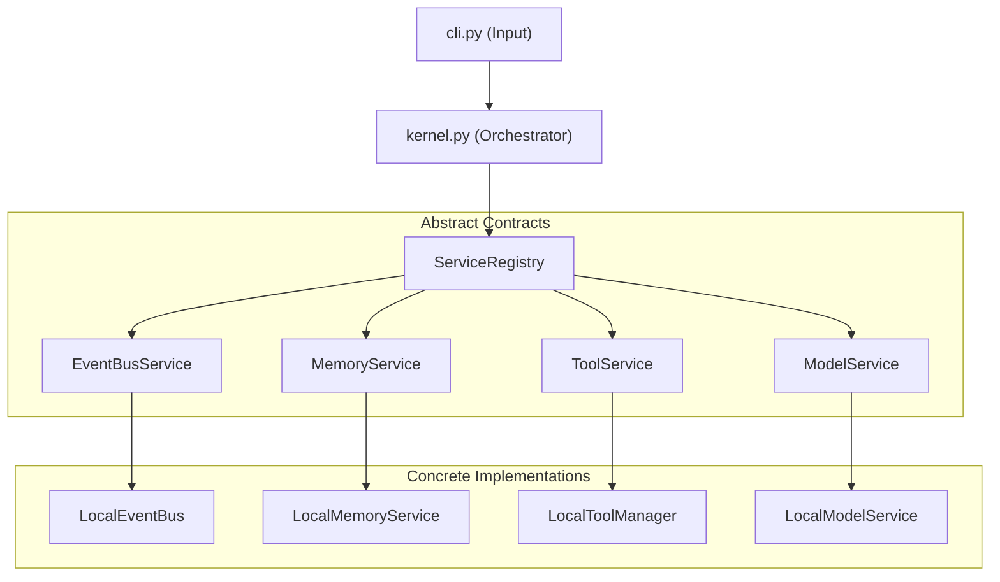

# AI Context (AI-Optimized Entrypoint)
**Version 1.0** · *Classified: For One Person Only* · *July 2026*

---

## Document Metadata
* **Purpose**: Provide a token-efficient, high-level structural overview and system index of the Personal AI OS. It serves as the primary context document that AI coding agents read first before modifying or extending the repository.
* **Scope**: Maps all repository workspaces, core interfaces, service models, and documentation files.
* **Audience**: AI Coding Agents, Systems Architects, and Technical Maintainers.
* **Related Documents**:
  * [00_PROJECT_VISION.md](file:///Users/anzarakhtar/aios/docs/00_PROJECT_VISION.md) - Constitutional core principles.
  * [02_ARCHITECTURE_GUIDELINES.md](file:///Users/anzarakhtar/aios/docs/02_ARCHITECTURE_GUIDELINES.md) - Dependency inversion rules.
  * [15_SYSTEM_DESIGN.md](file:///Users/anzarakhtar/aios/docs/15_SYSTEM_DESIGN.md) - Subsystem diagrams and sequence charts.
  * [16_ENGINEERING_BIBLE.md](file:///Users/anzarakhtar/aios/docs/16_ENGINEERING_BIBLE.md) - Comprehensive monorepo reference manual.
* **Future Extensions**: This index is updated whenever new subdirectories, core services, or package structures are added.

---

## 1. Executive Summary & Project Vision
Personal AI OS is a local-first, privacy-focused operating system that consolidates software development, knowledge indexing, memory tracking, and project planning into a single interface. It is a keyboard-driven command CLI shell, not a chatbot, designed as a cognitive mind extension for a single developer.
* *Detailed Reference*: **[00_PROJECT_VISION.md](file:///Users/anzarakhtar/aios/docs/00_PROJECT_VISION.md)** (Constitutional Vision).
* *Success Metrics*: Command latencies under **200ms**, test coverage above **85%**, and 90% friction-free automation loops.

---

## 2. Core Engineering Philosophy
The codebase is governed by a strict development discipline:
* **Boring by Default**: Prioritize standard libraries and stable, well-documented tools over niche frameworks.
* **Optimize for Deletion**: Keep modules decoupled behind public boundaries so they can be easily replaced.
* **Single Responsibility**: Restrict files to a maximum of **400 lines** and functions to a cyclomatic complexity under **10**.
* **No Speculative Generality**: Build only for active, verified requirements.
* *Detailed Reference*: **[01_ENGINEERING_GUIDELINES.md](file:///Users/anzarakhtar/aios/docs/01_ENGINEERING_GUIDELINES.md)** (Principles & DoD).

---

## 3. High-Level Architecture Summary
The system relies on the **Dependency Inversion Principle (DIP)**. Orchestration engines interact strictly via service interfaces registered on a `ServiceRegistry` at boot. 
Dependencies are injected via constructors, and the class graph is initialized inside a Composition Root ([bootstrap.py](file:///Users/anzarakhtar/aios/core/src/aios/bootstrap.py)).

* *Detailed Reference*: **[02_ARCHITECTURE_GUIDELINES.md](file:///Users/anzarakhtar/aios/docs/02_ARCHITECTURE_GUIDELINES.md)** (DIP & Composition).

---

## 4. Protected Core Policy
Core orchestrators and data coordinators are classified as **Protected Core**:
* `kernel.py`
* `brain/`
* `event_bus_impl.py`
* `memory_impl.py`
* `providers/`
* `services/action/` and `services/task/`

**Rule**: AI assistants must extend system capabilities safely by registering new skills under `skills/`, mapping commands via `CommandRegistry`, or subscribing to Event Bus events, rather than modifying protected files.
* *Detailed Reference*: **[03_IMPLEMENTATION_GUIDELINES.md](file:///Users/anzarakhtar/aios/docs/03_IMPLEMENTATION_GUIDELINES.md)** (Development Workflows).

---

## 5. Subsystems Quick Index

### 5.1 The Brain Orchestration Engine
* **Purpose**: Evaluate natural language queries, build prompt contexts, select models, and plan multi-step workflows.
* **Selection**: Dynamically selects models (e.g. Claude-3.5-Sonnet for coding, GPT-4o-mini/Gemini-1.5-pro for general chat) using the OmniRoute selector.
* *Detailed Reference*: **[04_AI_MODEL_STRATEGY.md](file:///Users/anzarakhtar/aios/docs/04_AI_MODEL_STRATEGY.md)** (Model Strategy).

### 5.2 Memory & Conversation Engines
* **Memory**: Tiered storage (Permanent, Long-Lived, Short-Lived). Expired short-term logs are pruned, and long-term history is compressed.
* **Conversations**: Dialogue logs are persisted as JSON files under `.aios_conversations/`. History is automatically summarized when threads exceed 10 turns.
* *Detailed Reference*: **[12_PRD.md](file:///Users/anzarakhtar/aios/docs/12_PRD.md)** (Product Specifications).

### 5.3 Action Engine & Task Executor
* **Action Engine**: Generates safe code modifications. Actions are categorized by risk. HIGH-risk steps block for user approval. File contents are cached before writing to enable reverse rollbacks.
* **Task Executor**: Plans and runs sequences of registered commands. Telemetry logs are saved to `.aios_tasks/` to support resuming tasks.
* *Detailed Reference*: **[05_SECURITY_GUIDELINES.md](file:///Users/anzarakhtar/aios/docs/05_SECURITY_GUIDELINES.md)** (Security Safeguards).

---

## 6. Current Technology Stack
* **Language & Runtime**: Python 3.10+ managed via the `uv` or `pip` package manager.
* **Database & Settings**: local JSON files storage (`memory.json`, `.aios_conversations/`) and TOML configurations.
* **Quality & Quality checks**: Pytest unit/integration test suites and Ruff formatting/linting checker configurations.
* *Detailed Reference*: **[14_TECH_STACK.md](file:///Users/anzarakhtar/aios/docs/14_TECH_STACK.md)** (Libraries & Future UI).

---

## 7. Developer Playbook Summary

### 7.1 Testing Requirements
* No external API calls are allowed in tests.
* Tests use isolated temporary folders (`tmp_path`) and mock models via `conftest.py` fixtures.
* The test suite must run clean with `PYTHONPATH=. .venv/bin/pytest` and maintain a minimum of **85%** code coverage on modified files.
* *Detailed Reference*: **[06_TESTING_GUIDELINES.md](file:///Users/anzarakhtar/aios/docs/06_TESTING_GUIDELINES.md)** (Testing Playbooks).

### 7.2 Contribution Workflow
* Feature work must be performed on short-lived branches merged using Conventional Commit formats.
* AI-assisted changes must append the co-authored trailer to commits:
  `Co-authored-by: AI-agent <assistant@personal-ai-os.local>`
* *Detailed Reference*: **[11_CONTRIBUTING.md](file:///Users/anzarakhtar/aios/docs/11_CONTRIBUTING.md)** (Contributing Workflows).

---

## 8. Current Roadmap & Active Priorities

* **Current Status**: **v0.5 (Documentation Phase)**. Complete architectural guidelines, system specifications, and reference materials are established.
* **Active Priority**: Transitioning to **v0.6 (Security Hardening)**. Implementing local database encryption (SQLCipher) and macOS sandbox command restrictions.
* **Roadmap Targets**:
  * *v0.7*: Cron-based memory pruning and local vector database search.
  * *v1.0*: Production stabilization release.
  * *v1.5*: Next.js local web server UI dashboard.
  * *v2.0*: Multi-agent concurrent execution pipelines.
* *Detailed Reference*: **[09_ROADMAP.md](file:///Users/anzarakhtar/aios/docs/09_ROADMAP.md)** (Roadmap Phases).
