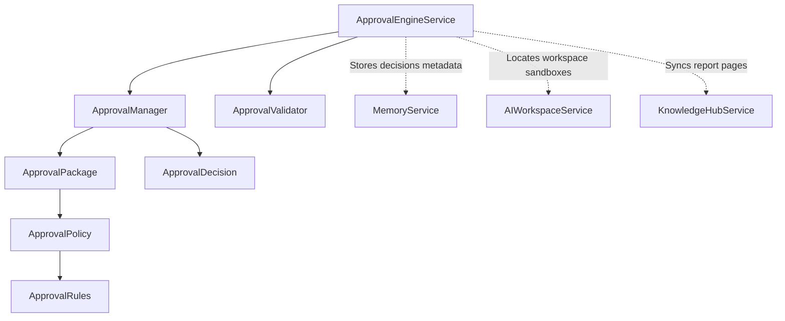

# Approval Engine — Phase 1 Milestone 1 Report

## Executive Summary
This report details the implementation of **Phase 1: Approval Engine**, specifically **Milestone 1: Approval Foundation**. The Approval Engine serves as the authoritative, non-mutating decision gateway situated between engineering intelligence gathering and runtime execution. 

The subsystem **never** modifies source repository files, **never** generates functional code, and **never** applies patches. It only digests validation evidence to produce structured, rule-governed quality decisions.

---

## 1. Approval Architecture

The Approval Engine is built around decoupled managers, validators, and rules that ingest multi-disciplinary engineering evidence to evaluate gating metrics. Below is the subsystem architecture map:

---

## 2. Decision Model

The subsystem enforces seven structured decision outcomes (`ApprovalStatus`):
1. **`PENDING`**: Request intake initialized, awaiting evaluation.
2. **`APPROVED`**: All validation gates and policy rules passed successfully.
3. **`APPROVED_WITH_CONDITIONS`**: Minor warnings/findings exist but do not breach critical gates.
4. **`PARTIALLY_APPROVED`**: Only subset of components are cleared for progression.
5. **`MANUAL_REVIEW`**: Ambiguous outcomes or high-risk indicators warrant human oversight.
6. **`CHANGES_REQUESTED`**: Specific failures (e.g. documentation missing) require updates.
7. **`REJECTED`**: Critical rules failed (e.g. test execution breaks or coverage is insufficient).

Each decision is packed inside an `ApprovalDecision` carrying epoch timestamps, structured reasoning strings, and detailed reviewer notes.

---

## 3. Approval Package

The engine consolidates evidence into a single, cohesive `ApprovalPackage` structure:
* **Engineering Summary**: Core changes outline.
* **Validation Summary**: Test runs count, pass/fail counts.
* **Documentation Summary**: README, API, and architectural specs status.
* **Risk Summary**: Severity rank (Low, Medium, High, Critical) and boundary impacts.
* **Affected Files & Components**: Scope of changes.
* **Coverage Summary**: Achieved statement/branch coverages.
* **Failure Summary**: Trace signatures and exception clusters.
* **Recommendations**: Remediation notes.
* **Approval Policy**: Gating policies applied.
* **Reviewer Notes**: Passed/failed rule logs.
* **Overall Health**: Overall health category (`healthy`, `degraded`, `critical`).
* **Confidence Rating**: Heuristic rating index [0.0 - 1.0].

---

## 4. Policy Engine

Policies are represented by the `ApprovalPolicy` container carrying extensible `ApprovalRule` checks:
* **`MinValidationScoreRule`**: Asserts that Validation Report scores meet targets.
* **`RequiredCoverageRule`**: Asserts that achieved coverages meet thresholds.
* **`MaxRiskLevelRule`**: Bounds implementation risk values.
* **`DocumentationCompletenessRule`**: Asserts that README, API, and architectural guides are complete.
* **`CriticalFailureThresholdRule`**: Checks that critical test failures equal zero.
* **`EngineeringProfileRequirementsRule`**: Asserts target coding standard and language compliance.

---

## 5. Validation Pipeline

The `ApprovalValidator` performs structural checks on the package:
* **Completeness**: Flags empty summaries, missing test metrics, or empty files list.
* **Confidence Gating**: Enforces that rating parameters stand strictly between 0.0 and 1.0.
* **Duplicate Detection**: Inspects history trees to flag duplicate requests initiated within a 60-second window.

---

## 6. Integration Points

The subsystem exposes clean interfaces for future components to consume:
* **`AutomationIntelligenceService`**: Future agent controller triggering reviews.
* **`GitHubAutomationService`**: Future hook posting PR comments.
* **`ExecutionPlanService`**: Future planner staging approved tasks.
* **`ApplyEngineService`**: Future applicator applying validated patches.
* **`ReleaseIntelligenceService`**: Future release manager promoting versions.
