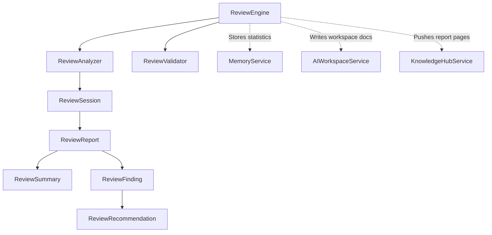

# Review Engine — Phase 1 Milestone 2 Report

## Executive Summary
This report details the implementation of **Phase 1: Approval Engine**, specifically **Milestone 2: Intelligent Review Engine**. This engine performs an automated engineering review of compiled Approval Packages, identifying quality strengths, weaknesses, and blocking issues, and generating actionable remediation checklists without modifying files.

---

## 1. Review Architecture

The Review Engine functions as a decoupled analytical pipeline that processes approval packages, maps them to extensible review domains, performs model refinements, and outputs files exclusively inside workspace paths.

---

## 2. Finding Model

Each diagnostic issue flagged during a code review is compiled into a `ReviewFinding` structure containing:
* **Category**: One of twelve review domains (e.g. `ARCHITECTURE`, `SECURITY`, `TESTING`, `DOCUMENTATION`).
* **Severity**: The severity level of the finding.
* **Confidence**: Float rating [0.0 - 1.0] of diagnostic certainty.
* **Description**: Detailed description of the findings.
* **Evidence**: List of telemetry records backing the finding.
* **Recommendation**: Actionable checklist of remediation steps.
* **Related Components & Files**: Impacted systems scope.
* **Blocking Flag**: True if the finding is critical enough to block promotion or execution.

---

## 3. Severity Model

Findings are mapped to five severity levels (`ReviewSeverity`):
1. **`INFO`**: Low impact advice and architectural notes.
2. **`LOW`**: Style discrepancies or non-critical documentation suggestions.
3. **`MEDIUM`**: Test coverage gaps, mild dependencies risk, or minor performance overheads.
4. **`HIGH`**: Severe policy failures (e.g., low validation score) or high-risk coupling.
5. **`CRITICAL`**: Test suite failures, exception traceback faults, or repository degradation.

---

## 4. Evidence Model

To ensure findings are substantiated by facts, the `ReviewEvidence` structure tracks:
* **Source**: Component generating the telemetry (e.g. `validation_report`, `engineering_intelligence`).
* **Type**: Telemetry type (e.g. `coverage`, `risk`, `failures`).
* **Data**: Key-value JSON dictionary carrying the raw telemetry metadata.
* **Timestamp**: Time of evidence capture.

---

## 5. Integration Points

The Review Engine serves as a diagnostic feed for future subsystems:
* **`Automation Intelligence`**: Automated review statistics are queried to gauge build stability.
* **`GitHub Automation`**: Review findings lists can be posted as pull request review comments.
* **`Execution Plan` / `Apply Engine`**: Blocking findings halt plan execution and patch applications.
