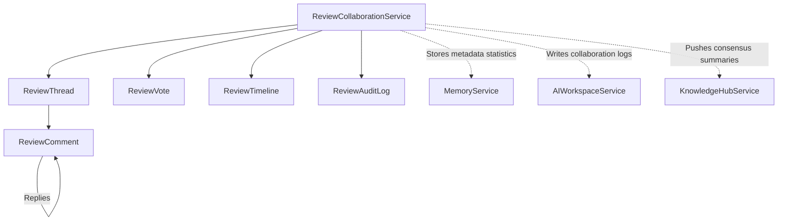
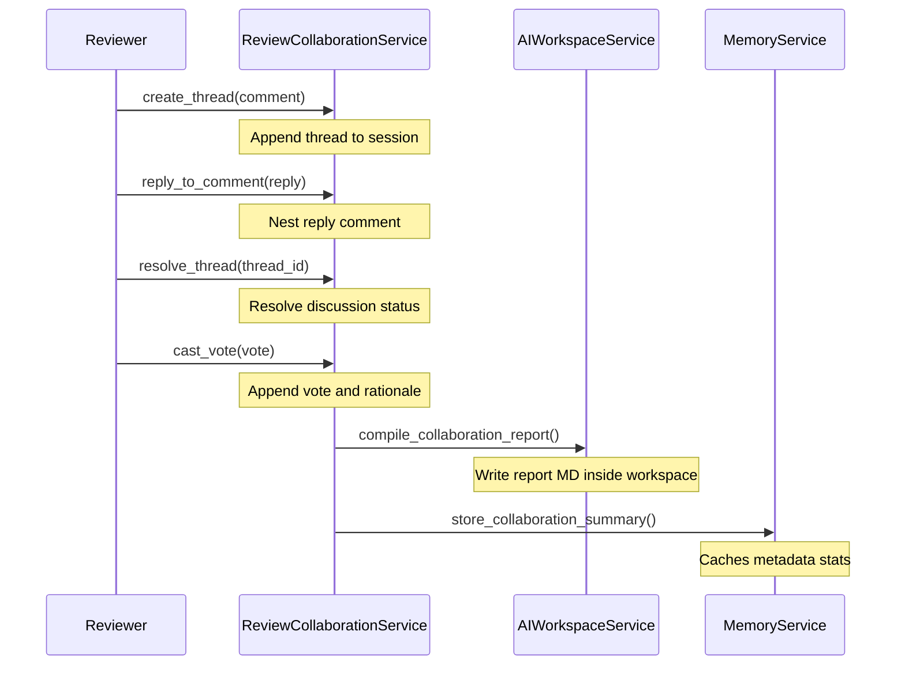

# Human Collaboration & Feedback — Phase 1 Milestone 3 Report

## Executive Summary
This report details the implementation of **Phase 1: Approval Engine**, specifically **Milestone 3: Human Collaboration & Feedback**. This subsystem enables structured collaboration, allowing multiple human roles to vote, discuss, and track audit trails concerning Approval Packages before gating transitions.

The subsystem **never** modifies source files or runs pipelines. It only provides a secure, append-only records log of reviewer interactions.

---

## 1. Collaboration Architecture

Reviewers collaborate on active Approval Sessions by submitting comments, raising threads, replying, resolving issues, and casting decision votes.

---

## 2. Comment Model

To keep technical discussions structured, comments are grouped into nested threads:
* **Comment Types**: Supports `general`, `file` comments, `artifact` specs comments, `validation` checks comments, `documentation` comments, and `finding` comments.
* **Metadata**: Comments contain author name, epoch timestamps, active/resolved status, and links to affected code structures.
* **Replies**: Root comments support nested, multi-level replies.
* **Resolution**: Reviewers can mark threads `resolved` or `reopen` them.

---

## 3. Timeline Model

The timeline (`ReviewTimeline`) provides an immutable, chronological trace of events happening during a review session:
* Creates thread events
* Reviews comments and reply threads
* Reviewers votes and rationales
* Thread resolutions and reopenings
* Status changes

The timeline history is strictly **immutable** and can never be rewritten.

---

## 4. Audit Log

The `ReviewAuditLog` registers append-only, structured audit records tracking:
* Log ID
* Action type (`CREATE`, `COMMENT`, `REPLY`, `RESOLVE`, `REOPEN`, `VOTE`, `STATUS_CHANGE`)
* Actor ID (author or reviewer)
* Action details
* Timestamp

---

## 5. Review Lifecycle

The human review lifecycle is governed by the following sequence:

---

## 6. Integration Points

Exposed interfaces support future interactions:
* **`Automation Intelligence`**: Checks if all discussion threads are resolved before auto-gating.
* **`GitHub Automation`**: Mirror threads and comments as GitHub pull request reviews.
* **`Execution Plan` / `Apply Engine`**: Restricts patch application until vote conditions are resolved.
* **`Release Intelligence`**: Verifies owner approval before promoting versions to stable channels.
