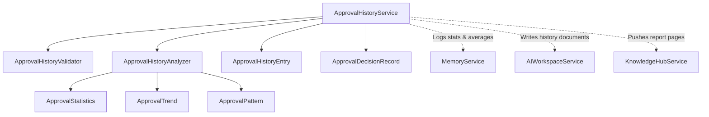
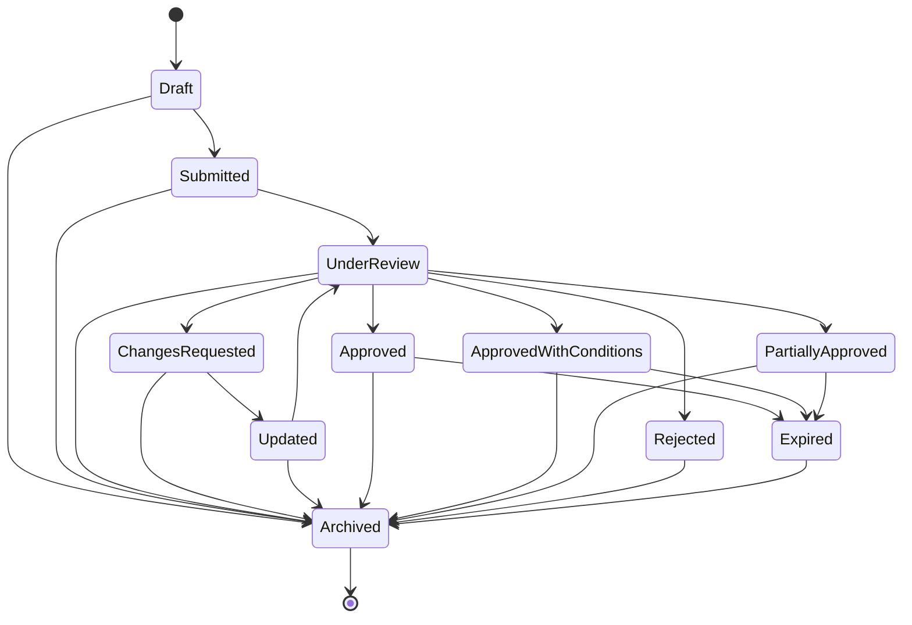

# Approval History & Decision Intelligence — Phase 1 Milestone 4 Report

## Executive Summary
This report details the implementation of **Phase 1: Approval Engine**, specifically **Milestone 4: Approval History & Decision Intelligence**. This milestone introduces an immutable workflow state machine and historical analyzer that tracks gating sessions, metrics trends, and recurrent quality blocker patterns to output data-driven recommendations.

The subsystem **never** modifies repository source files or executes runtime patches. It only aggregates past gating decisions.

---

## 1. Approval History Architecture

The History service listens to state transitions, records final session telemetries, compiles trends, and writes reports to the workspace.

---

## 2. State Machine Model

Approval workflows are governed by an immutable state machine containing eleven distinct states:

Every transition is recorded inside `ApprovalStateTransition` containing the origin state, target state, actor name, transition rationale, and timestamp, maintaining an append-only timeline.

---

## 3. Trend Analysis

The `ApprovalHistoryAnalyzer` compiles metrics trends over time to identify if project parameters are improving, declining, or stable:
* **Validation Scores Trend**: Tracks evolution of overall validation scores.
* **Test Coverage Trend**: Tracks testing line coverage percentages.
* **Reviewer Confidence Trend**: Tracks confidence rating indices.

Directions are determined by comparing the first record in the time series with the most recent record.

---

## 4. Statistics Model

The statistics model (`ApprovalStatistics`) provides high-level diagnostics detailing:
* Total number of runs completed
* Success counts (Approved, Conditional)
* Deficit counts (Changes Requested, Rejected)
* Averages (Validation, Coverage, Confidence)
* Transition frequency mapping

---

## 5. Integration Points

Exposed interfaces support future interactions:
* **`Automation Intelligence`**: Automatically flags build promotions if validation trends are `improving`.
* **`GitHub Automation`**: Updates pull request state labels based on state machine statuses.
* **`Execution Plan` / `Apply Engine`**: Prevents patch application for expired or archived states.
