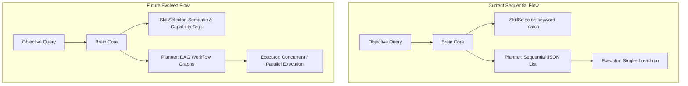

# Architecture Evolution Report
**Version 1.0** · *Classified: For One Person Only* · *July 2026*

---

## Document Metadata
* **Purpose**: Provide a comprehensive evaluation of the core Brain, Planner, Skill Selector, and Provider Router subsystems to determine how to scale the system for AI OS v2.0.
* **Scope**: Governs all orchestrators, planners, skill managers, and routing interfaces across the monorepo.
* **Audience**: Systems Architects, Technical Leads, and AI developer agents.
* **Related Documents**:
  * [00_PROJECT_VISION.md](file:///Users/anzarakhtar/aios/docs/00_PROJECT_VISION.md) - Constitutional simplicity and speed principles.
  * [02_ARCHITECTURE_GUIDELINES.md](file:///Users/anzarakhtar/aios/docs/02_ARCHITECTURE_GUIDELINES.md) - Component systems design boundaries.
  * [15_SYSTEM_DESIGN.md](file:///Users/anzarakhtar/aios/docs/15_SYSTEM_DESIGN.md) - Context and container sequence flows.
* **Future Extensions**: This report's recommendations will serve as the technical blueprint for Phase 3 (daemon configurations) and Phase 4 (autonomy workflows) release developments.

---

## 1. Executive Summary & Architecture Assessment
This report audits the current capability routing, task planning, and model selection components of the Personal AI OS. 
The system currently uses a decoupled, event-driven, pipeline-based flow:
* **The Brain** (`brain.py`) resolves services, assembles prompt contexts, and triggers the planner and workflow executor.
* **The Planner** (`planner.py`) decomposes queries into sequential `WorkflowStep` blocks using exact command matching or LLM-driven planning.
* **The Skill Selector** (`skill_selector.py`) resolves objectives to metadata skills via exact command prefixes or heuristic description keyword intersections.
* **The Provider Selector** (`provider_selector.py`) matches keywords in requests to select LLM models, fallback chains, and provider registries.

**Conclusion**: The existing codebase contains a functional capability-based resolution pipeline. The modular Skill Registry and Skill Selector already form the foundation of a **Capability Layer**. 

We do not need to introduce a new, heavy, separate abstraction subsystem. We can achieve v2.0 capabilities by incrementally evolving our existing architecture.

---

## 2. Analysis Q&A

### 1. What responsibilities does the current Brain have?
The Brain resolves the core services registry (`ModelService`, `MemoryService`, `ContextService`), dynamically scans and loads all workspace skills from disk directories into the `SkillRegistry` at initialization, assembles prompt contexts, queries provider selections, plans sequential tasks, runs workflows, and consolidates multi-step outputs.

### 2. Which responsibilities belong inside the Brain?
The Brain should strictly own **high-level reasoning, planning, context coordination, and consolidation**. It functions as the thinking mind of the OS.

### 3. Which responsibilities should be delegated elsewhere?
* **Skill Loading**: Dynamic loading of directory directories (`skills/`) and files parsing should be managed by the Composition Root (`bootstrap.py`) or a dedicated `SkillService` instead of instantiating `SkillManager` inside `Brain.__init__`.
* **Workflow Execution**: Running command steps, capturing stdout, and coordinating file rollbacks should reside in a decoupled `TaskExecutor` service under `services/`, rather than keeping `WorkflowExecutor` coupled inside the brain directory.

### 4. Does the existing Skill Selector already function as a Capability Resolver?
Yes. The `SkillSelector` inspects registered skills, checks command matches, and outputs matched targets along with confidence scores, performing the role of a semantic capability resolver.

### 5. Can the current Planner become the Workflow Planner?
Yes. `BrainPlanner` already plans sequences of command-level `WorkflowStep` models. By extending the models to support dependency targets, parallel executing flags, and state validation queries, it naturally scales to support complex workflow graphs.

### 6. Does introducing a dedicated Capability Layer reduce complexity or increase it?
It increases complexity. Introducing an isolated "Capability Layer" creates duplicate registries, wrapper files, and configuration redundancies over our modular Skill System.

### 7. Can the existing architecture evolve without breaking backward compatibility?
Yes. Since the brain interfaces via modular schemas (`BrainContext`, `Workflow`, `WorkflowStep`), we can append new configuration attributes (like execution dependencies) while preserving legacy sequential routes.

### 8. Which modules should remain part of the Protected Core?
`kernel.py`, `registry.py`, `LocalEventBus`, `LocalAgentRuntime`, and base `Brain` interfaces.

### 9. Which modules require refactoring?
* `brain.py`: Remove direct `SkillManager` loading from `__init__`.
* `workflow.py`: Decouple `WorkflowExecutor` from inline action checks, routing executions through abstract tool adapters.
* `provider_selector.py`: Move model keyword hardcodes to configurations.

### 10. What is the simplest architecture that satisfies both current and future requirements?
Option B: Incrementally evolving the existing architecture. Extending the metadata configurations of `Skill` and parsing them inside the `SkillSelector` and `BrainPlanner` preserves simplicity while supporting v2.0 feature scopes.

---

## 3. Subsystem Assessment & Evolution Plan

### 3.1 Strengths & Weaknesses
* **Strengths**: Light footprint, zero configuration bloat, clean interfaces.
* **Weaknesses**: Sequential steps only, hardcoded provider routing keywords, skill loading is coupled inside the brain initializer.

### 3.2 Required Refactors
* **Skill Service decoupling**: Move skill initialization to `bootstrap.py` and register the `SkillRegistry` on the `ServiceRegistry`.
* **DAG Schema expansion**: Extend `WorkflowStep` to include a list of `depends_on` UUID strings, enabling the execution engine to run steps with zero dependencies in parallel.

---

## 4. Evaluation of Future Features

* **Multi-skill workflows & Parallel execution**: Supported by updating the `Workflow` class to represent a Directed Acyclic Graph (DAG) of steps, running tasks concurrently via `asyncio`.
* **Capability-based routing**: Supported by adding a `capabilities = []` list attribute to `skill.toml` and filtering them inside `SkillSelector`.
* **Notion, n8n, Research Skills**: Supported by creating new folders under `skills/` containing custom prompts and command mappings. No core brain refactoring required.

---

## 5. Final Recommendation & Justification

### Selected Option: B. Incrementally evolve the existing architecture.

### Justification
According to the project constitution ([00_PROJECT_VISION.md](file:///Users/anzarakhtar/aios/docs/00_PROJECT_VISION.md)):
1. **Simplicity over complexity**: Option B avoids creating new wrapper classes or runtime registries, keeping the monorepo simple.
2. **Extend instead of replace**: Evolving `SkillSelector` and `BrainPlanner` preserves legacy exact-match tests while scaling capabilities.
3. **Avoid unnecessary abstractions**: The Skill System already handles dynamic registration, enabling direct integration of future skills (Notion, n8n, etc.) without a duplicate layer.

---

## 6. Migration Strategy & Risk Analysis

### 6.1 Step-by-Step Migration Plan
1. **Decouple Skill Loading**: Move `SkillManager` instantiation and `load_all_skills()` to `bootstrap.py`. Register `SkillRegistry` on the system registry.
2. **Extend Workflow Models**: Append `depends_on` and `parallel` attributes to `WorkflowStep`.
3. **Update Executor**: Refactor `WorkflowExecutor` to process steps using DAG topologies and `asyncio.gather()`.
4. **Deploy Capability tags**: Add tag mappings to `skill.toml` files and update `SkillSelector` matching.

### 6.2 Implementation Effort Estimation
* **Skill Decoupling**: 2 Days (Low effort).
* **DAG Workflow Support**: 4 Days (Medium effort).
* **Capability Matching**: 2 Days (Low effort).
* **Total Estimated Effort**: **8 Days**.
