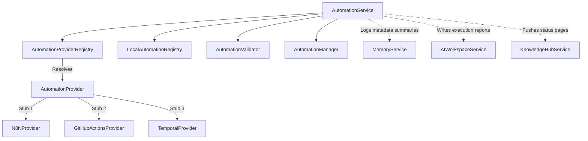

# Automation Intelligence — Phase 1 Milestone 1 Report

## Executive Summary
This report details the implementation of **Phase 1: Automation Intelligence**, specifically **Milestone 1: Automation Foundation**. This foundation establishes a platform-independent abstraction layer separating the AI OS workflow definition logic from specific automation platform providers (such as n8n, GitHub Actions, or Temporal).

---

## 1. Automation Architecture

The subsystem models workflows as directed graphs independent of provider formats. Custom providers register with the central registry to receive translated tasks.

---

## 2. Workflow Graph Model

Workflows are modeled topology-first using a `WorkflowGraph` containing:
* **`WorkflowNode`**: A block representing triggers (webhooks, cron schedules), actions (http requests, scripts), branches, loops, or conditions.
* **`WorkflowEdge`**: Directed connectors mapping execution routes and carrying transition conditions.
* **Variables**: Input schema parameters mapping data flows.

---

## 3. Provider Abstraction

The `AutomationProvider` abstract class forces provider implementations to declare validation compatibility checkups and execute steps:
* **`N8NProvider`**: Abstract model mapping nodes to n8n json workflows.
* **`GitHubActionsProvider`**: Abstract model mapping steps to GitHub workflow yml structures.
* **`TemporalProvider`**: Abstract model mapping graphs to Temporal activity chains.

Provider implementations do not own workflow graph topology; they only implement translations and platform communication.

---

## 4. Execution Policy Model

Policies (`WorkflowExecutionPolicy`) bound runtime execution parameters:
* **Max Retries**: Max number of retries before fail status is logged.
* **Retry Delay**: Seconds between retries.
* **Timeout Threshold**: Gating timeout limits.
* **Concurrency Limits**: Concurrency limits for parallel loops.

Defaults are consumed directly from active `AutomationProfile` preferences without configuration duplication.

---

## 5. Registry Design

The `AutomationRegistry` holds definition templates, ensuring platform-agnostic models are saved centrally. The registry isolates workflow blueprints from active execution sessions.

---

## 6. Validation Pipeline

The `AutomationValidator` acts as a topological gate checker analyzing definitions before runs:
* **Disconnected Nodes Check**: Verifies non-trigger nodes have incoming links, and non-terminal nodes have outgoing links.
* **Circular Execution Check**: Runs DFS cycle detection algorithms on graph edges.
* **Duplicates Check**: Checks unique node identifiers.
* **Credentials Check**: Verifies references match named vault structures.
* **Policy Check**: Validates positive thresholds for retries, delays, and timeouts.

---

## 7. Integration Points

Exposed interfaces support future interactions:
* **`Intent Engine` / `Mission Engine`**: Translate high-level goals into platform-independent workflow definitions.
* **`Daily OS`**: Trigger scheduled workflow automations matching cron patterns.
* **`Career OS`**: Stages jobs search cron flows.
* **`GitHub Automation` / `Execution Plan`**: Schedules PR merges or file patching actions.
