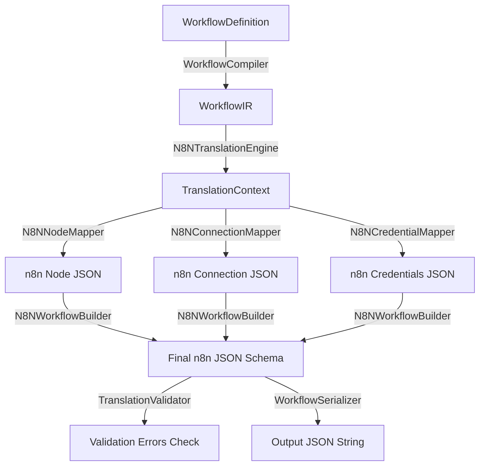

# n8n Translation Engine — Phase 1 Milestone 3 Report

## Executive Summary
This report details the implementation of **Phase 1: Automation Intelligence**, specifically **Milestone 3: n8n Translation Engine**. This subsystem compiles provider-independent Workflow IR into native self-hosted n8n workflow JSON, validating edge connections and credentials configurations.

The subsystem **only** performs translation, never communicating with external n8n API endpoints directly.

---

## 1. Workflow IR (Intermediate Representation)

The `WorkflowIR` acts as the canonical data format separating high-level workspace logic from provider structures:
* **Canonical Schema**: Maps variables schemas, policies parameters, metadata tags, node configurations, and dependency edges.
* **Immutability Bounds**: Workflow IR objects are read-only and never modified by translation engines during compilations.

---

## 2. Translation Pipeline

The compiler translates canonical IR schemas into native n8n structures using a deterministic sequence:



---

## 3. Node Mapping Architecture

The `N8NNodeMapper` maps generic node structures to specific n8n node formats:
* **Webhook Trigger**: Maps to `"n8n-nodes-base.webhook"` detailing HTTP methods and paths.
* **Cron Trigger**: Maps to `"n8n-nodes-base.cron"` configuring cron execution modes.
* **HTTP Request Action**: Maps to `"n8n-nodes-base.httpRequest"` detailing query methods and URLs.
* **Script Action**: Maps to `"n8n-nodes-base.code"` wrapping JavaScript script code.
* **Slack / Email Action**: Maps to Slack and Email API node parameters.

---

## 4. Connection Mapping

The `N8NConnectionMapper` formats DAG graph edges into n8n's connections format:
```json
{
  "Webhook Trigger": {
    "main": [
      [
        { "node": "HTTP Post", "type": "main", "index": 0 }
      ]
    ]
  }
}
```
This is a deterministic translation that connects the source node's outputs to the target node's inputs.

---

## 5. Validation Pipeline

The `TranslationValidator` validates the translated output schema:
* **Schema Integrity Check**: Checks that nodes list and connections dictionaries exist.
* **Duplicate Node IDs Check**: Flags duplicate IDs.
* **Broken Connections Check**: Verifies source/target nodes exist in the nodes collection.

---

## 6. Integration Points

* **`Workflow Planner`**: Input source feeding definitions to the translator.
* **`Automation Foundation`**: Calls translator to create provider-specific formats.
* **`n8n Integration`**: Future subsystem executing translated JSONs via self-hosted n8n instances.
