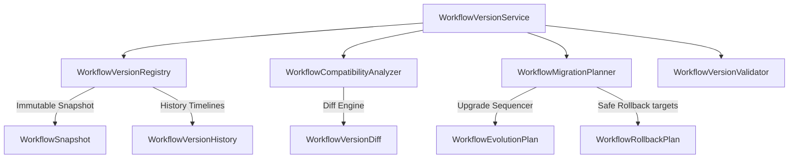

# Workflow Versioning & Evolution — Phase 1 Milestone 7 Report

## Executive Summary
This report details the implementation of **Phase 1: Automation Intelligence**, specifically **Milestone 7: Workflow Versioning & Evolution**. This subsystem manages immutable workflow version nodes, tracks graphs branching, parses node/parameter differences, verifies semver compatibility rules, and builds migration/rollback plans.

The subsystem never edits, uploads, or executes workflows, providing analytical version tracking only.

---

## 1. Version Architecture

The service registers immutable version nodes, snapshots the IR json payloads, matches previous and parent version pointers, compiles diff results, and updates Notion pages:

---

## 2. Evolution Lifecycle

Every workflow version node undergoes strict verification:
1. **Creation**: Version tag, semver, and author metadata are registered along with references to optimizations, translations, approvals, and telemetry.
2. **Validation**: The validator verifies that the semver conforms to `X.Y.Z` formatting rules and that the author string is populated.
3. **Graph Registry**: The version is appended as a node in the DAG graph, linking its previous version ID as parent and adding its key to child arrays.
4. **Snapshotting**: The system records the complete workflow IR configuration inside a read-only snapshot container.

---

## 3. Diff Engine & Compatibility

* **Diff Engine**: Parses snapshot json payloads to isolate added nodes, removed nodes, and modified nodes, and identifies connection routing modifications.
* **Compatibility Model**: Evaluates semantic version updates. Bumps to minor or patch numbers (`1.0.0` -> `1.1.0`) are classified as safe upgrades (`compatible`), while major increments (`1.0.0` -> `2.0.0`) are flagged as breaking upgrades (`breaking`).

---

## 4. Rollback Planning

Rollback plans are computed analytically without mutating runtime definitions:
* **Checklist**: Compiles validation steps such as confirming vault secrets, verifying webhooks connectivity, and monitoring latency bounds.
* **Risk & Downtime**: Approximates risk levels (e.g. `medium`) and estimates downtime duration (e.g. `15.0` seconds) based on node counts.

---

## 5. Integration Points

* **`Workflow Planner`**: Inputs original design requirements.
* **`n8n Integration / Translation`**: Tracks changes in active REST integrations and IR compilation outputs.
* **`Memory Intelligence`**: Caches metadata summaries without storing credentials or source code.
* **`Knowledge Hub`**: Synchronizes report data rows to Notion databases on-demand.
