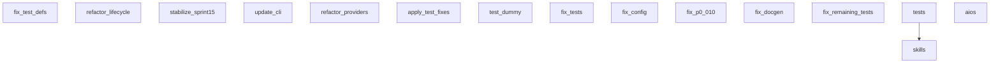

# System Architecture Graphs

## Package Relationships Graph

```mermaid
flowchart TD
    %% Package Graph
    fix_test_defs["fix_test_defs"]
    refactor_lifecycle["refactor_lifecycle"]
    stabilize_sprint15["stabilize_sprint15"]
    update_cli["update_cli"]
    refactor_providers["refactor_providers"]
    apply_test_fixes["apply_test_fixes"]
    test_dummy["test_dummy"]
    fix_tests["fix_tests"]
    fix_config["fix_config"]
    fix_p0_010["fix_p0_010"]
    fix_docgen["fix_docgen"]
    fix_remaining_tests["fix_remaining_tests"]
    core_tests["tests"]
    skills["skills"]
    core_tests --> skills
    aios["aios"]
```

## Core Services Relationships Graph

```mermaid
flowchart TD
    %% Service Graph
    refactor_providers["refactor_providers"]
    aios_registry["registry"]
    aios_providers_metrics["metrics"]
    aios_providers_nvidia["nvidia"]
    aios_providers_config["config"]
    aios_providers_models["models"]
    aios_providers_health["health"]
    aios_providers_interface["interface"]
    aios_providers___init__["__init__"]
    aios_providers_adapters["adapters"]
    aios_bootstrap_modules_services["services"]
    aios_bootstrap_modules_providers["providers"]
    aios_n8n_service["service"]
    aios_brain_provider_selector["provider_selector"]
    aios_skills_registry["registry"]
    aios_services_intent["intent"]
    aios_services_intent_impl["intent_impl"]
    aios_services_automation_impl["automation_impl"]
    aios_services_context_impl["context_impl"]
    aios_services_workflow_monitoring_impl["workflow_monitoring_impl"]
    aios_services_workflow_planning_impl["workflow_planning_impl"]
    aios_services_workflow_versioning_impl["workflow_versioning_impl"]
    aios_services_file_planner["file_planner"]
    aios_services_persistence["persistence"]
    aios_services_documentation_intelligence_impl["documentation_intelligence_impl"]
    aios_services_reasoning_impl["reasoning_impl"]
    aios_services_agent_impl["agent_impl"]
    aios_services_developer_workspace_impl["developer_workspace_impl"]
    aios_services_workflow_monitoring["workflow_monitoring"]
    aios_services_file_planner_impl["file_planner_impl"]
    aios_services_orchestrator_impl["orchestrator_impl"]
    aios_services_memory["memory"]
    aios_services_research["research"]
    aios_services_execution_engine["execution_engine"]
    aios_services_execution_engine_impl["execution_engine_impl"]
    aios_services_engineering_profile_impl["engineering_profile_impl"]
    aios_services_n8n_translation_impl["n8n_translation_impl"]
    aios_services_patch_generation_impl["patch_generation_impl"]
    aios_services_knowledge_hub_impl["knowledge_hub_impl"]
    aios_services_career_impl["career_impl"]
    aios_services_memory_impl["memory_impl"]
    aios_services_engineering_documentation["engineering_documentation"]
    aios_services_session_impl["session_impl"]
    aios_services_workspace_intelligence["workspace_intelligence"]
    aios_services_automation["automation"]
    aios_services_review_impl["review_impl"]
    aios_services_security["security"]
    aios_services_n8n["n8n"]
    aios_services_runtime_impl["runtime_impl"]
    aios_services_approval_impl["approval_impl"]
    aios_services_session["session"]
    aios_services_memory_storage["memory_storage"]
    aios_services_intent_engine["intent_engine"]
    aios_services_code_generation["code_generation"]
    aios_services___init__["__init__"]
    aios_services_n8n_integration_impl["n8n_integration_impl"]
    aios_services_code_generation_impl["code_generation_impl"]
    aios_services_readme_intelligence_impl["readme_intelligence_impl"]
    aios_services_review["review"]
    aios_services_runtime["runtime"]
    aios_services_project_intelligence_impl["project_intelligence_impl"]
    aios_services_model["model"]
    aios_services_developer_workspace["developer_workspace"]
    aios_services_event_bus["event_bus"]
    aios_services_ai_workspace_impl["ai_workspace_impl"]
    aios_services_architecture_documentation["architecture_documentation"]
    aios_services_event_bus_impl["event_bus_impl"]
    aios_services_approval_history_impl["approval_history_impl"]
    aios_services_personal_impl["personal_impl"]
    aios_services_stubs["stubs"]
    aios_services_mission_impl["mission_impl"]
    aios_services_approval_history["approval_history"]
    aios_services_context["context"]
    aios_services_ai_workspace["ai_workspace"]
    aios_services_workflow_optimization_impl["workflow_optimization_impl"]
    aios_services_orchestrator["orchestrator"]
    aios_services_workflow_planning["workflow_planning"]
    aios_services_documentation_intelligence["documentation_intelligence"]
    aios_services_collaboration["collaboration"]
    aios_services_model_impl["model_impl"]
    aios_services_engineering_intelligence_impl["engineering_intelligence_impl"]
    aios_services_intent_engine_impl["intent_engine_impl"]
    aios_services_release_documentation["release_documentation"]
    aios_services_agent["agent"]
    aios_services_approval["approval"]
    aios_services_mission["mission"]
    aios_services_patch_generation["patch_generation"]
    aios_services_reasoning["reasoning"]
    aios_services_api_documentation["api_documentation"]
    aios_services_project_intelligence["project_intelligence"]
    aios_services_daily["daily"]
    aios_services_workflow_versioning["workflow_versioning"]
    aios_services_n8n_translation["n8n_translation"]
    aios_services_architecture_documentation_impl["architecture_documentation_impl"]
    aios_services_persistence_impl["persistence_impl"]
    aios_services_github["github"]
    aios_services_career["career"]
    aios_services_engineering_profile["engineering_profile"]
    aios_services_knowledge_hub["knowledge_hub"]
    aios_services_engineering_intelligence["engineering_intelligence"]
    aios_services_software_engineer_impl["software_engineer_impl"]
    aios_services_tool_impl["tool_impl"]
    aios_services_collaboration_impl["collaboration_impl"]
    aios_services_workflow_optimization["workflow_optimization"]
    aios_services_readme_intelligence["readme_intelligence"]
    aios_services_tool["tool"]
    aios_services_api_documentation_impl["api_documentation_impl"]
    aios_services_workspace_intelligence_impl["workspace_intelligence_impl"]
    aios_services_research_impl["research_impl"]
    aios_services_github_impl["github_impl"]
    aios_services_base["base"]
    aios_services_n8n_impl["n8n_impl"]
    aios_services_n8n_integration["n8n_integration"]
    aios_services_release_documentation_impl["release_documentation_impl"]
    aios_services_personal["personal"]
    aios_services_daily_impl["daily_impl"]
    aios_services_software_engineer["software_engineer"]
    aios_services_engineering_documentation_impl["engineering_documentation_impl"]
    aios_services_memory_storage_impl["memory_storage_impl"]
    aios_services_developer_scanner["scanner"]
    aios_services_developer_index["index"]
    aios_services_developer___init__["__init__"]
    aios_services_developer_summary["summary"]
    aios_services_intelligence_tool_selector["tool_selector"]
    aios_services_intelligence___init__["__init__"]
    aios_services_intelligence_reasoning_context["reasoning_context"]
    aios_services_intelligence_intent_expander["intent_expander"]
    aios_services_intelligence_memory_ranker["memory_ranker"]
    aios_services_intelligence_context_ranker["context_ranker"]
    aios_services_intelligence_repository_analyzer["repository_analyzer"]
    aios_services_docintel_scanner["scanner"]
    aios_services_docintel_graph["graph"]
    aios_services_docintel_intelligence["intelligence"]
    aios_services_docintel_generator["generator"]
    aios_services_docintel_indexer["indexer"]
    aios_services_action_planner["planner"]
    aios_services_action_models["models"]
    aios_services_action___init__["__init__"]
    aios_services_action_rollback["rollback"]
    aios_services_action_approval["approval"]
    aios_services_action_report["report"]
    aios_services_action_executor["executor"]
    aios_services_action_history["history"]
    aios_services_persistence_impl_modules_postgresql["postgresql"]
    aios_services_persistence_impl_modules_core_persistence["core_persistence"]
    aios_services_persistence_impl_modules_repo_base["repo_base"]
    aios_services_persistence_impl_modules_embedding["embedding"]
    aios_services_persistence_impl_modules_qdrant["qdrant"]
    aios_services_persistence_impl_modules_transactions["transactions"]
    aios_services_persistence_impl_modules___init__["__init__"]
    aios_services_persistence_impl_modules_intelligence["intelligence"]
    aios_services_persistence_impl_modules_sqlite["sqlite"]
    aios_services_persistence_impl_modules_redis["redis"]
    aios_services_persistence_impl_modules_migrations["migrations"]
    aios_services_persistence_impl_modules_repositories["repositories"]
    aios_services_persistence_impl_modules_utilities["utilities"]
    aios_services_persistence_impl_modules_redis_sessions["sessions"]
    aios_services_persistence_impl_modules_redis_queues["queues"]
    aios_services_persistence_impl_modules_redis_rate_limiting["rate_limiting"]
    aios_services_persistence_impl_modules_redis_locks["locks"]
    aios_services_persistence_impl_modules_redis_cache["cache"]
    aios_services_persistence_impl_modules_redis___init__["__init__"]
    aios_services_persistence_impl_modules_redis_telemetry["telemetry"]
    aios_services_persistence_impl_modules_redis_redis_client["redis_client"]
    aios_services_persistence_impl_modules_redis_pubsub["pubsub"]
    aios_services_persistence_impl_modules_redis_coordination["coordination"]
    aios_services_task_planner["planner"]
    aios_services_task_models["models"]
    aios_services_task___init__["__init__"]
    aios_services_task_progress["progress"]
    aios_services_task_executor["executor"]
    aios_services_task_history["history"]
    aios_services_command_metadata["metadata"]
    aios_services_command_doc_gen["doc_gen"]
    aios_services_command_discovery["discovery"]
    aios_services_command_registry["registry"]
    aios_services_command___init__["__init__"]
    aios_services_conversation_store["store"]
    aios_services_conversation_models["models"]
    aios_services_conversation___init__["__init__"]
    aios_services_conversation_manager["manager"]
    aios_source_control_service["service"]
    aios_source_control_github_provider["github_provider"]
```
