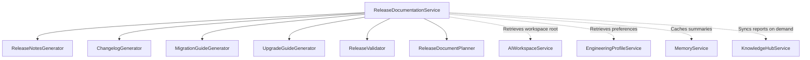
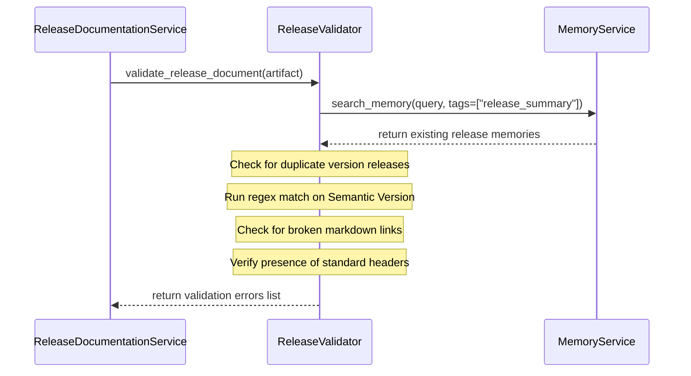

# Documentation Intelligence — Phase 1 Milestone 6 Report

## Executive Summary
This report details the implementation of the final milestone for **Phase 1: Documentation Intelligence**, specifically **Milestone 6: Release Documentation Intelligence**. This subsystem automates the compilation, generation, validation, and storage of release materials, ensuring they are placed exclusively inside isolated workspace environments to prevent dirtying production roots.

---

## 1. Release Documentation Architecture

The Release Documentation subsystem coordinates with the other intelligence systems (Engineering, Testing, Validation) to assemble structured Markdown release documents. Below is the subsystem component diagram:

### Components
* **`ReleaseDocumentationService`**: The primary coordinator executing planners, generators, and validators, and storing metadata in Memory.
* **`ReleaseNotesGenerator`**: Formats version summaries, features, bug fixes, and breaking changes into markdown documents.
* **`ChangelogGenerator`**: Groups commits list into Keep a Changelog standard format categories (Added, Changed, Fixed, Security).
* **`MigrationGuideGenerator`**: Formulates checkboxes and warnings detailing schema and codebase migration layouts.
* **`UpgradeGuideGenerator`**: Synthesizes deployment checklist items and prerequisites verification checks.
* **`ReleaseValidator`**: Validates markdown link formats, semantic version structures, and checks duplicate releases.
* **`ReleaseDocumentPlanner`**: Plans the target scope metrics for version updates.

---

## 2. Versioning Model

The versioning model adheres to **Semantic Versioning (SemVer) 2.0.0** (`MAJOR.MINOR.PATCH[-PRERELEASE]`).
* **Supported Channels**: `alpha`, `beta`, `rc` (Release Candidate), and `stable`.
* **Prerelease Tags**: Channels are mapped automatically from the target version text (e.g. `1.2.0-rc1` is categorized as `rc`, `1.2.0-beta.2` as `beta`, and `1.2.0` as `stable`).
* **Strict Validation**: The `ReleaseValidator` checks the version structure against the standard regex: `^\d+\.\d+\.\d+(-[a-zA-Z0-9.]+)?$`.

---

## 3. Validation Pipeline

Before release documents are saved, the validation pipeline runs sanity checks to maintain technical accuracy:

---

## 4. Workspace Generation

To protect the production repository root:
* **Isolated Writing**: All generated release notes, changelogs, migration guides, and upgrade guides are written exclusively inside the workspace directory (`workspace_root/docs/releases/`).
* **Dynamic Paths**: Paths are resolved dynamically by querying `AIWorkspaceService` with the current `workspace_id`.
* **Naming Conventions**: Filename targets are resolved from the profile's `naming_conventions` configuration:
  * Release notes: `RELEASE_NOTES_{version}.md`
  * Changelog: `CHANGELOG.md`
  * Migration guide: `MIGRATION_GUIDE_{from}_TO_{to}.md`
  * Upgrade guide: `UPGRADE_GUIDE_{version}.md`

---

## 5. Integration Points

* **Memory Intelligence**: The `store_release_summary` method persists version history, release metadata, and generation summaries. In accordance with privacy rules, **raw codebase contents or document markdown files are never saved in Memory**.
* **Knowledge Hub**: The Notion synchronization layer publishes `ReleaseDocumentationReport` validation summaries on demand. Automatic background synchronization is disabled to prevent unnecessary bandwidth consumption.
* **OmniRoute Model Service**: If active, generators prompt LLM models (e.g. Gemini 3.5 Flash) to automatically refine markdown layout styling and emphasize warning callouts before writing to workspaces.
