# Personal AI OS — Documentation Homepage
**Version 1.0** · *Classified: For One Person Only* · *July 2026*

---

## 🗺️ Documentation System Navigation
This homepage serves as the index and navigation portal for the entire documentation system of the Personal AI OS. Every document has a single responsibility and is structured for both human owners and AI coding agents.

```mermaid
graph TD
    %% Categories
    AI["AI Context Entrypoint"] --> Foundation["Foundation & Vision"]
    Foundation --> EngBibleFoundation["Engineering Bible Foundation"]
    Foundation --> Eng["Engineering Specifications"]
    Foundation --> Prod["Product Definitions"]
    Foundation --> KB["Knowledge & Vocabularies"]
    Foundation --> Ops["Operations Manual"]

    %% AI Context
    AI --> AI_Context["AI_CONTEXT.md"]

    %% Foundation
    Foundation --> Vision["00_PROJECT_VISION.md"]
    Foundation --> ADR["10_DECISION_LOG.md"]

    %% Engineering Bible Foundation
    EngBibleFoundation --> EBF_README["engineering/README.md"]
    EngBibleFoundation --> EBF_Vision["engineering/vision.md"]
    EngBibleFoundation --> EBF_Philosophy["engineering/philosophy.md"]
    EngBibleFoundation --> EBF_Principles["engineering/engineering_principles.md"]
    EngBibleFoundation --> EBF_Goals["engineering/design_goals.md"]
    EngBibleFoundation --> EBF_Ethics["engineering/engineering_ethics.md"]

    %% Engineering
    Eng --> EngGuide["01_ENGINEERING_GUIDELINES.md"]
    Eng --> Arch["02_ARCHITECTURE_GUIDELINES.md"]
    Eng --> Implement["03_IMPLEMENTATION_GUIDELINES.md"]
    Eng --> Model["04_AI_MODEL_STRATEGY.md"]
    Eng --> Security["05_SECURITY_GUIDELINES.md"]
    Eng --> Testing["06_TESTING_GUIDELINES.md"]
    Eng --> DocGuide["07_DOCUMENTATION_GUIDELINES.md"]
    Eng --> CodeStand["08_CODING_STANDARDS.md"]
    Eng --> Contrib["11_CONTRIBUTING.md"]
    Eng --> SysDesign["15_SYSTEM_DESIGN.md"]
    Eng --> Bible["16_ENGINEERING_BIBLE.md"]

    %% Product
    Prod --> Roadmap["09_ROADMAP.md"]
    Prod --> PRD["12_PRD.md"]
    Prod --> DRD["13_DRD.md"]

    %% Knowledge
    KB --> KB_File["17_KNOWLEDGE_BASE.md"]
    KB --> Interview["18_INTERVIEW_GUIDE.md"]
    KB --> Glossary["19_GLOSSARY.md"]

    %% Operations
    Ops --> Ops_File["20_OPERATIONS_MANUAL.md"]
```

---

## 1. AI Context (Token-Efficient Entrypoint)

### [AI_CONTEXT.md](file:///Users/anzarakhtar/aios/docs/AI_CONTEXT.md)
* **Title**: AI Context (AI-Optimized Entrypoint)
* **Purpose**: Provide a token-efficient system overview to minimize prompt contexts.
* **Audience**: AI Coding Agents and Assistants.
* **Prerequisites**: None.
* **Related Documents**: [00_PROJECT_VISION.md](file:///Users/anzarakhtar/aios/docs/00_PROJECT_VISION.md), [02_ARCHITECTURE_GUIDELINES.md](file:///Users/anzarakhtar/aios/docs/02_ARCHITECTURE_GUIDELINES.md).
* **When to Read**: Read first before any AI coding session begins.

---

## 2. Foundation & Vision

### [00_PROJECT_VISION.md](file:///Users/anzarakhtar/aios/docs/00_PROJECT_VISION.md)
* **Title**: Project Vision & Constitution
* **Purpose**: Define the project constitution, vision, philosophy, and success metrics.
* **Audience**: Core Developers, Architects, Contributors, and AI agents.
* **Prerequisites**: None.
* **Related Documents**: [12_PRD.md](file:///Users/anzarakhtar/aios/docs/12_PRD.md).
* **When to Read**: Read to understand core principles and non-goals.

### [10_DECISION_LOG.md](file:///Users/anzarakhtar/aios/docs/10_DECISION_LOG.md)
* **Title**: Decision Log (Architecture Decision Records)
* **Purpose**: Document the context, constraints, and rationales for major design choices.
* **Audience**: Systems Architects and Core Maintainers.
* **Prerequisites**: [00_PROJECT_VISION.md](file:///Users/anzarakhtar/aios/docs/00_PROJECT_VISION.md).
* **Related Documents**: [01_ENGINEERING_GUIDELINES.md](file:///Users/anzarakhtar/aios/docs/01_ENGINEERING_GUIDELINES.md).
* **When to Read**: Read before proposing library replacements or structural alterations.

---

## 2.5 Engineering Bible Foundation

> [!IMPORTANT]
> **Read this section before any Engineering Specifications document.** The `docs/engineering/` directory is the root identity layer of the Engineering Bible — it establishes *why* this system exists and *how* we think before any rule is written.

### [engineering/README.md](file:///Users/anzarakhtar/aios/docs/engineering/README.md)
* **Title**: Engineering Bible Foundation — Navigation Hub
* **Purpose**: Provide document map, reading order, and relationship diagram for the entire `docs/engineering/` directory.
* **Audience**: All contributors (human and AI) before touching the codebase.
* **Prerequisites**: None.
* **Related Documents**: [00_PROJECT_VISION.md](file:///Users/anzarakhtar/aios/docs/00_PROJECT_VISION.md).
* **When to Read**: Read first in every engineering session.

### [engineering/vision.md](file:///Users/anzarakhtar/aios/docs/engineering/vision.md)
* **Title**: Engineering Vision
* **Purpose**: Define the 10-year trajectory, mission statement, success horizon, and strategic pillars for the Personal AI OS.
* **Audience**: Core Architects, Product Owners, and AI agents.
* **Prerequisites**: [engineering/README.md](file:///Users/anzarakhtar/aios/docs/engineering/README.md).
* **Related Documents**: [00_PROJECT_VISION.md](file:///Users/anzarakhtar/aios/docs/00_PROJECT_VISION.md), [09_ROADMAP.md](file:///Users/anzarakhtar/aios/docs/09_ROADMAP.md).
* **When to Read**: Read before proposing any architectural change or new feature direction.

### [engineering/philosophy.md](file:///Users/anzarakhtar/aios/docs/engineering/philosophy.md)
* **Title**: Engineering Philosophy
* **Purpose**: Articulate the Three Foundational Beliefs and Guiding Principles that frame every engineering decision.
* **Audience**: Core Developers, Architects, and AI coding agents.
* **Prerequisites**: [engineering/vision.md](file:///Users/anzarakhtar/aios/docs/engineering/vision.md).
* **Related Documents**: [01_ENGINEERING_GUIDELINES.md](file:///Users/anzarakhtar/aios/docs/01_ENGINEERING_GUIDELINES.md).
* **When to Read**: Read before writing or reviewing any code.

### [engineering/engineering_principles.md](file:///Users/anzarakhtar/aios/docs/engineering/engineering_principles.md)
* **Title**: Engineering Principles
* **Purpose**: Define the five operational engineering laws that govern every line of code in this system.
* **Audience**: Core Developers, QA Engineers, and AI coding agents.
* **Prerequisites**: [engineering/philosophy.md](file:///Users/anzarakhtar/aios/docs/engineering/philosophy.md).
* **Related Documents**: [01_ENGINEERING_GUIDELINES.md](file:///Users/anzarakhtar/aios/docs/01_ENGINEERING_GUIDELINES.md), [08_CODING_STANDARDS.md](file:///Users/anzarakhtar/aios/docs/08_CODING_STANDARDS.md).
* **When to Read**: Read before writing or reviewing code, and before any PR review.

### [engineering/design_goals.md](file:///Users/anzarakhtar/aios/docs/engineering/design_goals.md)
* **Title**: Design Goals
* **Purpose**: Enumerate the non-negotiable system design properties that every service and interface must preserve.
* **Audience**: Software Architects and Systems Integrators.
* **Prerequisites**: [engineering/engineering_principles.md](file:///Users/anzarakhtar/aios/docs/engineering/engineering_principles.md).
* **Related Documents**: [02_ARCHITECTURE_GUIDELINES.md](file:///Users/anzarakhtar/aios/docs/02_ARCHITECTURE_GUIDELINES.md), [15_SYSTEM_DESIGN.md](file:///Users/anzarakhtar/aios/docs/15_SYSTEM_DESIGN.md).
* **When to Read**: Read before creating new services, interfaces, or cross-module integrations.

### [engineering/engineering_ethics.md](file:///Users/anzarakhtar/aios/docs/engineering/engineering_ethics.md)
* **Title**: Engineering Ethics
* **Purpose**: Establish the ethical constraints and red lines binding all contributors — human and AI — without exception.
* **Audience**: All contributors, AI agents, and external reviewers.
* **Prerequisites**: [engineering/design_goals.md](file:///Users/anzarakhtar/aios/docs/engineering/design_goals.md).
* **Related Documents**: [05_SECURITY_GUIDELINES.md](file:///Users/anzarakhtar/aios/docs/05_SECURITY_GUIDELINES.md), [00_PROJECT_VISION.md](file:///Users/anzarakhtar/aios/docs/00_PROJECT_VISION.md).
* **When to Read**: Read before any AI-assisted contribution or when handling user data.

---

## 3. Engineering Specifications

### [01_ENGINEERING_GUIDELINES.md](file:///Users/anzarakhtar/aios/docs/01_ENGINEERING_GUIDELINES.md)
* **Title**: Engineering Guidelines & DoD
* **Purpose**: Enforce clean code practices, dependency locks, and Definition of Done checklists.
* **Audience**: Core Developers and QA Engineers.
* **Prerequisites**: [00_PROJECT_VISION.md](file:///Users/anzarakhtar/aios/docs/00_PROJECT_VISION.md).
* **Related Documents**: [08_CODING_STANDARDS.md](file:///Users/anzarakhtar/aios/docs/08_CODING_STANDARDS.md).
* **When to Read**: Read before writing code or proposing PRs.

### [02_ARCHITECTURE_GUIDELINES.md](file:///Users/anzarakhtar/aios/docs/02_ARCHITECTURE_GUIDELINES.md)
* **Title**: Architecture Guidelines & Boundaries
* **Purpose**: Specify Kernel-service decoupling and Dependency Inversion contracts.
* **Audience**: Software Architects and systems programmers.
* **Prerequisites**: [01_ENGINEERING_GUIDELINES.md](file:///Users/anzarakhtar/aios/docs/01_ENGINEERING_GUIDELINES.md).
* **Related Documents**: [15_SYSTEM_DESIGN.md](file:///Users/anzarakhtar/aios/docs/15_SYSTEM_DESIGN.md).
* **When to Read**: Read before creating new service interfaces or editing constructors.

### [03_IMPLEMENTATION_GUIDELINES.md](file:///Users/anzarakhtar/aios/docs/03_IMPLEMENTATION_GUIDELINES.md)
* **Title**: Implementation Guidelines & Playbooks
* **Purpose**: Define workflows for registering skill commands and adding tools.
* **Audience**: Skill Developers and AI coding agents.
* **Prerequisites**: [02_ARCHITECTURE_GUIDELINES.md](file:///Users/anzarakhtar/aios/docs/02_ARCHITECTURE_GUIDELINES.md).
* **Related Documents**: [17_KNOWLEDGE_BASE.md](file:///Users/anzarakhtar/aios/docs/17_KNOWLEDGE_BASE.md).
* **When to Read**: Read when implementing new capabilities or CLI commands.

### [04_AI_MODEL_STRATEGY.md](file:///Users/anzarakhtar/aios/docs/04_AI_MODEL_STRATEGY.md)
* **Title**: AI Model Strategy & OmniRoute
* **Purpose**: Outline LLM selectors, token budgets, and local offline modes.
* **Audience**: AI Engineers and prompt designers.
* **Prerequisites**: [00_PROJECT_VISION.md](file:///Users/anzarakhtar/aios/docs/00_PROJECT_VISION.md).
* **Related Documents**: [14_TECH_STACK.md](file:///Users/anzarakhtar/aios/docs/14_TECH_STACK.md).
* **When to Read**: Read when tweaking model parameters or configuring local providers.

### [05_SECURITY_GUIDELINES.md](file:///Users/anzarakhtar/aios/docs/05_SECURITY_GUIDELINES.md)
* **Title**: Security Guidelines & Traversal Mitigations
* **Purpose**: Outline path validation checks, terminal whitelists, and threat models.
* **Audience**: Systems Integrators and Security Auditors.
* **Prerequisites**: [01_ENGINEERING_GUIDELINES.md](file:///Users/anzarakhtar/aios/docs/01_ENGINEERING_GUIDELINES.md).
* **Related Documents**: [11_CONTRIBUTING.md](file:///Users/anzarakhtar/aios/docs/11_CONTRIBUTING.md).
* **When to Read**: Read when coding filesystem mutations or terminal subprocess handlers.

### [06_TESTING_GUIDELINES.md](file:///Users/anzarakhtar/aios/docs/06_TESTING_GUIDELINES.md)
* **Title**: Testing Guidelines & Mocks
* **Purpose**: Detail pytest setup fixtures, unit/integration splits, and coverage goals.
* **Audience**: Test Engineers, QA, and AI coding agents.
* **Prerequisites**: [01_ENGINEERING_GUIDELINES.md](file:///Users/anzarakhtar/aios/docs/01_ENGINEERING_GUIDELINES.md).
* **Related Documents**: [08_CODING_STANDARDS.md](file:///Users/anzarakhtar/aios/docs/08_CODING_STANDARDS.md).
* **When to Read**: Read when writing unit tests or verifying code quality pipelines.

### [07_DOCUMENTATION_GUIDELINES.md](file:///Users/anzarakhtar/aios/docs/07_DOCUMENTATION_GUIDELINES.md)
* **Title**: Documentation Guidelines & Markdown standards
* **Purpose**: Specify markdown format parameters, docstrings schemas, and diagram designs.
* **Audience**: Technical Writers and AI contributors.
* **Prerequisites**: None.
* **Related Documents**: [11_CONTRIBUTING.md](file:///Users/anzarakhtar/aios/docs/11_CONTRIBUTING.md).
* **When to Read**: Read before writing or updating any Markdown file in `docs/`.

### [08_CODING_STANDARDS.md](file:///Users/anzarakhtar/aios/docs/08_CODING_STANDARDS.md)
* **Title**: Coding Standards & Budgets
* **Purpose**: Define line limits, function complexity targets, and styling format rules.
* **Audience**: Core Developers and QA Engineers.
* **Prerequisites**: [01_ENGINEERING_GUIDELINES.md](file:///Users/anzarakhtar/aios/docs/01_ENGINEERING_GUIDELINES.md).
* **Related Documents**: [06_TESTING_GUIDELINES.md](file:///Users/anzarakhtar/aios/docs/06_TESTING_GUIDELINES.md).
* **When to Read**: Read to ensure code conforms to PEP8 and monorepo formatting rules.

### [11_CONTRIBUTING.md](file:///Users/anzarakhtar/aios/docs/11_CONTRIBUTING.md)
* **Title**: Contributing Guide
* **Purpose**: Outline workspace bootstrapping, git branching, and Conventional Commits.
* **Audience**: Open-source contributors and AI agents.
* **Prerequisites**: [07_DOCUMENTATION_GUIDELINES.md](file:///Users/anzarakhtar/aios/docs/07_DOCUMENTATION_GUIDELINES.md).
* **Related Documents**: [05_SECURITY_GUIDELINES.md](file:///Users/anzarakhtar/aios/docs/05_SECURITY_GUIDELINES.md).
* **When to Read**: Read during initial local machine setups.

### [15_SYSTEM_DESIGN.md](file:///Users/anzarakhtar/aios/docs/15_SYSTEM_DESIGN.md)
* **Title**: System Design Specifications
* **Purpose**: Detail subsystem responsibilities, context container boundaries, and sequence charts.
* **Audience**: Software Architects and Core Developers.
* **Prerequisites**: [02_ARCHITECTURE_GUIDELINES.md](file:///Users/anzarakhtar/aios/docs/02_ARCHITECTURE_GUIDELINES.md).
* **Related Documents**: [16_ENGINEERING_BIBLE.md](file:///Users/anzarakhtar/aios/docs/16_ENGINEERING_BIBLE.md).
* **When to Read**: Read to analyze cross-module communications and dependency flows.

### [16_ENGINEERING_BIBLE.md](file:///Users/anzarakhtar/aios/docs/16_ENGINEERING_BIBLE.md)
* **Title**: The Engineering Bible (Reference Manual)
* **Purpose**: Serve as the comprehensive technical textbook summarizing all system choices.
* **Audience**: Core Maintainers and AI coding agents.
* **Prerequisites**: All guidelines documents (00 to 08).
* **Related Documents**: [15_SYSTEM_DESIGN.md](file:///Users/anzarakhtar/aios/docs/15_SYSTEM_DESIGN.md).
* **When to Read**: Read as the definitive textbook guide for the system design.

---

## 4. Product Definitions

### [09_ROADMAP.md](file:///Users/anzarakhtar/aios/docs/09_ROADMAP.md)
* **Title**: Roadmap & Milestones
* **Purpose**: Outline release timelines (v0.6 to v2.0) and development phases.
* **Audience**: Product Managers and User alignment stakeholders.
* **Prerequisites**: [12_PRD.md](file:///Users/anzarakhtar/aios/docs/12_PRD.md).
* **Related Documents**: [18_INTERVIEW_GUIDE.md](file:///Users/anzarakhtar/aios/docs/18_INTERVIEW_GUIDE.md).
* **When to Read**: Read to identify active project priorities and phase targets.

### [12_PRD.md](file:///Users/anzarakhtar/aios/docs/12_PRD.md)
* **Title**: Product Requirements Document (PRD)
* **Purpose**: Define user personas, workflows, KPIs, and MVP criteria.
* **Audience**: Product Managers and Designers.
* **Prerequisites**: [00_PROJECT_VISION.md](file:///Users/anzarakhtar/aios/docs/00_PROJECT_VISION.md).
* **Related Documents**: [13_DRD.md](file:///Users/anzarakhtar/aios/docs/13_DRD.md).
* **When to Read**: Read to evaluate if new feature proposals match the MVP scope.

### [13_DRD.md](file:///Users/anzarakhtar/aios/docs/13_DRD.md)
* **Title**: Design Requirements Document (DRD)
* **Purpose**: Specify UI/UX, CLI format parameters, colors, and dashboard layouts.
* **Audience**: UI/UX Designers and Front-End Developers.
* **Prerequisites**: [12_PRD.md](file:///Users/anzarakhtar/aios/docs/12_PRD.md).
* **Related Documents**: [14_TECH_STACK.md](file:///Users/anzarakhtar/aios/docs/14_TECH_STACK.md).
* **When to Read**: Read when modifying CLI render layouts or web views.

---

## 5. Knowledge & Vocabularies

### [17_KNOWLEDGE_BASE.md](file:///Users/anzarakhtar/aios/docs/17_KNOWLEDGE_BASE.md)
* **Title**: Knowledge Base (System Encyclopedia)
* **Purpose**: Provide technical encyclopedic entries and structural model schemas.
* **Audience**: Developers and AI query systems.
* **Prerequisites**: None.
* **Related Documents**: [16_ENGINEERING_BIBLE.md](file:///Users/anzarakhtar/aios/docs/16_ENGINEERING_BIBLE.md).
* **When to Read**: Read to inspect class property fields or storage layouts.

### [18_INTERVIEW_GUIDE.md](file:///Users/anzarakhtar/aios/docs/18_INTERVIEW_GUIDE.md)
* **Title**: Interview Guide (Q&A Handbook)
* **Purpose**: Detail presentation elevator pitches, technical Q&As, and architecture trade-offs.
* **Audience**: Tech Presenters and Review Candidates.
* **Prerequisites**: [16_ENGINEERING_BIBLE.md](file:///Users/anzarakhtar/aios/docs/16_ENGINEERING_BIBLE.md).
* **Related Documents**: [10_DECISION_LOG.md](file:///Users/anzarakhtar/aios/docs/10_DECISION_LOG.md).
* **When to Read**: Read to prepare for engineering design presentations or system audits.

### [19_GLOSSARY.md](file:///Users/anzarakhtar/aios/docs/19_GLOSSARY.md)
* **Title**: Glossary (Official Vocabulary)
* **Purpose**: Define 38 core terms, contexts, and common misunderstandings.
* **Audience**: All contributors and AI assistants.
* **Prerequisites**: None.
* **Related Documents**: [17_KNOWLEDGE_BASE.md](file:///Users/anzarakhtar/aios/docs/17_KNOWLEDGE_BASE.md).
* **When to Read**: Read to check vocabulary terms usage rules.

---

## 6. Operations Manual

### [20_OPERATIONS_MANUAL.md](file:///Users/anzarakhtar/aios/docs/20_OPERATIONS_MANUAL.md)
* **Title**: Operations Manual (SysOps Playbook)
* **Purpose**: Define setup runbooks, backups scripts, diagnostics tables, and disaster recoveries.
* **Audience**: Systems Operators and Maintainers.
* **Prerequisites**: [14_TECH_STACK.md](file:///Users/anzarakhtar/aios/docs/14_TECH_STACK.md).
* **Related Documents**: [05_SECURITY_GUIDELINES.md](file:///Users/anzarakhtar/aios/docs/05_SECURITY_GUIDELINES.md).
* **When to Read**: Read when troubleshooting server rate limits, restoring database files, or configuring keys.
