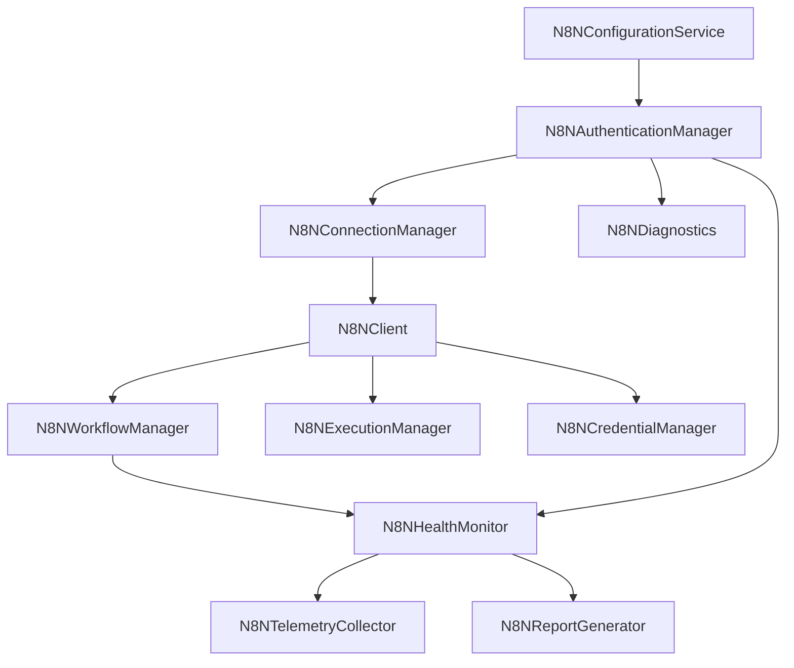

# self-hosted n8n Production Integration Report (M2)

This report documents the architectural design, lifecycle structures, and integration points for the production self-hosted n8n integration subsystem (Sprint 2).

---

## 1. Production Architecture

The n8n integration subsystem consists of 16 specialized service managers registered dynamically within the Dependency Injection container inside `bootstrap.py`.

All 16 components inherit from the `DIInitializeMixin` class, satisfying the lifecycle initialization protocol of the `ServiceRegistry`.

---

## 2. REST Client Lifecycle

The `N8NClient` coordinates all underlying REST API queries to the self-hosted instance (targeting `http://localhost:5678/api/v1` by default).

* **Retry Policies**: Standard requests use a linear backoff retry loop up to `max_retries` (configured in `N8NConfigurationService`).
* **Error Mappings**: Converts transport level `httpx` request failures into clean diagnostic error logs. Maps 401 unauthorized status codes to the diagnostic state `"Awaiting Runtime Configuration"`.

---

## 3. Authentication

Supports production-ready authentication headers:
* **API Key**: Attaches the token key under the `X-N8N-API-KEY` header.
* **Bearer Token**: Transmits standard JSON Web Tokens under the `Authorization: Bearer <token>` header.
* **Diagnostics**: If credentials or path environments are missing, it flags the state as `"Awaiting Runtime Configuration"` instead of utilizing dummy fallback payloads.

---

## 4. Workflow Lifecycle

The `N8NWorkflowManager` encapsulates:
* **Upload**: Transmits node list layouts and connections graph payloads via `POST /api/v1/workflows`.
* **Activation / Deactivation**: Sends activation patches (`PATCH /api/v1/workflows/{id}`) to activate/deactivate execution triggers.
* **Integrity Validation**: Runs structural AST validations ensuring nodes list contains valid entries prior to upload.

---

## 5. Execution Lifecycle

Coordinates workflow execution runs:
* **Triggering**: Triggers workflow runs via `POST /api/v1/workflows/{id}/run`.
* **Polling**: Queries the status of executions using `GET /api/v1/executions` and logs status changes.
* **Cancellation**: Removes active executions using `DELETE /api/v1/executions/{id}` if supported.

---

## 6. Telemetry & Diagnostics

* **Telemetry Collector**: Compiles execution latencies, P95 profiles, and connection error rates.
* **Diagnostics**: Analyzes connection profiles and certificates to verify system integrity.

---

## 7. Integration Points

* **Workspace Reporting**: Automatically writes status reports inside the active workspace under `docs/n8n/` (containing `N8N_STATUS.md`, `N8N_HEALTH.md`, etc.).
* **Memory Syncing**: Records execution summaries in the central memory database. Never logs credentials, API keys, or raw execution payloads containing secrets.
* **Knowledge Hub**: Syncs connection reports to the Notion knowledge base on-demand.
