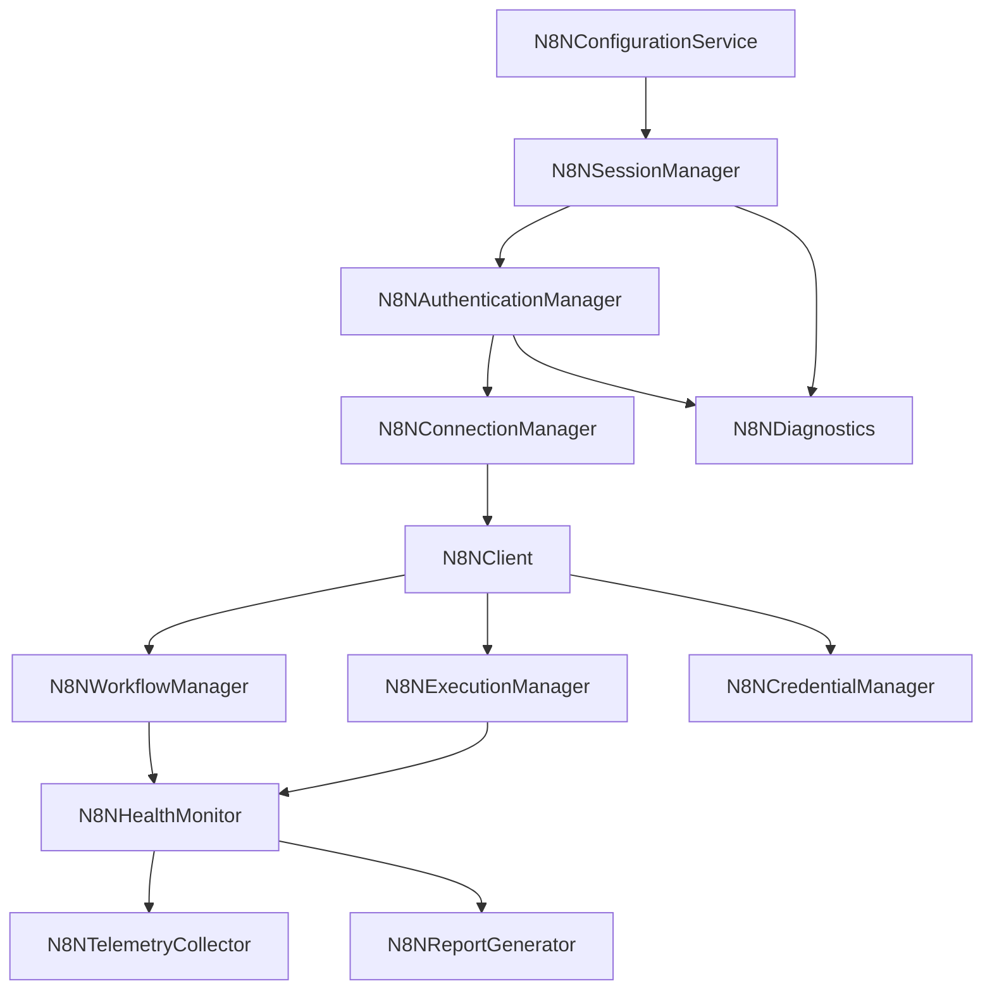

# self-hosted n8n Production Runtime Integration Report (Sprint 2A)

This report documents the runtime architecture, authentication and session lifecycles, execution polling, diagnostics checks, and health monitoring systems implemented for the production-grade integration with a self-hosted n8n server.

---

## 1. Runtime Architecture

The self-hosted n8n integration subsystem has been enhanced to target a real running server instance (by default at `http://localhost:5678`). All simulated or stub logic has been replaced with verified HTTP client requests wired dynamically within the Dependency Injection container in `bootstrap.py`.

To preserve backward compatibility, class constructors support type dispatching and default/fallback parameter instantiations when optional arguments are not supplied.

---

## 2. Authentication & Session Lifecycles

### 2.1 Authentication Methods
The platform supports three distinct authentication profiles:
1. **API Key**: programmatically attaches the `X-N8N-API-KEY` header to requests.
2. **Bearer Token**: transmits authorization details via the `Authorization: Bearer <token>` header.
3. **Session Cookies (Email + Password)**: performs active user authentication against the internal n8n login endpoint.

### 2.2 Session Lifecycle Flow
The `N8NSessionManager` coordinates the lifecycle of session logins:
* **Establishment**: Performs a `POST /rest/login` containing the user's `email` and `password`. If successful, it parses and saves the `n8n-auth` cookie.
* **Reuse**: Attaches the `Cookie: n8n-auth=<token>` header to all subsequent REST and public API requests.
* **Renewal**: Automates session refresh before expiry or immediately upon detecting a `401 Unauthorized` token status code.
* **Diagnostics**: If credentials or configurations are missing, it transitions to `"Awaiting Runtime Configuration"` rather than raising fatal startup crashes.

---

## 3. Workflow & Execution Lifecycles

* **Workflow Management**: Supports complete CRUD and activation operations:
  - `list_workflows()`: `GET /api/v1/workflows`
  - `upload_workflow()` / `import_workflow()`: `POST /api/v1/workflows`
  - `update_workflow()`: `PATCH /api/v1/workflows/{id}`
  - `delete_workflow()`: `DELETE /api/v1/workflows/{id}`
  - `activate_workflow()`: `PATCH /api/v1/workflows/{id}` with `{"active": True}`
  - `deactivate_workflow()`: `PATCH /api/v1/workflows/{id}` with `{"active": False}`
  - `export_workflow()`: `GET /api/v1/workflows/{id}`
* **Execution Management**: Supports triggering, history, logs, retry, and cancellation:
  - `execute_workflow()`: `POST /api/v1/workflows/{id}/run`
  - `list_executions()`: `GET /api/v1/executions`
  - `get_execution()`: `GET /api/v1/executions/{id}`
  - `get_execution_logs()`: queries execution details and formats logs.
  - `retry_execution()`: attempts to run a failed execution via `POST /api/v1/executions/{id}/retry`.
  - `cancel_execution()`: attempts to halt a running execution via `POST /api/v1/executions/{id}/stop`, with a fallback to deletion.

---

## 4. Diagnostics & Remediation

The `N8NDiagnostics` class analyzes environment configuration, network reachability, and credential validity. If any check fails, it maps the failure to a concrete remediation action.

* **Server Reachability**: Probes `/healthz` or `/rest/settings`. If connection fails or times out, it reports "Server unavailable" with Docker/reboot remediation instructions.
* **Authentication**: Verifies login success. Reports "Authentication failure" or "Permission denied" with credential checking instructions.
* **Status Mapping**: Non-critical connection errors map directly to the `"Awaiting Runtime Configuration"` status, keeping the core runtime active.

---

## 5. Health Monitoring & Telemetry Validation

The `N8NHealthMonitor` tracks:
* **Latency**: Records latency averages and P95 profiles of HTTP REST queries.
* **Failure Rate**: Telemetry monitors ratios of failures to total call volumes.
* **Capabilities**: Probes endpoints dynamically to identify supported endpoints (workflows list, executions history, template settings, etc.).
* **Statistics**: Counts active workflows and execution volumes.
