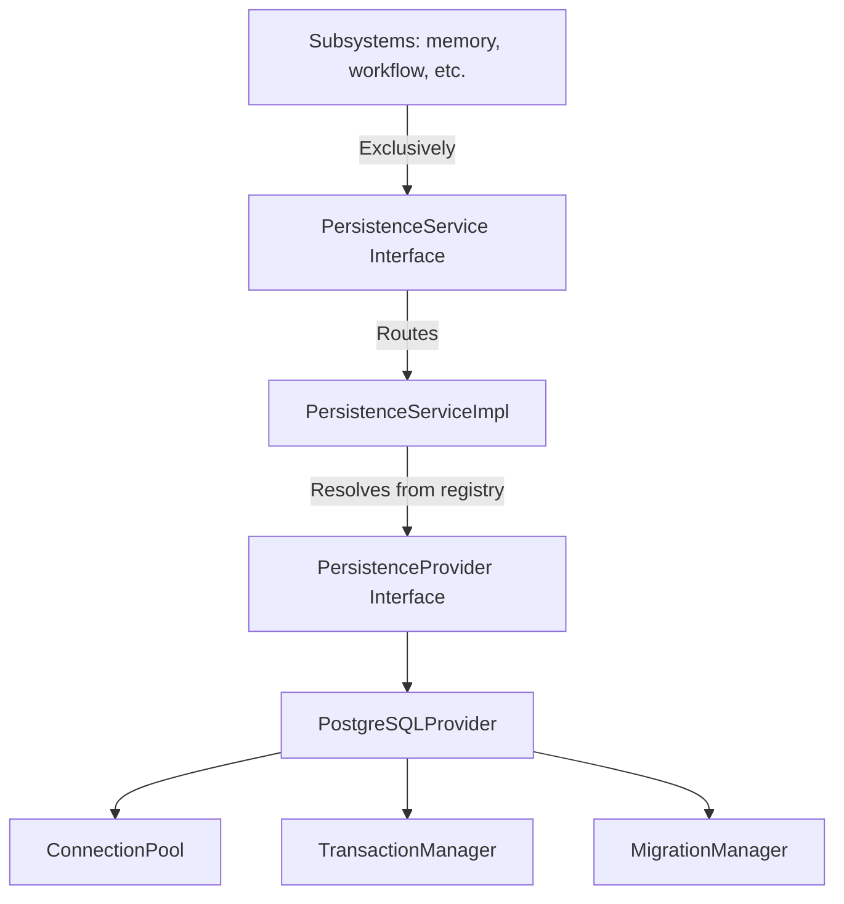

# Persistence Platform Milestone 1 Integration Report

## 1. Architecture Discovery & Integration Strategy

### 1.1 Discovery Summary
An extensive discovery phase was conducted on the Personal AI OS codebase to analyze existing components:
*   **Dependency Injection**: Driven by the class-mapped registration system `ServiceRegistry` in [registry.py](file:///Users/anzarakhtar/aios/core/src/aios/registry.py).
*   **Lifecycle**: Standardized by the base class `ServiceLifecycle` in [base.py](file:///Users/anzarakhtar/aios/core/src/aios/services/base.py) (handling `initialize`, `on_ready`, `on_active`, and `teardown` stages).
*   **Diagnostics/Health**: Monitored via custom domain-specific metrics trackers and diagnostics validators.

### 1.2 Integration Strategy
To integrate persistence without violating architecture rules:
*   Registered all persistence managers inside the unified Composition Root in [bootstrap.py](file:///Users/anzarakhtar/aios/core/src/aios/bootstrap.py).
*   Designed the persistence classes to inherit directly from `ServiceLifecycle` so that the Kernel manages their startup and shutdown automatically.
*   Enforced database provider decoupling: all subsystems communicate strictly with `PersistenceService`, never referencing PostgreSQL directly.

---

## 2. Persistence Architecture & Provider Abstraction

The Persistence Platform follows a strictly decoupled provider-agnostic layering pattern:

### 2.1 Interface Specifications
*   **`PersistenceService`**: Exposes simple unified methods `execute(query, params)`, `begin_transaction()`, `commit_transaction()`, and `rollback_transaction()` to consumer subsystems.
*   **`PersistenceProvider`**: Abstract interface declaring required hooks for database initialization, connecting, query executing, and transactional operations.
*   **`PersistenceRegistry`**: Registers and instantiates pluggable provider classes by name (e.g. `'postgresql'`).
*   **`RepositoryRegistry`**: A clean, centralized dictionary structure enabling future business domain entities to register their table repositories.

---

## 3. Core Lifecycles

### 3.1 Connection Pool Lifecycle & Management
The connection pool runs on `ConnectionPool` in `persistence_impl.py`:
*   **Pre-population**: When the provider is connected, it pre-spawns connection instances up to `pool_min_size`.
*   **Acquisition & Validation**: Checks out connection instances on demand. Every checkout performs a quick query validation (`SELECT 1`). If a connection is dead, it is automatically discarded and a new connection is spawned.
*   **Pool Growth**: If checkout requests exceed available pooled connections, the pool dynamically spawns new instances up to `pool_max_size`.
*   **Timeout & Exhaustion**: If all slots up to `pool_max_size` are active, requests block and raise a `TimeoutError` after a configurable timeout limit.
*   **Graceful Teardown**: Closes all active connections and empties the pool.

### 3.2 Transaction Lifecycle & Nested Savepoints
Transaction scopes are managed by the `TransactionManager`:
*   **Flat Transactions**: The first call to `begin_transaction()` acquires a pooled connection and starts a database transaction (`BEGIN TRANSACTION`).
*   **Nested Transactions**: Subsequent calls to `begin_transaction()` while a transaction is active create database savepoints (`SAVEPOINT sp_N`), incrementing the nested stack counter.
*   **Committing**: Committing decrements the stack counter. Once the stack counter hits zero, the changes are committed to the database (`COMMIT`) and the connection is returned to the pool.
*   **Rollbacks**: Rollbacks restore the state to the nearest nested transaction savepoint (`ROLLBACK TO SAVEPOINT sp_N`). If rolling back the outermost scope, the entire transaction is rolled back (`ROLLBACK`) and the connection is returned to the pool.

### 3.3 Migration Lifecycle & Validation
Database schemas are managed by the `MigrationManager`:
*   **Discovery**: Migrations are registered in sequential version numbers.
*   **Sequence Validation**: Checks for duplicate migration versions and verifies that migration versions are registered in ascending sequential order.
*   **History & Tracking**: Compares registered migrations against the internal `_migrations` database history table.
*   **Atomic Application**: Pending migration scripts are executed inside atomic transaction blocks to prevent partial migration states in case of script failures.

---

## 4. Diagnostics & Health Monitoring

### 4.1 Diagnostics Checks
The `PersistenceDiagnostics` service scans database configuration and connectivity states, returning remediation actions:
*   **Connection Failure**: Probes connection health. Remediates by prompting checking database process status and port listings.
*   **Pool Configuration Inconsistency**: Ensures min size > 0 and max >= min. Remediates by instructing correcting parameters.
*   **Migration Sequence Inconsistency**: Detects duplicate or unordered migration versions. Remediates by instructing sequence audits.

### 4.2 Health Audits
The `PersistenceHealthMonitor` compiles runtime metrics:
*   **Availability**: Checks connection state.
*   **Latency**: Measures query roundtrip latencies and maintains average and P95 latency profiles.
*   **Pool Status**: Exposes active connection counts and total pool size.
*   **Performance Metrics**: Exposes query success rates, transaction retry/failure statistics, and applied migration levels.
