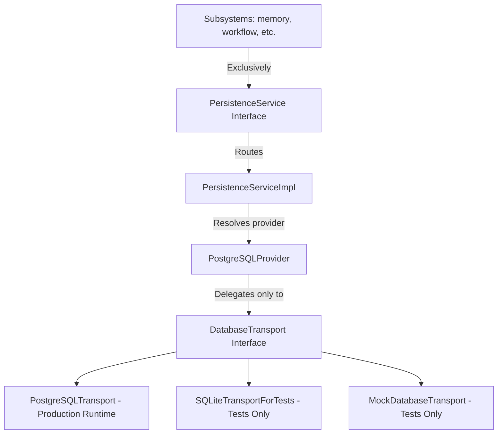

# Persistence Platform Milestone 1.1 Integration Report

## 1. Architectural Correction: Database Transport Abstraction

During architecture review, it was resolved that PostgreSQLProvider should not transparently execute on top of an internal SQLite database at runtime. To ensure that production engines execute strictly over production-ready protocols, this milestone correction decouples database provider logic from the concrete transport layer.

### 1.1 Decoupled Layering Architecture
A database transport abstraction layer has been introduced:

### 1.2 Transport Interface Specifications
*   **`DatabaseTransport`**: Abstract interface exposing base methods:
    *   `connect()` / `disconnect()`
    *   `execute(query, params)` / `execute_many(query, params_list)`
    *   `begin_transaction() -> TransportTransaction`
    *   `health() -> TransportHealth`
    *   `capabilities() -> TransportCapabilities`
    *   `validate_configuration() -> List[str]`
*   **`TransportConnection`**: Abstract instance wrapping active client connections.
*   **`TransportTransaction`**: Abstract transaction wrapper exposing standard `commit()` and `rollback()` targets.
*   **`TransportResult`**: Contains list of fetched rows, affected count, and last inserted ID.
*   **`TransportFactory`**: Configures, validates, and instantiates registered transports.

---

## 2. Decoupled Provider & Runtime Separation

### 2.1 Production PostgreSQL Transport
The concrete `PostgreSQLTransport` executes database statements over the `psycopg2` driver. It does not contain any fallback logic to SQLite:
*   **Awaiting Runtime Configuration**: If Postgres connection parameters (`POSTGRES_HOST`, `POSTGRES_USER`, etc.) are missing from the environment, the transport enters the `"Awaiting Runtime Configuration"` state. In this state, it does not fail the kernel bootstrap, but safely blocks query execution and reports status errors.
*   **Validation**: Validates configuration parameters. If any key config is missing, it logs info and suspends active socket connections.

### 2.2 Test Transports Separation
To completely isolate SQLite from the production runtime codebase:
*   `SQLiteTransportForTests` has been created and placed strictly inside [test_persistence.py](file:///Users/anzarakhtar/aios/core/tests/test_persistence.py). It wraps Python's standard `sqlite3` using memory-shared schemas (`file:persistence_test_db?mode=memory&cache=shared`) and coordinates connection-affinity for transaction savepoint scopes.
*   `MockDatabaseTransport` has been created inside [test_persistence.py](file:///Users/anzarakhtar/aios/core/tests/test_persistence.py) to simulate offline connectivity errors, protocol compatibility warnings, and configuration mismatches.
*   The production code in `persistence_impl.py` contains **zero** `sqlite3` imports or SQLite references.

---

## 3. Core Lifecycles

### 3.1 Connection Management
The transport establishes connection pooling and manages timeouts:
*   **Connect/Disconnect**: Opens client sockets and maps query parameters.
*   **Validation**: Every active query checked out from pools runs a pre-validation `SELECT 1` probe to confirm socket status.
*   **Metrics**: Collects connection counts, average roundtrip times, and P95 latency profiles.

### 3.2 Transaction Stack & Savepoints
Transaction scopes are tracked by the `TransactionStackManager`:
*   **Flat Transactions**: The outermost scope requests a transport-level transaction (`begin_transaction()`).
*   **Nested Savepoints**: Any nested transaction requests are managed using database savepoints (`SAVEPOINT sp_N`). Commits release savepoint labels, and rollbacks restore state coordinates to savepoints.

### 3.3 Migrations
Migrations are discovered and validated by the `MigrationManager`. Sequenced scripts are registered, compared to the applied history versions inside the `_migrations` table, and executed atomically.

---

## 4. Diagnostics & Health Indicators

### 4.1 Diagnostics Checks
The `PersistenceDiagnostics` service scans configurations and connection health, outputting:
*   **Awaiting Runtime Configuration**: Emits actionable advice to configure Postgres variables (`POSTGRES_HOST`, `POSTGRES_USER`, etc.) when missing.
*   **Connection/Credential Errors**: Diagnoses port connection failures, bad authentication parameters, or SSL mismatches.

### 4.2 Health Monitoring
The `PersistenceHealthMonitor` polls transport health. It records latencies, checks server availability, and calculates overall health scores.
