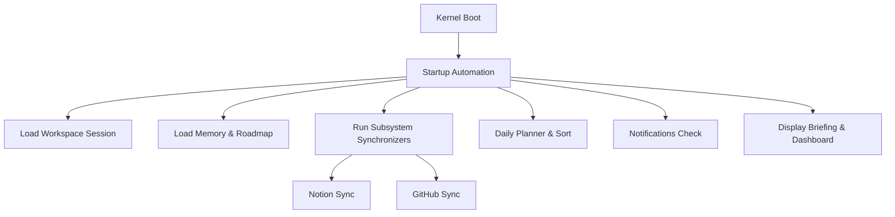

# Phase 3: Daily Intelligence & Autonomous Workspace

Welcome to Phase 3 of the AI OS Local Model Intelligence Layer specification. This document serves as the Technical Reference, Developer Guide, CLI Guide, and Architecture Specification for the Daily Intelligence and Autonomous Workspace system.

---

## 1. System Architecture

The Daily Intelligence system acts as an autonomous workspace coordinator that boot-straps context, gathers multi-modal telemetry, synthesizes agendas, runs background synchronizers, and notifies the user of events across all registered projects and tasks.

The system is built as a set of unified CLI extensions on top of the Phase 1 Model Intelligence and Phase 2 Workspace subsystems.

### Architecture Overview



### Dynamic Context Detection

The Workspace Intelligence engine dynamically inspects the active environment to identify the focus project. It evaluates:
1. The name of the current working directory.
2. The name of the current active Git branch.
3. The names of recently opened files in the active session.

| Pattern | Detected Workspace |
|---------|---------------------|
| Branch/CWD contains `hackathon` | **Hackathon Workspace** |
| Branch/CWD contains `agency` | **Agency Workspace** |
| Branch/CWD contains `portfolio` | **Portfolio Workspace** |
| Branch/CWD contains `college` | **College Workspace** |
| Branch/CWD contains `research` | **Research Workspace** |
| Else | **AI OS Development Workspace** |

---

## 2. CLI Command Guide

All daily intelligence features are exposed via the `aios` command and its subcommands:

### `aios` (No arguments)
- **Description**: Default startup command. Runs the boot sequence, loads the session, synchronizes databases, displays the Morning Briefing, shows the Unified Systems Dashboard, and starts the interactive REPL shell.

### `aios today`
- **Description**: Displays the Morning Briefing and the consolidated Daily Planner tasks sorted by priority (Critical > High > Medium > Low).

### `aios dashboard`
- **Description**: Renders the complete Unified Systems Dashboard, showcasing:
  - Kernel info (version, uptime, session details).
  - Diagnostics/Health checks.
  - Active Ollama model registries and statuses.
  - Today's agenda summary.
  - CRM Agency leads & active Hackathons trackers.

### `aios work`
- **Description**: Displays the current Workspace Engineering Context, including git branch, unstaged/untracked modifications, recent command history, active sprint, and build/linter configurations.

### `aios agenda`
- **Description**: Compiles and displays today's schedule, client meetings, outreach targets, and upcoming college/hackathon deadlines.

### `aios projects`
- **Description**: Lists active and completed projects with client links and pipeline budgets.

### `aios agency`
- **Description**: Displays CRM Leads, follow-up items, outreaches, and reminders.

### `aios hackathons`
- **Description**: Renders active hackathons, deadlines, submission checklist items, and project progress profiles.

### `aios github`
- **Description**: Displays GitHub Repository Intelligence, including failed workflow actions, open issues, open pull requests, and recent commit histories.

### `aios notion`
- **Description**: Forces Notion Daily Page synchronization, log pages, engineering journal updates, and benchmark reports synchronization.

### `aios resume`
- **Description**: Restores the previous session state (including conversation transcripts) and displays exactly where the developer stopped.

---

## 3. Developer Integration Guide

Developers can extend the system by registering new task scrapers or custom alert checks in the pipeline:

### Adding a Custom Task Scraper
Add task generation logic inside `generate_daily_planner` in [cli_workspace_commands.py](file:///Users/anzarakhtar/aios/core/src/aios/local/cli_workspace_commands.py):
```python
# Example: Adding a JIRA task scraper
try:
    jira_svc = registry.get(JiraService)
    if jira_svc:
        for issue in jira_svc.get_assigned_issues():
            planner_tasks.append({
                "source": "Jira Task",
                "title": issue.summary,
                "priority": issue.priority,
                "status": issue.status
            })
except Exception:
    pass
```

### Adding a Diagnostic Recovery Alert
Alerts are parsed by `check_notifications`. You can append custom conditions:
```python
# Example: Check CPU Temp warning
try:
    cpu_temp = get_cpu_temp()
    if cpu_temp > 90:
        notifications.append({
            "type": "warning",
            "title": "High CPU Temperature Alert",
            "message": f"Processor temperature is {cpu_temp}°C! Consider cooling."
        })
except Exception:
    pass
```
