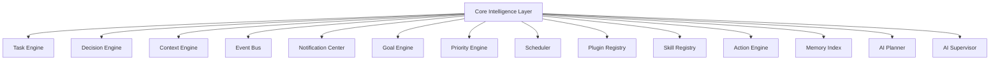

# Phase 4: Core Intelligence Layer Documentation

This document describes the Architecture, Component Specification, CLI Commands, and Developer Guidelines for the **Core Intelligence Layer (Phase 4)** of AI OS.

---

## 1. System Architecture

The Core Intelligence Layer acts as the central coordinator (the "brain") of AI OS. Instead of modules calling each other directly, all future modules (Notion, GitHub, CRM Agency, Hackathon, College, etc.) plug into this centralized architecture.

---

## 2. Component Design & Guides

### Universal Task Engine
- **Class**: `TaskEngine` (persists to `.agent/tasks.json`)
- **Format**: Every execution unit is represented as a `Task` containing:
  - `task_id`: Unique identifier.
  - `title` / `description`: Action items.
  - `priority`: Critical, High, Medium, Low.
  - `project` / `workspace`: Groupings.
  - `status`: Pending, In Progress, Completed, Failed.
  - `dependencies`: List of parent task IDs that must complete first.
  - `estimated_time` / `assigned_model` / `required_skill` / `completed_time`.

### Decision Engine
- **Class**: `DecisionEngine`
- **Heuristics**:
  - Automatically selects the **Best Model** based on priority: reasoning models (`deepseek-r1`) are assigned to Critical/High tasks; helper models (`gemma3:4b`) are assigned to Low/Medium tasks.
  - Dynamically routes target capability to the **Best Tool** (e.g. `DeveloperWorkspaceTool`, `NotionIntegrationTool`, etc.).
  - Configures retry strategies dynamically for failed states.

### Context Engine
- **Class**: `ContextEngine` (persists to `.agent/context.json`)
- **Context fields**: Tracks active project, sprint, git branch, workspace, client, hackathon, active session, and loaded Ollama models.

### Goal Engine & Priority Engine
- **Class**: `GoalEngine` (persists to `.agent/goals.json`)
  - Supports Daily, Weekly, Monthly, Sprint, Project, Agency, and Hackathon goals.
- **Class**: `PriorityEngine`
  - Computes task scores dynamically using deadlines, dependencies, client priority, roadmap status, and effort weights.

### Scheduler & Event Bus
- **Class**: `Scheduler` (persists to `.agent/scheduler.json`)
  - Triggers periodic jobs (daily syncs, health checks, cache pruning, diagnostics).
- **Class**: `EventBus`
  - Facilitates publish-subscribe communications across all subsystems. Events include `TaskCreated`, `TaskCompleted`, `ModelLoaded`, `ModelUnloaded`, `NotionUpdated`, `GitHubPush`.

### Registries: Plugin, Skill & Action
- **Class**: `PluginRegistry` / `SkillRegistry`
  - Registers capability nodes (e.g. `Generate Code`, `Review Code`, `Research Paper`).
- **Class**: `ActionEngine`
  - Exposes actions from loaded modules (e.g., GitHub `Create Issue`, Notion `Create Page`).

### AI Planner & AI Supervisor
- **Class**: `AIPlanner`
  - Decomposes objectives into dependency-linked task sequences.
- **Class**: `AISupervisor`
  - Monitors service health, watches daemon lifecycles, and triggers automated recoveries if any module crashes or hangs.

---

## 3. CLI Command Guide

- `aios tasks [create/complete]`: List, add, or complete tasks in the queue.
- `aios goals [create/achieve]`: Set and track sprint/project goals.
- `aios planner "<objective>"`: Run AI planner breakdown on an objective.
- `aios plugins`: View registered plugins and their capability list.
- `aios skills`: View AI system skills catalog.
- `aios notifications [create]`: List system notifications and warnings.
- `aios events [publish]`: Interact with or publish events to the EventBus.
- `aios context [update]`: Inspect or modify active context.
- `aios scheduler [trigger]`: Check and trigger background scheduler jobs.
