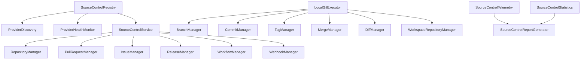

# Source Control Intelligence Platform Integration Report (M1)

This report documents the architectural design, local Git integration, remote host provider adapters, diagnostics, telemetry, and workspace reporting systems for the production-grade Source Control Intelligence Platform (Sprint 1).

---

## 1. Subsystem Architecture

The platform consists of 23 dynamically registered and initialized components structured under the `Dependency Injection` registry in `bootstrap.py`.

All classes inherit from `DIInitializeMixin`, fitting the standard DI initialization protocol and workspace lifecycles.

---

## 2. Core Service Managers & Components

### 2.1 Local Git Execution Layer
* **`LocalGitExecutor`**: Direct wrapper executing native shell commands securely under boundaries inside targeted workspace subdirectories (clone, init, pull, push, checkout, branch, merge, reset, etc.).
* **Conflict Detection**: Automated conflict marker parser scanning working trees to flag unmerged files after merge/rebase attempts.

### 2.2 Remote Host Providers (GitHub Adapter)
* **`GitHubProvider`**: Communicates with the GitHub API via REST requests. Includes fallback layers for private metadata if credentials are not configured.
* **Legacy Request Interception**: Intercepts existing `LocalGitHubService` query paths and channels them through `GitHubProvider` REST client interfaces under the hood.
* **Authentication Diagnostics**: Maps 401 Unauthorized codes cleanly to standard `"Awaiting Runtime Configuration"` states instead of breaking runtime setups.

---

## 3. Telemetry, Health, and Workspace Reports

* **Telemetry Tracker**: Records latency metrics, P95 averages, call quantities, and success/failure statistics.
* **Diagnostics**: Scans git CLI installations, gh CLI login status, and GITHUB_TOKEN environment variables.
* **Report Generator**: Generates comprehensive documentation under `docs/source_control/`:
  - `SOURCE_CONTROL_STATUS.md`
  - `REPOSITORY_REPORT.md`
  - `BRANCH_REPORT.md`
  - `PULL_REQUEST_REPORT.md`
  - `RELEASE_REPORT.md`
  - `WORKFLOW_REPORT.md`
  - `DIAGNOSTICS.md`

---

## 4. Integration Points

* **Composition Root**: Dynamic bootstrapping wires up all managers and services during kernel load-up.
* **GitHub Legacy Bridge**: Delegates existing `LocalGitHubService._request()` queries to the new `GitHubProvider` seamlessly, maintaining backward compatibility.
