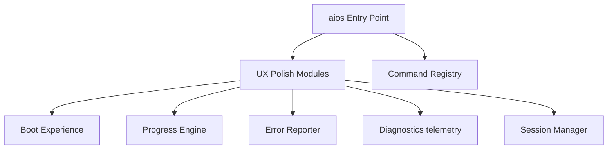

# CLI & UX Architecture Guide

This document describes the design architecture, modules, and data flow of the CLI.

---

## 1. System Overview

---

## 2. Component Flows
- **Centralized Middleware Integration**: Intercepts command runs to check validation rules.
- **Persistent Cache States**: Saves session info to `.agent/session.json`.
- **Keyboard Hook bindings**: Bind `Ctrl+K` and `Ctrl+L` in `cli.py` to trigger palette and clear operations.
