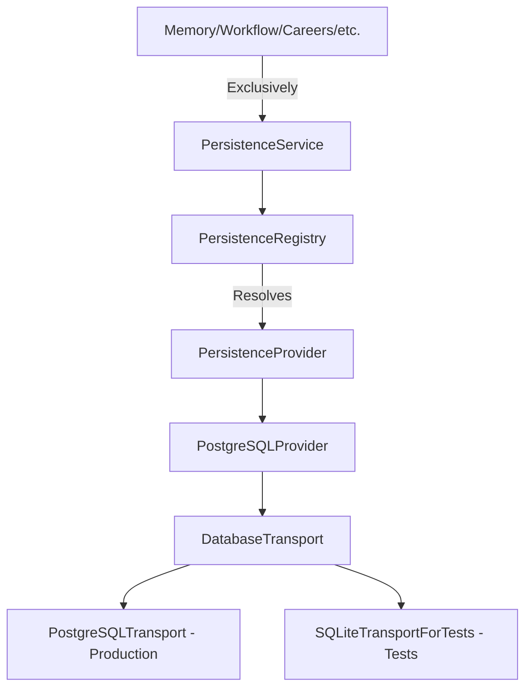

# Persistence Platform Milestone 1: Architecture Discovery Report

This report outlines the discovery phase of the persistence subsystem, analyzing existing architecture patterns in the Personal AI OS codebase to ensure a seamless, non-duplicative integration.

---

## 1. Existing Components Analysis

The codebase currently implements a variety of domain-specific managers, engines, and services. The fundamental infrastructure components identified during discovery are:

*   **Dependency Injection & Registry**: Managed by `ServiceRegistry` in [registry.py](file:///Users/anzarakhtar/aios/core/src/aios/registry.py). It registers service instances subclassed from `ServiceLifecycle` and retrieves them by their class interface.
*   **Lifecycle Management**: Governed by the `ServiceLifecycle` base class in [base.py](file:///Users/anzarakhtar/aios/core/src/aios/services/base.py), which defines transitions through `initialize`, `on_ready`, `on_active`, and `teardown`.
*   **Initialization Helper**: `DIInitializeMixin` in [providers/models.py](file:///Users/anzarakhtar/aios/core/src/aios/providers/models.py) or similar packages provides hook conventions for components that need standard pre-initialization.
*   **Configuration Management**: Loaded locally via custom configurations (e.g. `N8NConfigurationService`).
*   **Storage Abstractions**: `MemoryStorage` interface and `LocalJSONMemoryStorage` in `memory_storage.py` and `memory_storage_impl.py`.
*   **Diagnostics & Health**: Implemented as custom diagnostic classes (e.g., `N8NDiagnostics`, `N8NHealthMonitor`, `N8NReportGenerator`) that run connection/authentication audits and generate markdown reports.

---

## 2. Reusable Components & Patterns

To maintain structural consistency, the Persistence Platform will reuse and adapt the following design patterns:

1.  **Service Registration**: Register `PersistenceService` under the `ServiceRegistry` container inside `bootstrap.py`.
2.  **Diagnostics Structs**: Return dicts mapping failures (e.g. timeout, connection, pool exhaustion) to clear remediations, mirroring `N8NDiagnostics`.
3.  **Telemetry Collection**: Gather average latencies, failure rates, connection counts, and transaction success rates dynamically.
4.  **Markdown Report Generation**: Periodically write diagnostics, health, and status summaries to the `docs/persistence/` folder via `PersistenceReportGenerator`.

---

## 3. Extension Points & Provider-Agnostic Design

Every subsystem must interface exclusively with the `PersistenceService`. Direct interaction with provider-specific drivers (e.g. `psycopg2`) is restricted.

### Key Interfaces
*   **`PersistenceProvider`**: Abstract base class declaring standard capabilities (`connect`, `disconnect`, `execute`, `begin_transaction`, `commit_transaction`, `rollback_transaction`, `validate_connection`, `run_migration`).
*   **`DatabaseTransport`**: Abstract interface decoupling providers from target database drivers (connect, disconnect, execute, transaction hooks).
*   **`TransportFactory`**: Factory discovering and instantiating appropriate database transports.
*   **`RepositoryRegistry`**: Registers and resolves domain-specific repositories.

---

## 4. Potential Conflicts & Integration Strategy

*   **Circular Dependencies**: Ensured managers coordinate exclusively via the `PersistenceService` mediator.
*   **Decoupled SQLite Mocking**: Moved SQLite-backed pooling and connections completely out of the production runtime into [test_persistence.py](file:///Users/anzarakhtar/aios/core/tests/test_persistence.py) via `SQLiteTransportForTests`. Production code executes strictly over PostgreSQL protocols, reporting `"Awaiting Runtime Configuration"` if env is missing.
*   **Secrets Exposure**: Connection strings and credentials are excluded from reports and logs.

---

## 5. Recommended Integration Strategy

1.  Define abstract bases `PersistenceProvider`, `DatabaseTransport`, `TransportConnection`, and `TransportTransaction` in `core/src/aios/services/persistence.py` and implement concrete psycopg2 wrappers in `core/src/aios/services/persistence_impl.py`.
2.  Wire and register all persistence services in `core/src/aios/bootstrap.py`.
3.  Write test transports `SQLiteTransportForTests` and `MockDatabaseTransport` inside `core/tests/test_persistence.py` to verify connection affinity, transactions, and diagnostics under test scopes.
4.  Compile all health and diagnostic reports using `PersistenceReportGenerator`.
