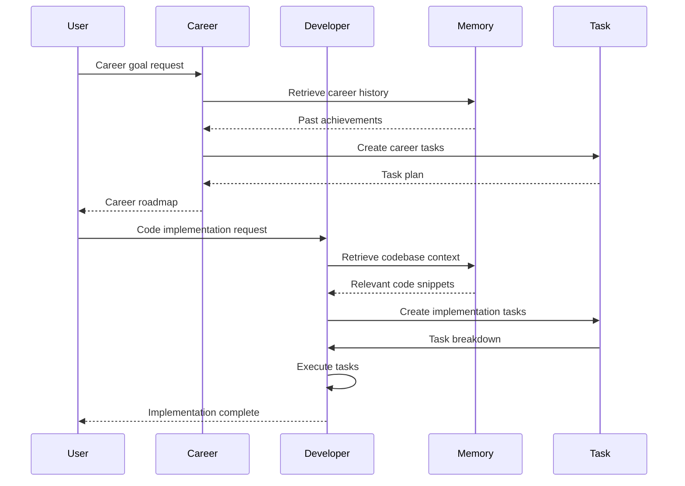

<!--
  ⚠  AUTO-GENERATED — DO NOT EDIT MANUALLY
  Generated by: aios.docgen diagram generator
  Generated on: 2026-07-06T09:17:00Z
  This file is recreated on every generation run.
  Edit the source code and re-run the generator to update this file.
-->

# Agent Interaction Flow

> Multi-agent coordination and communication patterns.

## Agent Coordination Flow

## Agent Capabilities

### Career Agent
- Career planning and goal setting
- Interview preparation
- Resume optimization
- Learning path recommendations

### Developer Agent
- Code generation and analysis
- Bug fixing and debugging
- Refactoring and optimization
- Testing and documentation

### Memory Agent
- Context retrieval
- Semantic search
- Knowledge base queries
- Conversation history

### Task Agent
- Task decomposition
- Execution planning
- Progress tracking
- Dependency management
