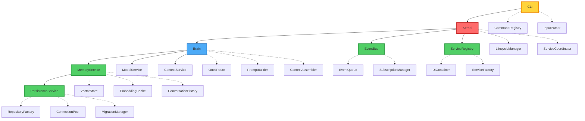

<!--
  ⚠  AUTO-GENERATED — DO NOT EDIT MANUALLY
  Generated by: aios.docgen diagram generator
  Generated on: 2026-07-07T17:17:04Z
  This file is recreated on every generation run.
  Edit the source code and re-run the generator to update this file.
-->

# AI OS Architecture

> High-level system architecture showing major components and their relationships.

## Overall Architecture

## Component Types

- **Kernel** (red): Core orchestration engine
- **Engine** (blue): Processing and reasoning engines
- **Service** (green): System services and coordinators
- **Interface** (yellow): External interfaces and entry points

**Solid arrows** (→) represent dependencies
**Dotted arrows** (⇢) represent subcomponent relationships
