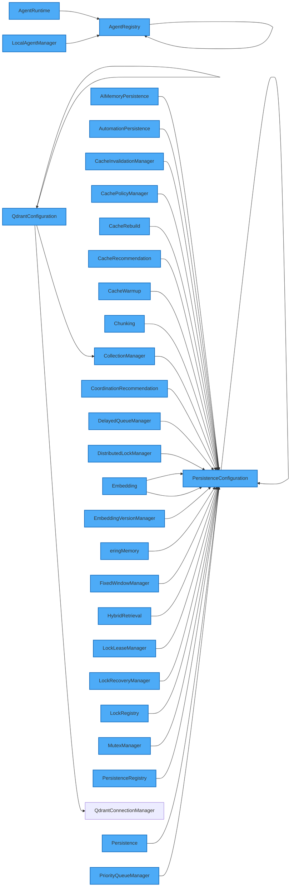

<!--
  ⚠  AUTO-GENERATED — DO NOT EDIT MANUALLY
  Generated by: aios.docgen diagram generator
  Generated on: 2026-07-06T09:17:00Z
  This file is recreated on every generation run.
  Edit the source code and re-run the generator to update this file.
-->

# Service Dependency Graph

> Dependency relationships between 123 services.

## Service Dependencies

## Legend

- **Blue nodes**: Service interfaces
- **Green nodes**: Service implementations
- **Arrows**: Service depends on target

Note: Showing 30 services with the most dependencies out of 123 total services.
