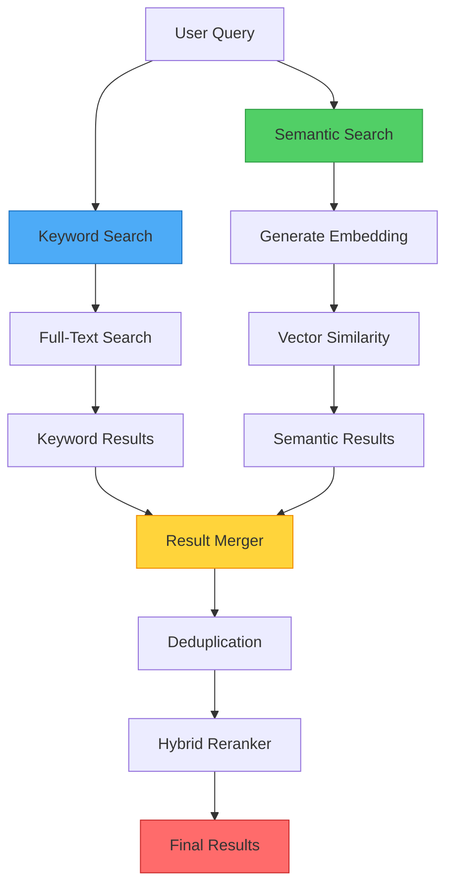

<!--
  ⚠  AUTO-GENERATED — DO NOT EDIT MANUALLY
  Generated by: aios.docgen diagram generator
  Generated on: 2026-07-13T17:22:38Z
  This file is recreated on every generation run.
  Edit the source code and re-run the generator to update this file.
-->

# Hybrid Retrieval Pipeline

> Combined keyword and semantic search for comprehensive memory retrieval.

## Hybrid Retrieval Flow

## Retrieval Strategies

### Keyword Search Path
- Full-text search on conversation history
- Exact and fuzzy matching
- Fast for known terms and entities

### Semantic Search Path
- Vector embedding similarity
- Captures semantic meaning
- Finds conceptually related content

### Hybrid Combination
- Merges results from both paths
- Removes duplicates
- Reranks by combined relevance score
