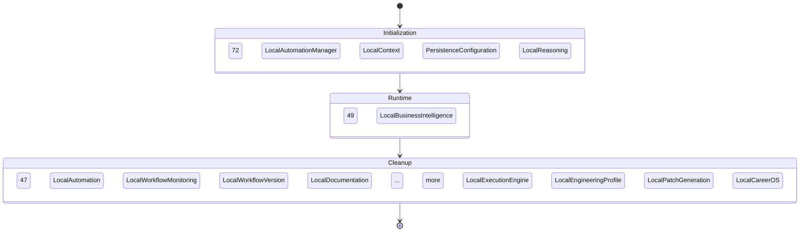

<!--
  ⚠  AUTO-GENERATED — DO NOT EDIT MANUALLY
  Generated by: aios.docgen diagram generator
  Generated on: 2026-07-13T17:22:38Z
  This file is recreated on every generation run.
  Edit the source code and re-run the generator to update this file.
-->

# Runtime Lifecycle

> Service lifecycle phases from initialization through cleanup.

## Lifecycle Flow

## Lifecycle Phases

### Initialization

Services in this phase: 80

Key services:
- LocalAutomationManager
- LocalAutomationService
- LocalContextService
- LocalWorkflowMonitoringService
- LocalWorkflowVersionService

### Runtime

Services in this phase: 57

Key services:
- LocalAutomationService
- LocalWorkflowMonitoringService
- LocalWorkflowVersionService
- LocalDocumentationService
- LocalBusinessIntelligenceService

### Cleanup

Services in this phase: 55

Key services:
- LocalAutomationService
- LocalWorkflowMonitoringService
- LocalWorkflowVersionService
- LocalDocumentationService
- LocalExecutionEngine

