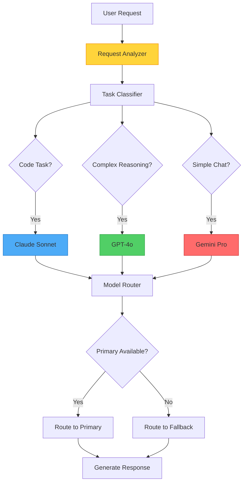

<!--
  ⚠  AUTO-GENERATED — DO NOT EDIT MANUALLY
  Generated by: aios.docgen diagram generator
  Generated on: 2026-07-13T18:12:41Z
  This file is recreated on every generation run.
  Edit the source code and re-run the generator to update this file.
-->

# OmniRoute Architecture

> Intelligent model selection and routing based on task complexity and capabilities.

## OmniRoute Decision Flow

## Model Selection Criteria

### Task Classification
- **Code Generation/Analysis**: Claude Sonnet (primary)
- **Complex Reasoning**: GPT-4o (primary)
- **Simple Chat/Q&A**: Gemini Pro (cost-effective)
- **Specialized Tasks**: Task-specific model selection

### Fallback Strategy
- Primary model unavailable → fallback to secondary
- Rate limit exceeded → queue or fallback
- Quality monitoring → switch if quality degrades
